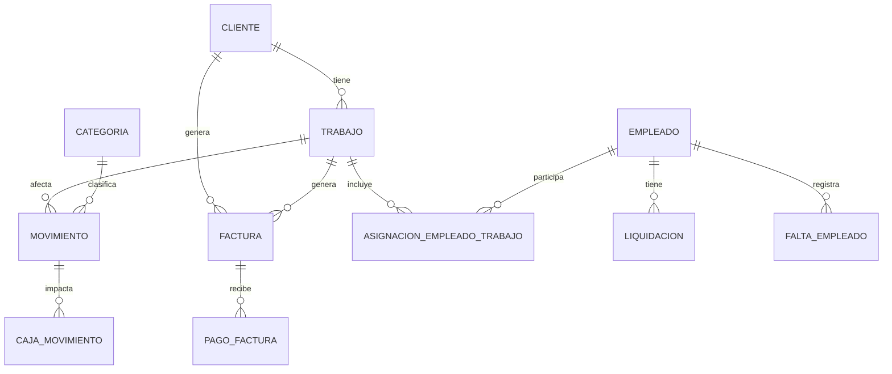

# ElectroObraApp: Especificaciones Técnicas
## Documentación de Arquitectura e Implementación

### 1. Arquitectura del Sistema
Se implementa una **Clean Architecture (Arquitectura Limpia)** simplificada para garantizar el desacoplamiento y la facilidad de prueba.

*   **Core**: Entidades de dominio y reglas de negocio puras.
*   **Application**: Casos de uso, DTOs y lógica de orquestación.
*   **Infrastructure**: Implementación de persistencia (EF Core), acceso a archivos y servicios externos.
*   **UI (Avalonia)**: Interfaz de usuario multiplataforma siguiendo el patrón **MVVM**.

### 2. Stack Tecnológico
*   **Framework**: .NET 10 (C#), versionado vía `global.json` (SDK 10.0.400+)
*   **UI**: Avalonia UI 12.0+ (con CommunityToolkit.Mvvm)
*   **Base de Datos**: SQLite (Local)
*   **ORM**: Entity Framework Core 10+
*   **Validaciones**: FluentValidation
*   **Logging**: Serilog (Sinks: Console, File; enrichers: MachineName, ThreadId; stub DB sink preparado)
*   **Mapeo**: Mapster (para conversión entre Entidades y DTOs)
*   **Reportes**: QuestPDF (PDF), ClosedXML (Excel)
*   **Testing**: xUnit.v3, FluentAssertions, NSubstitute (174 tests)

### 3. Modelo de Datos (Entidades)
El núcleo del sistema se basa en las siguientes entidades:

*   **Movimiento**: Id, Fecha, Tipo (Enum), Monto, Moneda, FKs (Trabajo, Cliente, Empleado, Factura).
*   **Cliente**: Datos fiscales y de contacto.
*   **Trabajo**: Nombre, ClienteId, Fechas, Estado, Presupuesto.
*   **Factura**: Número, ClienteId, MontoTotal, Estado (Calculado).
*   **Empleado**: Nombre, TipoPago (Enum), TarifaBase.
*   **Liquidacion**: EmpleadoId, Período, Montos (Base, Adelantos, Faltas), TotalFinal.
*   **Categoria**: Jerarquía para clasificación de gastos e ingresos.

### 4. Diagrama Entidad-Relación (Mermaid)

### 5. Plan de Implementación (Fases)
1.  **Fase 1 - Cimientos**: Estructura de solución, DI, localización y Serilog.
2.  **Fase 2 - Dominio/Persistencia**: Movimientos, categorías, SQLite y migraciones.
3.  **Fase 3 - Aplicación**: DTOs, servicios, validaciones y tests.
4.  **Fase 4 - UI Base**: Navegación, DataGrid de movimientos y formularios.
5.  **Fase 5 - Módulos Avanzados**: Clientes, facturación, empleados, liquidaciones y trabajos.
6.  **Fase 6 - Reportes y DevOps**: Dashboard, exportaciones, CI/CD y configuración por entorno.
7.  **Fase 7 - Documentación**: README, licencia BSL y especificaciones técnicas.

### 6. Consideraciones de Infraestructura
*   **SQLite / decimal**: Los campos `decimal` se persisten como `long` mediante conversores EF Core (`DecimalToLongConverter`), evitando pérdida de precisión frente al antiguo mapeo a `double`.
*   **Migrations**: Uso de EF Core Migrations desde el inicio para evolución del esquema.
*   **Dependency Injection**: Uso extensivo del contenedor de .NET para servicios y repositorios.
*   **Configuración por entorno**: `appsettings.Development.json` (`SeedEnabled=true`) y `appsettings.Production.json` (`SeedEnabled=false`), seleccionados vía `DOTNET_ENVIRONMENT`.
*   **DevOps**: `.editorconfig`, `Directory.Build.props` (versión desde `VERSION`), GitHub Actions y Dependabot para NuGet.
