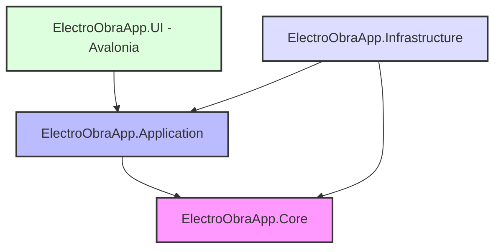

# ElectroObraApp

[](VERSION)
[](https://dotnet.microsoft.com/es-es/)
[](https://avaloniaui.net/)
[](https://www.sqlite.org/)
[](LICENSE)

> **Leer en otros idiomas:**
> [Read in English :uk:](README.md)

**ElectroObraApp** es un sistema profesional de gestión operativa y control de flujo de caja multiplataforma. Está diseñado para simplificar y optimizar la administración diaria de pequeñas empresas dedicadas al sector del mantenimiento y la construcción.

En lugar de enfocarse en una contabilidad fiscal compleja, ElectroObraApp se orienta al **control operativo y al flujo de caja real** del negocio, ofreciendo flexibilidad, estabilidad y una arquitectura limpia y profesional.

---

## 🚀 Objetivo y Filosofía del Proyecto

*   **Enfoque en el Flujo de Caja Real:** Control físico de entradas y salidas de dinero, monotributo, seguros, insumos, herramientas y materiales.
*   **Diseño Minimalista y Premium:** Interfaz limpia, moderna y dinámica desarrollada con Avalonia UI.
*   **Flexibilidad en Escenarios Reales:** Contempla situaciones cotidianas de obras, como pagos parciales, adelantos quincenales a empleados, faltas injustificadas y saldos pendientes de clientes.
*   **Soporte Multiplataforma:** Diseñado para ejecutarse en Desktop (Windows, Linux, macOS), Móvil (Android, iOS) y Web (Navegador) a partir de una única base de código compartida en C#.

---

## 🏗️ Arquitectura de Software y Patrones de Diseño

El proyecto está construido siguiendo los principios de **Clean Architecture (Arquitectura Limpia)** para asegurar el desacoplamiento, la facilidad de pruebas unitarias y la mantenibilidad a largo plazo.



### 1. Descripción de Capas
*   **Core (Dominio):** Lógica pura del negocio, incluyendo Entidades de Dominio, Enums, Especificaciones e Interfaces de Repositorio.
*   **Application (Aplicación):** Implementación de casos de uso, DTOs, Interfaces de Servicio, configuraciones de mapeo (con Mapster) y reglas de validación (con FluentValidation).
*   **Infrastructure (Infraestructura):** Persistencia en base de datos (EF Core 10 con SQLite), gestión de archivos locales, exportaciones externas (PDF/Excel) e implementación de Logging (Serilog).
*   **UI (Avalonia):** Interfaz de usuario multiplataforma siguiendo el patrón estricto Model-View-ViewModel (MVVM) con `CommunityToolkit.Mvvm` y soporte de localización (i18n).

### 2. Patrones de Diseño Aplicados
*   **Repository & Unit of Work:** Abstrae la persistencia de datos y garantiza transacciones atómicas.
*   **Dependency Injection (DI):** Integración nativa del contenedor de dependencias de .NET.
*   **Options Pattern:** Carga de configuración fuertemente tipada desde el archivo `appsettings.json`.
*   **Observer Pattern:** Implementado a través de `ObservableObject` y el sistema de mensajería `Messenger` de CommunityToolkit.

---

## 🛠️ Stack Tecnológico y Librerías Clave

*   **Lenguaje y Runtime:** C# (latest) / .NET 10.0 (fijado vía `global.json`)
*   **Framework de UI:** Avalonia UI 12.0+ (utilizando `Material.Icons.Avalonia` y `LiveChartsCore`)
*   **ORM:** Entity Framework Core 10.0+ (Proveedor SQLite)
*   **Validación:** FluentValidation
*   **Mapeo de Objetos:** Mapster
*   **Logging:** Serilog (archivos rotativos, consola, enrichers MachineName/ThreadId)
*   **Reportes:** QuestPDF (generación de PDF) y ClosedXML (planillas de Excel)
*   **Testing:** xUnit.v3 (174 tests), FluentAssertions y NSubstitute

---

## 📦 Estructura del Proyecto

```
ElectroObra/
├── .github/workflows/                 # CI/CD (build-test, release)
├── Docs/                              # Documentación técnica y funcional
├── ElectroObraApp/                    # Vistas y recursos compartidos de UI (Avalonia)
├── ElectroObraApp.Android/            # Proyecto específico para Android
├── ElectroObraApp.Application/        # Servicios de aplicación, DTOs y mappings
├── ElectroObraApp.Browser/            # Proyecto específico para Navegador (WebAssembly)
├── ElectroObraApp.Core/               # Entidades de dominio e interfaces core
├── ElectroObraApp.Desktop/            # Lanzador para Escritorio (Windows, macOS, Linux)
├── ElectroObraApp.Infrastructure/     # DbContext de EF Core, Repositorios y Exportación
├── ElectroObraApp.iOS/                # Proyecto específico para iOS
├── ElectroObraApp.Tests/              # Suite de pruebas unitarias (xUnit.v3, 174 tests)
├── Directory.Build.props              # Propiedades MSBuild compartidas (versión desde VERSION)
├── Directory.Packages.props           # Configuración centralizada de paquetes NuGet
├── global.json                        # Pin del SDK .NET (10.0.400+)
├── LICENSE                            # Información de licencia (BSL 1.1)
└── VERSION                            # Versión actual de la aplicación
```

---

## 📅 Roadmap e Implementación

*   **[x] Fase 1: Cimientos y Configuración** — Gestión centralizada de paquetes, estructura Clean Architecture, sistema de localización JSON y configuración de Serilog.
*   **[x] Fase 2: Dominio y Persistencia** — Entidades de flujo de caja, DbContext SQLite, repositorios base y migraciones iniciales.
*   **[x] Fase 3: Lógica de Aplicación** — DTOs, mapeos de Mapster y reglas de validación de negocio con cobertura de tests unitarios.
*   **[x] Fase 4: UI Base** — Maquetación de navegación principal, DataGrid de movimientos y formularios con fecha proxy estabilizada.
*   **[x] Fase 5: Módulos Avanzados** — Clientes y Facturación, Empleados y Liquidación, Trabajos y Rentabilidad (CRUD completado).
*   **[x] Fase 6: Reportes, DevOps y Pulido** — Dashboard, exportaciones PDF/Excel, CI/CD, configuración por entorno y enrichers Serilog.
*   **[x] Fase 7: Documentación** — README, AGENTS.md, especificaciones técnicas y licencia BSL.

---

## ⚙️ Primeros Pasos

### Requisitos Previos
*   [.NET 10 SDK](https://dotnet.microsoft.com/download) — versión fijada en [`global.json`](global.json) (`10.0.400`, rollForward `latestFeature`)
*   Un IDE de desarrollo: [JetBrains Rider](https://www.jetbrains.com/rider/), [Visual Studio 2022](https://visualstudio.microsoft.com/) o [VS Code](https://code.visualstudio.com/) (con C# Dev Kit).

### Workloads opcionales (targets móvil / navegador)
Instalar solo si vas a compilar targets distintos al escritorio:

```bash
# Android
dotnet workload install android

# iOS (solo macOS)
dotnet workload install ios

# Navegador (WebAssembly)
dotnet workload install wasm-tools
```

### Restaurar y Compilar
Restaura los paquetes NuGet y compila la solución:
```bash
dotnet restore
dotnet build ElectroObraApp.slnx
```

> **Nota:** Los proyectos Android e iOS están comentados en `ElectroObraApp.slnx` para evitar errores de build mientras se estabilizan. Para reactivarlos, descomenta el bloque `Mobile paused` al inicio del archivo `.slnx`.

### Ejecutar la Aplicación (Escritorio)
Para iniciar la aplicación de escritorio:
```bash
dotnet run --project ElectroObraApp.Desktop
```

Para datos de seed en desarrollo, define el entorno antes de ejecutar:
```bash
# Windows PowerShell
$env:DOTNET_ENVIRONMENT = "Development"
dotnet run --project ElectroObraApp.Desktop

# Linux/macOS
DOTNET_ENVIRONMENT=Development dotnet run --project ElectroObraApp.Desktop
```

`appsettings.Development.json` habilita `SeedEnabled=true`; producción usa `SeedEnabled=false`.

### Ejecutar Pruebas Unitarias
Para correr la suite de pruebas automatizadas con xUnit.v3 (174 tests):
```bash
dotnet test ElectroObraApp.Tests/ElectroObraApp.Tests.csproj
```

Con cobertura de código:
```bash
dotnet test ElectroObraApp.Tests/ElectroObraApp.Tests.csproj --collect:"XPlat Code Coverage"
```

### Almacenamiento decimal en SQLite
Los campos monetarios usan `decimal` en el dominio. EF Core los persiste como `long` mediante conversores personalizados (`DecimalToLongConverter`), reemplazando el antiguo mapeo a `double` y evitando errores de redondeo.

### Design System UI (Agosto 2026)
ElectroObraApp utiliza un design system basado en tokens semánticos en `ElectroObraApp/Styles/`:

| Recurso | Propósito |
|---|---|
| `Palette.axaml` | Diccionarios Light/Dark: superficies, bordes, texto, acento, estados |
| `Tokens.axaml` | Espaciado, radios, tipografía (`H1`, `BodySmall`, `Caption`) |
| `Components.axaml` | `eo-primary`, `eo-secondary`, `eo-grid`, `eo-input`, `eo-card` |
| `Controls.axaml` | `filterPanel`, `filterLabel`, `pageSizeLabel`, `card` |

**Reglas de migración:** usar `PageHeader`, `FilterBar` y `ListStateOverlay`; colores vía `DynamicResource` (sin hex hardcodeado); textos en `Assets/i18n/*.json`.

**Estado del rediseño:** vistas CRUD, pantallas admin (Categorías, Tipos de Movimiento), Centro de Reportes y formulario extendido de Movimientos migrados. Pendiente tokenización completa de Certificados/Dashboard.

---

## 📄 Licencia

Este proyecto está bajo la licencia **Business Source License 1.1 (BSL 1.1)**.

*   **Licenciante:** ElectroObraApp Project Owners (FittyAr)
*   **Fecha de Cambio:** 6 de Julio de 2030
*   **Licencia de Cambio:** GNU General Public License v2.0 or later (GPL-2.0-or-later)

Para más detalles, consulta el archivo [LICENSE](LICENSE).
