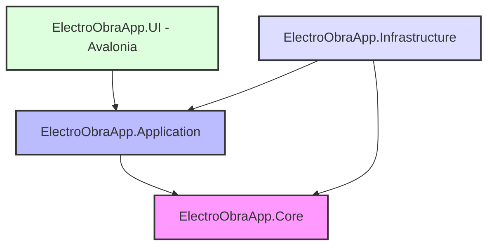

# ElectroObraApp

[](VERSION)
[](https://dotnet.microsoft.com/en-us/)
[](https://avaloniaui.net/)
[](https://www.sqlite.org/)
[](LISENSE)

> **Read in other languages:**
> [Leer en Español :spain:](README.es.md)

**ElectroObraApp** is a professional, multiplatform operational management and cash flow control system. It is designed to simplify and streamline the daily operations of small companies in the maintenance and construction sectors.

Instead of focusing on complex fiscal accounting, ElectroObraApp addresses the raw **operational control and real cash flow** of your business, offering flexibility, stability, and clean engineering.

---

## 🚀 Project Goal & Philosophy

*   **Real Cash Flow Focus:** Track physical money inflows and outflows, monotributo, insurance, tools, and materials.
*   **Minimalist & Premium Design:** A clean, modern, and interactive user interface built with Avalonia UI.
*   **Real-World Flexibility:** Contemplates everyday scenarios such as partial payments, employee salary advances, unjustified absences, and client debts.
*   **Multiplatform Support:** Designed to run seamlessly across Desktop (Windows, Linux, macOS), Mobile (Android, iOS), and Web (Browser) from a single shared C# codebase.

---

## 🏗️ Software Architecture & Design Patterns

The project is built following the principles of **Clean Architecture** to ensure decoupling, ease of testing, and long-term maintainability.



### 1. Layers Description
*   **Core (Domain):** Pure business logic, including Domain Entities ([Movement](file:///d:/GitHub/ElectroObra/ElectroObraApp.Core), [Client](file:///d:/GitHub/ElectroObra/ElectroObraApp.Core), [Job](file:///d:/GitHub/ElectroObra/ElectroObraApp.Core), [Employee](file:///d:/GitHub/ElectroObra/ElectroObraApp.Core)), Enums, Specifications, and Repository Interfaces.
*   **Application:** Use cases implementation, DTOs (Data Transfer Objects), Service Interfaces, Mapping configurations (via Mapster), and validation rules (via FluentValidation).
*   **Infrastructure:** Database persistence (EF Core with SQLite), file system management, external exports (PDF/Excel), and Logging implementation.
*   **UI (Avalonia):** Cross-platform user interface using the strict Model-View-ViewModel (MVVM) pattern with `CommunityToolkit.Mvvm` and localization support.

### 2. Applied Design Patterns
*   **Repository & Unit of Work:** Abstracts database persistence and ensures transactional operations.
*   **Dependency Injection (DI):** Native .NET dependency container integration.
*   **Options Pattern:** For strongly-typed configuration loading from `appsettings.json`.
*   **Observer Pattern:** Implemented using `ObservableObject` and `Messenger` from CommunityToolkit.

---

## 🛠️ Tech Stack & Key Libraries

*   **Language & Runtime:** C# 10 / .NET 10.0
*   **UI Framework:** Avalonia UI 12.0+ (using `Material.Icons.Avalonia` and `LiveChartsCore`)
*   **ORM:** Entity Framework Core 10.0+ (SQLite provider)
*   **Validation:** FluentValidation
*   **Object Mapping:** Mapster
*   **Logging:** Serilog (configured for rotative local files and console output)
*   **Reporting:** QuestPDF (PDF generation) and ClosedXML (Excel spreadsheets)
*   **Testing:** xUnit.v3, FluentAssertions, and NSubstitute (for mocking)

---

## 📦 Project Structure

```
ElectroObra/
├── Docs/                              # Non-technical and technical documentation
├── ElectroObraApp/                    # Shared UI views and resources (Avalonia)
├── ElectroObraApp.Android/            # Android target project
├── ElectroObraApp.Application/        # Application services, DTOs, and mappings
├── ElectroObraApp.Browser/            # Web Browser target project (WebAssembly)
├── ElectroObraApp.Core/               # Domain entities and core interfaces
├── ElectroObraApp.Desktop/            # Desktop target launcher (Windows, macOS, Linux)
├── ElectroObraApp.Infrastructure/     # EF Core DbContext, Repositories, and Exports
├── ElectroObraApp.iOS/                # iOS target project
├── ElectroObraApp.Tests/              # Unit testing suite (xUnit.v3)
├── Directory.Packages.props           # Central Package Management configuration
├── LISENSE                            # License information (BSL 1.1)
└── VERSION                            # Current application version
```

---

## 📅 Roadmap & Progress

*   **[x] Phase 1: Foundations & Config** — Central package management, Clean Architecture setup, localization engine, and Serilog configuration.
*   **[x] Phase 2: Domain & Persistence** — Cash flow entities, SQLite DbContext, Repository Base, and migrations.
*   **[x] Phase 3: Application Logic** — DTOs, Mapster mappings, and business validation rules with extensive unit testing.
*   **[x] Phase 4: Base UI** — Main navigation layout, transactions DataGrid view, and forms with date proxy stabilization.
*   **[/] Phase 5: Advanced Modules** — Clients/Invoicing (CRUD done), Employees/Payroll (CRUD done), Jobs & Project Profitability (CRUD done).
*   **[/] Phase 6: Reports & Polish** — Basic PDF and Excel exports (Done), Dashboard statistics, and Avalonia 12 UI optimization.

---

## ⚙️ Getting Started

### Prerequisites
*   [.NET 10 SDK](https://dotnet.microsoft.com/download)
*   An IDE of your choice: [JetBrains Rider](https://www.jetbrains.com/rider/), [Visual Studio 2022](https://visualstudio.microsoft.com/), or [VS Code](https://code.visualstudio.com/) (with C# Dev Kit).

### Restore & Build
Restore NuGet packages and compile the solution:
```bash
dotnet restore
dotnet build
```

### Run the Application (Desktop)
To launch the desktop application, run:
```bash
dotnet run --project ElectroObraApp.Desktop
```

### Run Unit Tests
To run the automated xUnit.v3 test suite, execute:
```bash
dotnet test
```

---

## 📄 License

This project is licensed under the **Business Source License 1.1 (BSL 1.1)**. 

*   **Licensor:** Flota-HAS Project Owners (FittyAr)
*   **Change Date:** July 6, 2030
*   **Change License:** GNU General Public License v2.0 or later (GPL-2.0-or-later)

For details, please refer to the [LISENSE](file:///d:/GitHub/ElectroObra/LISENSE) file.
