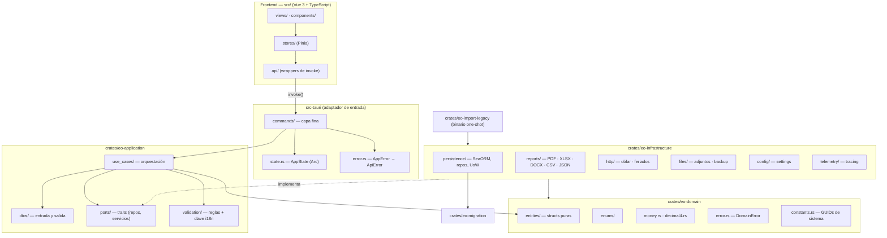

# 02 — Arquitectura

## 1. Visión general

Clean Architecture con **un crate de Rust por capa**, más un frontend Vue 3 que sólo consume
comandos Tauri. La regla de dependencia es unidireccional: las capas externas conocen a las
internas, nunca al revés.



## 2. Crates y sus dependencias permitidas

| Crate | Puede depender de | **Prohibido** |
| --- | --- | --- |
| `eo-domain` | `chrono`, `uuid`, `serde`, `thiserror`, `rust_decimal` | SeaORM, `sqlx`, `reqwest`, `tokio`, `std::fs`, Tauri, cualquier I/O |
| `eo-application` | `eo-domain`, `async-trait`, `serde`, `thiserror`, `chrono`, `uuid`, `tracing` | SeaORM, `sqlx`, `reqwest`, `std::fs`, Tauri, generación de PDF |
| `eo-infrastructure` | `eo-domain`, `eo-application`, `eo-migration`, SeaORM, `reqwest`, `printpdf`, `rust_xlsxwriter`, `docx-rs`, `csv`, `figment`, `tracing-*` | Tauri, referencias al frontend |
| `eo-migration` | `sea-orm-migration` | lógica de negocio |
| `eo-import-legacy` | `eo-domain`, `eo-infrastructure`, `sqlx` | Tauri |
| `src-tauri` | `eo-application`, `eo-infrastructure`, `tauri`, `serde` | acceso directo a SeaORM o a SQL |

Esta tabla es verificable: si `cargo tree -p eo-domain` muestra `sea-orm`, el diseño está roto.

## 3. Árbol de archivos

```
crates/eo-domain/src/
├── lib.rs
├── constants.rs              # GUIDs de sistema, límites, defaults de dominio
├── error.rs                  # DomainError
├── money.rs                  # Money(i64) escala 4
├── decimal4.rs               # Decimal4(i64) para porcentajes/multiplicadores
├── enums/
│   ├── mod.rs
│   ├── estado_factura.rs
│   ├── estado_obra.rs
│   ├── estado_trabajo.rs
│   ├── frecuencia_pago.rs
│   ├── tipo_jornada.rs
│   └── medio_pago.rs
└── entities/
    ├── mod.rs
    ├── audit.rs              # campos de auditoría compartidos (ver doc 05 §1)
    ├── movimiento.rs
    ├── tipo_movimiento.rs
    ├── tipo_concepto_pago.rs
    ├── categoria.rs
    ├── cliente.rs
    ├── cliente_contacto.rs
    ├── obra.rs
    ├── trabajo.rs
    ├── orden_trabajo.rs
    ├── orden_trabajo_item.rs
    ├── certificado.rs        # [NUEVO] historial de certificados
    ├── certificado_item.rs   # [NUEVO]
    ├── factura.rs
    ├── pago_factura.rs
    ├── empleado.rs
    ├── asistencia_empleado.rs
    ├── liquidacion.rs
    ├── liquidacion_adelanto.rs  # [NUEVO] vínculo liquidación ↔ movimiento de adelanto
    ├── adjunto.rs
    └── app_metadata.rs

crates/eo-application/src/
├── lib.rs
├── error.rs                  # AppError (código estable + clave i18n)
├── result.rs                 # type AppResult<T>
├── paging.rs                 # PageRequest, PagedResult<T>
├── ports/
│   ├── mod.rs
│   ├── repositories.rs       # un trait por agregado + UnitOfWork
│   ├── clock.rs              # Clock: now_utc() — inyectable para tests
│   ├── id_generator.rs       # IdGenerator: new_id()
│   ├── exporter.rs           # ReportExporter
│   ├── rates.rs              # ExchangeRateProvider
│   ├── holidays.rs           # HolidayProvider
│   ├── files.rs              # AttachmentStore
│   ├── backup.rs             # BackupService
│   └── settings.rs           # SettingsStore
├── dtos/                     # un módulo por agregado
├── validation/               # un validador por DTO de escritura
└── use_cases/                # un módulo por agregado, un archivo por caso de uso

crates/eo-infrastructure/src/
├── lib.rs
├── persistence/
│   ├── mod.rs
│   ├── connection.rs         # apertura, PRAGMAs, ruta del archivo
│   ├── models/               # entidades SeaORM (una por tabla)
│   ├── mappers/              # modelo SeaORM ↔ entidad de dominio
│   ├── repositories/         # impl de los traits de ports::repositories
│   └── unit_of_work.rs
├── reports/{pdf,xlsx,docx,csv,json}.rs
├── http/{dolar.rs,feriados.rs}
├── files/{attachments.rs,backup.rs}
├── config/settings.rs
└── telemetry/tracing.rs

src-tauri/src/
├── main.rs                   # setup, DI, invoke_handler
├── state.rs                  # AppState { db, use_cases, settings }
├── error.rs                  # AppError → ApiError serializable
└── commands/                 # un archivo por módulo funcional
```

## 4. Flujo de una operación de punta a punta

Ejemplo: crear un movimiento.

1. **Vista Vue** — `MovimientoForm.vue` emite el submit con un objeto tipado
   `CreateMovimientoRequest` (definido en `src/api/types.ts`, espejo del DTO de Rust).
2. **Store Pinia** — `useMovimientosStore().create(payload)` marca `loading = true` y llama al
   wrapper.
3. **Wrapper de API** — `src/api/movimientos.ts` hace
   `invoke<MovimientoDto>('movimientos_create', { request })`. Es el **único** lugar del frontend
   donde aparece `invoke`.
4. **Comando Tauri** — `commands/movimientos.rs::movimientos_create` recibe el DTO
   deserializado, toma el caso de uso de `AppState` y lo ejecuta. No valida ni calcula.
5. **Caso de uso** — `use_cases::movimientos::create::execute`:
   1. Valida el DTO con su validador; si falla devuelve `AppError::Validation` con la lista de
      `(campo, clave_i18n)`.
   2. Abre una unidad de trabajo (transacción).
   3. Verifica invariantes que requieren la base (existencia del tipo de movimiento y de la
      categoría, unicidad si aplica).
   4. Construye la entidad de dominio; los importes se convierten a `Money`, la fecha a
      `DateTime<Utc>`; `id` viene de `IdGenerator`, `created_at` de `Clock`.
   5. Persiste vía el puerto de repositorio.
   6. Confirma la transacción.
   7. Registra el evento con `tracing::info!` incluyendo el `id` resultante.
   8. Devuelve el DTO de salida.
6. **Vuelta** — el comando serializa `Ok(dto)`; el store actualiza su estado y muestra un toast
   con la clave i18n de éxito.

Si algo falla en cualquier punto, el error viaja como `ApiError` y el frontend traduce
`error.messageKey`. **El backend nunca devuelve texto traducido.**

## 5. Puertos y adaptadores

Los casos de uso sólo conocen traits. Ejemplo del contrato de repositorio:

```rust
// crates/eo-application/src/ports/repositories.rs
#[async_trait]
pub trait MovimientoRepository: Send + Sync {
    async fn find_by_id(&self, id: Uuid) -> AppResult<Option<Movimiento>>;
    async fn search(&self, filter: &MovimientoFilter, page: PageRequest)
        -> AppResult<PagedResult<Movimiento>>;
    async fn insert(&self, entity: &Movimiento) -> AppResult<()>;
    async fn update(&self, entity: &Movimiento) -> AppResult<()>;
    async fn soft_delete(&self, id: Uuid, at: DateTime<Utc>) -> AppResult<()>;
    async fn sum_by_tipo(&self, filter: &MovimientoFilter) -> AppResult<Vec<TipoTotal>>;
}

#[async_trait]
pub trait UnitOfWork: Send + Sync {
    async fn begin(&self) -> AppResult<Box<dyn Transaction>>;
}

#[async_trait]
pub trait Transaction: Send {
    fn movimientos(&self) -> &dyn MovimientoRepository;
    fn facturas(&self) -> &dyn FacturaRepository;
    // … un accesor por agregado
    async fn commit(self: Box<Self>) -> AppResult<()>;
    async fn rollback(self: Box<Self>) -> AppResult<()>;
}
```

`Clock` e `IdGenerator` también son puertos, para que los tests puedan fijar el tiempo y los
identificadores y comparar resultados exactos.

## 6. Manejo de errores

### 6.1 Tipos

```rust
// crates/eo-domain/src/error.rs
#[derive(Debug, thiserror::Error)]
pub enum DomainError {
    #[error("money overflow")]
    MoneyOverflow,
    #[error("invalid scale")]
    InvalidScale,
    #[error("invalid state transition from {from} to {to}")]
    InvalidStateTransition { from: String, to: String },
    #[error("invariant violated: {0}")]
    InvariantViolated(&'static str),
}
```

```rust
// crates/eo-application/src/error.rs
#[derive(Debug, thiserror::Error)]
pub enum AppError {
    #[error("validation failed")]
    Validation(Vec<FieldError>),
    #[error("not found: {entity} {id}")]
    NotFound { entity: &'static str, id: String },
    #[error("conflict: {code}")]
    Conflict { code: &'static str, message_key: &'static str },
    #[error("concurrency conflict on {entity}")]
    Concurrency { entity: &'static str },
    #[error("dependency in use: {code}")]
    DependencyInUse { code: &'static str, message_key: &'static str },
    #[error("domain error: {0}")]
    Domain(#[from] DomainError),
    #[error("persistence error")]
    Persistence(#[source] anyhow::Error),
    #[error("external service unavailable: {service}")]
    ExternalUnavailable { service: &'static str },
    #[error("io error")]
    Io(#[source] anyhow::Error),
    #[error("unexpected error")]
    Unexpected(#[source] anyhow::Error),
}

pub struct FieldError {
    pub field: String,
    pub message_key: String,
    pub params: BTreeMap<String, String>,
}
```

### 6.2 Contrato de salida hacia el frontend

Todo comando devuelve `Result<T, ApiError>`:

```rust
// src-tauri/src/error.rs
#[derive(serde::Serialize)]
#[serde(rename_all = "camelCase")]
pub struct ApiError {
    pub code: String,                 // "VALIDATION" | "NOT_FOUND" | "CONFLICT" | …
    pub message_key: String,          // clave i18n, p. ej. "Error.NotFound"
    pub params: BTreeMap<String, String>,
    pub fields: Vec<ApiFieldError>,   // vacío salvo en VALIDATION
    pub trace_id: String,             // correlaciona con el log
}
```

| `AppError` | `code` | `message_key` por defecto | HTTP-equivalente conceptual |
| --- | --- | --- | --- |
| `Validation` | `VALIDATION` | `Error.Validation` | 422 |
| `NotFound` | `NOT_FOUND` | `Error.NotFound` | 404 |
| `Conflict` | `CONFLICT` | el de la variante | 409 |
| `Concurrency` | `CONCURRENCY` | `Error.Concurrency` | 409 |
| `DependencyInUse` | `DEPENDENCY_IN_USE` | el de la variante | 409 |
| `Domain` | `DOMAIN` | `Error.Domain` | 422 |
| `Persistence` | `PERSISTENCE` | `Error.Persistence` | 500 |
| `ExternalUnavailable` | `EXTERNAL_UNAVAILABLE` | `Error.ExternalUnavailable` | 503 |
| `Io` | `IO` | `Error.Io` | 500 |
| `Unexpected` | `UNEXPECTED` | `Error.Unexpected` | 500 |

Reglas:

- `Persistence`, `Io`, `Unexpected` **nunca** exponen el mensaje interno al frontend: se registran
  con `tracing::error!` junto al `trace_id` y el usuario ve la clave genérica.
- `panic!`, `unwrap()` y `expect()` están prohibidos fuera de tests.
- **[LEGADO]** La app C# usaba `Result<T>` con mensajes ya traducidos en el servicio. Eso se
  elimina: la traducción es responsabilidad exclusiva del frontend.

## 7. Logging y observabilidad

- Biblioteca: `tracing` + `tracing-subscriber` + `tracing-appender`.
- Dos capas de salida:
  - **consola**, formato compacto legible, sólo en desarrollo;
  - **archivo rotativo diario** en el directorio de logs configurado, formato JSON.
- Nivel por entorno: `debug` en desarrollo, `info` en producción, configurable con la variable de
  entorno `EO_LOG` (sintaxis `EnvFilter`).
- Retención de archivos: configurable, valor por defecto 31 días.
- Cada comando Tauri abre un `tracing::info_span!` con el nombre del comando y un `trace_id`
  (UUID v7) que se propaga al `ApiError`. Así un error reportado por el usuario se ubica en el log.
- Qué se registra obligatoriamente:
  - `info` al crear, actualizar o borrar cualquier entidad, con tipo e `id`;
  - `info` al generar una liquidación o un certificado, con los totales calculados;
  - `info` al exportar, con formato y ruta de salida;
  - `warn` cuando un servicio externo falla y el sistema degrada;
  - `error` con `trace_id` en toda variante `Persistence`/`Io`/`Unexpected`.
- **Nunca** se registran datos personales completos ni rutas de archivos del usuario en nivel
  `info` de producción.
- **[NUEVO]** El sink a base de datos que el sistema anterior dejó como stub **no se implementa**
  en esta etapa. El archivo JSON rotativo es suficiente y se documenta como punto de extensión.

## 8. Configuración e inyección de dependencias

`main.rs` es el único lugar donde se construye el grafo de dependencias:

```rust
fn main() -> anyhow::Result<()> {
    let settings = infrastructure::config::load()?;      // defaults + archivo de usuario + env
    let _guard = infrastructure::telemetry::init(&settings.logging)?;

    tauri::Builder::default()
        .setup(move |app| {
            let handle = app.handle().clone();
            tauri::async_runtime::spawn(async move {
                match bootstrap(settings).await {           // conecta DB, migra, arma AppState
                    Ok(state) => { handle.manage(state); emit_ready(&handle); }
                    Err(e) => emit_fatal(&handle, e),
                }
            });
            Ok(())
        })
        .invoke_handler(tauri::generate_handler![ /* … */ ])
        .run(tauri::generate_context!())?;
    Ok(())
}
```

- `bootstrap` corre **en background**: abre la conexión, aplica migraciones, siembra los datos de
  sistema y construye `AppState`. La interfaz muestra un estado «inicializando» hasta recibir el
  evento `app://ready`. **[LEGADO]** El sistema anterior ya inicializaba la base en background;
  se conserva el patrón.
- `AppState` guarda los casos de uso ya construidos, envueltos en `Arc`, para que los comandos no
  hagan resolución de dependencias en cada llamada.
- Los detalles del catálogo de configuración están en
  [`14-configuracion-e-i18n.md`](./14-configuracion-e-i18n.md).

## 9. Concurrencia y transacciones

- Un caso de uso que escribe más de una tabla **debe** hacerlo dentro de una transacción
  (`UnitOfWork::begin`). Casos afectados: crear/anular liquidación, guardar certificado con sus
  ítems, registrar pago de factura, guardar orden de trabajo con ítems, importar JSON.
- Concurrencia optimista con `row_version`: en `update`, la sentencia lleva
  `WHERE id = ? AND row_version = ?`; si afecta 0 filas se devuelve `AppError::Concurrency`.
  Ver [`04-dinero-fechas-y-tipos.md`](./04-dinero-fechas-y-tipos.md) §5.
- SQLite se abre en modo WAL con `busy_timeout`, por si un backup corre en paralelo.

## 10. Patrones de diseño aplicados

| Patrón | Dónde | Por qué |
| --- | --- | --- |
| Clean Architecture | separación en crates | permite testear el dominio sin base de datos |
| Repository | `ports::repositories` + `persistence::repositories` | aísla SeaORM del dominio |
| Unit of Work | `ports::UnitOfWork` | atomicidad en operaciones multi-tabla |
| Puertos y adaptadores | todo `ports/` | HTTP, archivos y reportes son sustituibles y mockeables |
| Newtype | `Money`, `Decimal4` | hace imposible sumar pesos con porcentajes por accidente |
| Specification / filtro tipado | `MovimientoFilter` y análogos | consultas compuestas sin SQL en la capa de aplicación |
| Command (IPC) | `src-tauri/commands` | una función por caso de uso, sin lógica |
| Strategy | `ReportExporter` por formato | agregar un formato no toca el caso de uso |
| Clock / IdGenerator inyectables | `ports::clock`, `ports::id_generator` | tests deterministas |
| Store por módulo (Pinia) | `src/stores` | estado de UI acotado por dominio |

## 11. Antipatrones prohibidos

- Lógica de negocio en un comando Tauri o en un componente Vue.
- Entidades SeaORM (`persistence::models`) cruzando hacia `eo-application` o hacia el frontend.
  Siempre se mapea a entidad de dominio o a DTO.
- Cálculo de importes en TypeScript (`number` es IEEE-754: pierde precisión).
- Texto traducido dentro de Rust.
- `String` como tipo de estado cuando existe un enum. **[BUG-LEGADO]** el sistema anterior
  guardaba los estados de factura, obra y trabajo como texto libre; ver
  [`08-maquinas-de-estado.md`](./08-maquinas-de-estado.md).
