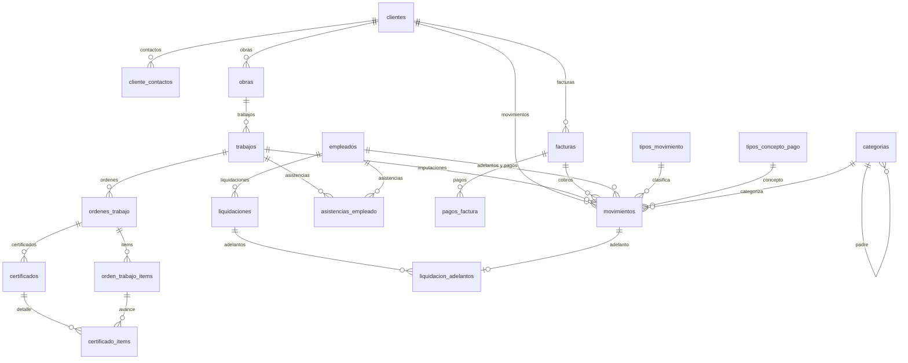

# 03 — Modelo de datos

> **Documento crítico.** El DDL de este archivo es la definición autoritativa del esquema. Las
> migraciones de `crates/eo-migration` deben producir exactamente estas tablas, columnas, tipos,
> índices y comportamientos de borrado. Ningún nombre de columna se cambia por gusto.

Antes de leer: [`04-dinero-fechas-y-tipos.md`](./04-dinero-fechas-y-tipos.md) explica por qué los
importes son `INTEGER` y por qué `created_at` es `TEXT`.

## 1. Reglas generales del esquema

| Regla | Detalle |
| --- | --- |
| Motor | SQLite. `PRAGMA foreign_keys = ON`, `journal_mode = WAL`, `busy_timeout = 5000`. |
| Nombres | Tablas y columnas en `snake_case`. **[NUEVO]** el sistema anterior usaba `PascalCase`; la traducción está en [`15-migracion-de-datos.md`](./15-migracion-de-datos.md) §2. |
| Clave primaria | `id TEXT NOT NULL PRIMARY KEY`, un UUID v7 en formato canónico con guiones y minúsculas. Excepciones: `app_metadata` (PK textual). |
| Auditoría | Toda tabla de negocio tiene `created_at`, `updated_at`, `row_version`, `is_deleted`, `deleted_at`. |
| Fechas | `TEXT` en formato ISO-8601 UTC con sufijo `Z` y milisegundos: `2026-08-29T12:34:56.789Z`. |
| Booleanos | `INTEGER` con valores `0` / `1` y `CHECK (col IN (0,1))`. |
| Importes y decimales | `INTEGER`: el valor decimal multiplicado por 10 000. Ver doc 04. |
| Enums | `INTEGER` con el valor numérico explícito del enum, más `CHECK` del rango válido. |
| Borrado | Lógico. Toda consulta de lectura filtra `is_deleted = 0` salvo que se pida explícitamente lo contrario. |
| Concurrencia | `row_version BLOB NOT NULL DEFAULT X'0000000000000001'`, 8 bytes, big-endian, se incrementa en cada `UPDATE`. |
| Tabla de migraciones | `seaql_migrations`, gestionada por `sea-orm-migration`. **[NO PORTAR]** la tabla `SchemaVersions` del sistema anterior no se recrea. |

### 1.1 Bloque de auditoría (se repite en cada tabla de negocio)

```sql
created_at   TEXT    NOT NULL,
updated_at   TEXT        NULL,
row_version  BLOB    NOT NULL DEFAULT X'0000000000000001',
is_deleted   INTEGER NOT NULL DEFAULT 0 CHECK (is_deleted IN (0,1)),
deleted_at   TEXT        NULL
```

Y en cada tabla de negocio, este índice:

```sql
CREATE INDEX ix_<tabla>_is_deleted ON <tabla> (is_deleted);
```

## 2. Inventario de tablas

21 tablas. Las 17 primeras existen en el sistema anterior; las 4 últimas son nuevas y están
justificadas en su sección.

| # | Tabla | Origen | Propósito |
| --- | --- | --- | --- |
| 1 | `tipos_movimiento` | legado `TiposMovimiento` | Clasificación primaria del movimiento. 4 filas de sistema. |
| 2 | `tipos_concepto_pago` | legado `TiposConceptoPago` | Concepto del pago a un empleado (adelanto, quincena…). |
| 3 | `categorias` | legado `Categorias` | Clasificación secundaria personalizable. |
| 4 | `clientes` | legado `Clientes` | Empresas o personas que contratan. |
| 5 | `cliente_contactos` | legado `ClienteContactos` | N emails/contactos por cliente (RC-13). |
| 6 | `obras` | legado `Obras` | Lugar físico con número único (RC-07). |
| 7 | `trabajos` | legado `Trabajos` | Tarea contratada dentro de una obra. |
| 8 | `ordenes_trabajo` | legado `OrdenesTrabajo` | Documento de orden con ajustes y descuentos. |
| 9 | `orden_trabajo_items` | legado `OrdenTrabajoItems` | Ítems con cantidad, precio y avance. |
| 10 | `facturas` | legado `Facturas` | Comprobantes emitidos al cliente. |
| 11 | `pagos_factura` | legado `PagosFactura` | Cobros imputados a una factura. |
| 12 | `empleados` | legado `Empleados` | Personal con tarifa y frecuencia de pago. |
| 13 | `asistencias_empleado` | legado `AsistenciasEmpleado` | Un registro por empleado y día. |
| 14 | `liquidaciones` | legado `Liquidaciones` | Cálculo de pago por período. |
| 15 | `movimientos` | legado `Movimientos` | Toda entrada y salida de dinero. |
| 16 | `adjuntos` | legado `Adjuntos` | Archivos asociados de forma polimórfica. |
| 17 | `app_metadata` | legado `AppMetadata` | Pares clave/valor de metadatos de la aplicación. |
| 18 | `certificados` | **[NUEVO]** | Historial de certificados de una orden (RC-10). |
| 19 | `certificado_items` | **[NUEVO]** | Porcentaje certificado por ítem en cada certificado. |
| 20 | `liquidacion_adelantos` | **[NUEVO]** | Qué adelantos concretos se descontaron en cada liquidación (RC-02, INV-05). |
| 21 | `feriados` | **[NUEVO]** | Calendario de feriados, de la API y manuales. Antes vivía en el archivo de configuración. |

### Diagrama de relaciones



## 3. DDL literal

El orden de creación respeta las dependencias: crear las tablas en este orden exacto.

### 3.1 `tipos_movimiento`

```sql
CREATE TABLE tipos_movimiento (
    id           TEXT    NOT NULL PRIMARY KEY,
    nombre       TEXT    NOT NULL,                                  -- max 100
    descripcion  TEXT        NULL,
    es_ingreso   INTEGER NOT NULL DEFAULT 0 CHECK (es_ingreso IN (0,1)),
    es_sistema   INTEGER NOT NULL DEFAULT 0 CHECK (es_sistema IN (0,1)),
    created_at   TEXT    NOT NULL,
    updated_at   TEXT        NULL,
    row_version  BLOB    NOT NULL DEFAULT X'0000000000000001',
    is_deleted   INTEGER NOT NULL DEFAULT 0 CHECK (is_deleted IN (0,1)),
    deleted_at   TEXT        NULL
);

CREATE UNIQUE INDEX ux_tipos_movimiento_nombre ON tipos_movimiento (nombre) WHERE is_deleted = 0;
CREATE INDEX ix_tipos_movimiento_is_deleted ON tipos_movimiento (is_deleted);
```

- `es_ingreso = 1` significa que el movimiento **suma** al balance; `0` que **resta**.
- `es_sistema = 1` impide borrar la fila y cambiar `es_ingreso`.
- **[NUEVO]** el índice único de `nombre` no existía en el sistema anterior; se agrega para que
  el usuario no cree dos tipos con el mismo nombre.

### 3.2 `tipos_concepto_pago`

```sql
CREATE TABLE tipos_concepto_pago (
    id           TEXT    NOT NULL PRIMARY KEY,
    nombre       TEXT    NOT NULL,                                  -- max 100
    es_sistema   INTEGER NOT NULL DEFAULT 0 CHECK (es_sistema IN (0,1)),
    created_at   TEXT    NOT NULL,
    updated_at   TEXT        NULL,
    row_version  BLOB    NOT NULL DEFAULT X'0000000000000001',
    is_deleted   INTEGER NOT NULL DEFAULT 0 CHECK (is_deleted IN (0,1)),
    deleted_at   TEXT        NULL
);

CREATE UNIQUE INDEX ux_tipos_concepto_pago_nombre ON tipos_concepto_pago (nombre) WHERE is_deleted = 0;
CREATE INDEX ix_tipos_concepto_pago_is_deleted ON tipos_concepto_pago (is_deleted);
```

### 3.3 `categorias`

```sql
CREATE TABLE categorias (
    id                 TEXT    NOT NULL PRIMARY KEY,
    nombre             TEXT    NOT NULL,                            -- max 100
    descripcion        TEXT        NULL,                            -- max 500
    color_hex          TEXT        NULL,                            -- max 7, formato #RRGGBB
    icono              TEXT        NULL,                            -- max 50, nombre de icono
    categoria_padre_id TEXT        NULL,                            -- [NUEVO]
    created_at         TEXT    NOT NULL,
    updated_at         TEXT        NULL,
    row_version        BLOB    NOT NULL DEFAULT X'0000000000000001',
    is_deleted         INTEGER NOT NULL DEFAULT 0 CHECK (is_deleted IN (0,1)),
    deleted_at         TEXT        NULL,
    CONSTRAINT fk_categorias_padre FOREIGN KEY (categoria_padre_id)
        REFERENCES categorias (id) ON DELETE RESTRICT
);

CREATE INDEX ix_categorias_categoria_padre_id ON categorias (categoria_padre_id);
CREATE UNIQUE INDEX ux_categorias_nombre_padre
    ON categorias (nombre, IFNULL(categoria_padre_id, '')) WHERE is_deleted = 0;
CREATE INDEX ix_categorias_is_deleted ON categorias (is_deleted);
```

- **[NUEVO]** `categoria_padre_id` implementa la jerarquía que la documentación de negocio pedía y
  que el sistema anterior nunca llegó a modelar.
- La profundidad máxima permitida es **2** (categoría → subcategoría). El caso de uso rechaza un
  padre que ya tenga padre, y rechaza ciclos.

### 3.4 `clientes`

```sql
CREATE TABLE clientes (
    id            TEXT    NOT NULL PRIMARY KEY,
    nombre        TEXT    NOT NULL,                                 -- max 200
    cuit          TEXT        NULL,                                 -- max 13, formato XX-XXXXXXXX-X
    direccion     TEXT        NULL,                                 -- max 500
    telefono      TEXT        NULL,                                 -- max 30
    email         TEXT        NULL,                                 -- max 254
    condicion_iva TEXT        NULL,                                 -- max 100
    created_at    TEXT    NOT NULL,
    updated_at    TEXT        NULL,
    row_version   BLOB    NOT NULL DEFAULT X'0000000000000001',
    is_deleted    INTEGER NOT NULL DEFAULT 0 CHECK (is_deleted IN (0,1)),
    deleted_at    TEXT        NULL
);

CREATE INDEX ix_clientes_cuit ON clientes (cuit);
CREATE INDEX ix_clientes_nombre ON clientes (nombre);
CREATE INDEX ix_clientes_is_deleted ON clientes (is_deleted);
```

- `cuit` **no** es único: el sistema anterior lo dejó no único a propósito y hay clientes cargados
  sin CUIT. Se conserva el índice no único.
- `email` sigue existiendo como «email principal» por compatibilidad, pero la fuente de verdad de
  los contactos es `cliente_contactos` (RC-13).

### 3.5 `cliente_contactos`

```sql
CREATE TABLE cliente_contactos (
    id          TEXT    NOT NULL PRIMARY KEY,
    cliente_id  TEXT    NOT NULL,
    etiqueta    TEXT    NOT NULL DEFAULT 'General',                 -- max 100
    email       TEXT    NOT NULL,                                   -- max 254
    nombre      TEXT        NULL,                                   -- max 200  [NUEVO]
    telefono    TEXT        NULL,                                   -- max 30   [NUEVO]
    es_principal INTEGER NOT NULL DEFAULT 0 CHECK (es_principal IN (0,1)),  -- [NUEVO]
    created_at  TEXT    NOT NULL,
    updated_at  TEXT        NULL,
    row_version BLOB    NOT NULL DEFAULT X'0000000000000001',
    is_deleted  INTEGER NOT NULL DEFAULT 0 CHECK (is_deleted IN (0,1)),
    deleted_at  TEXT        NULL,
    CONSTRAINT fk_cliente_contactos_cliente FOREIGN KEY (cliente_id)
        REFERENCES clientes (id) ON DELETE CASCADE
);

CREATE INDEX ix_cliente_contactos_cliente_id ON cliente_contactos (cliente_id);
CREATE UNIQUE INDEX ux_cliente_contactos_cliente_email
    ON cliente_contactos (cliente_id, email) WHERE is_deleted = 0;
CREATE INDEX ix_cliente_contactos_is_deleted ON cliente_contactos (is_deleted);
```

- `ON DELETE CASCADE`: los contactos no tienen sentido sin su cliente.
- A lo sumo un contacto con `es_principal = 1` por cliente; lo garantiza el caso de uso, que
  desmarca el anterior al marcar uno nuevo.

### 3.6 `obras`

```sql
CREATE TABLE obras (
    id          TEXT    NOT NULL PRIMARY KEY,
    numero      INTEGER NOT NULL,
    nombre      TEXT    NOT NULL,                                   -- max 200
    direccion   TEXT        NULL,                                   -- max 500
    localidad   TEXT        NULL,                                   -- max 200
    cliente_id  TEXT    NOT NULL,
    estado      INTEGER NOT NULL DEFAULT 0 CHECK (estado BETWEEN 0 AND 3),
    created_at  TEXT    NOT NULL,
    updated_at  TEXT        NULL,
    row_version BLOB    NOT NULL DEFAULT X'0000000000000001',
    is_deleted  INTEGER NOT NULL DEFAULT 0 CHECK (is_deleted IN (0,1)),
    deleted_at  TEXT        NULL,
    CONSTRAINT fk_obras_cliente FOREIGN KEY (cliente_id)
        REFERENCES clientes (id) ON DELETE RESTRICT
);

CREATE UNIQUE INDEX ux_obras_numero ON obras (numero);
CREATE INDEX ix_obras_cliente_id ON obras (cliente_id);
CREATE INDEX ix_obras_estado ON obras (estado);
CREATE INDEX ix_obras_is_deleted ON obras (is_deleted);
```

- `numero` es **único a nivel global**, no por cliente, y el índice **no** está filtrado por
  `is_deleted`: un número de obra borrado sigue reservado. Es intencional (INV-06).
- `estado` es `EstadoObra`: `0 = Activa`, `1 = Pausada`, `2 = Finalizada`, `3 = Cancelada`.
- `ON DELETE RESTRICT`: no se borra un cliente que tenga obras.

### 3.7 `trabajos`

```sql
CREATE TABLE trabajos (
    id           TEXT    NOT NULL PRIMARY KEY,
    obra_id      TEXT    NOT NULL,
    descripcion  TEXT    NOT NULL,                                  -- max 500
    fecha_inicio TEXT    NOT NULL,
    fecha_fin    TEXT        NULL,
    presupuesto  INTEGER NOT NULL DEFAULT 0,                        -- Money, escala 10 000
    estado       INTEGER NOT NULL DEFAULT 0 CHECK (estado BETWEEN 0 AND 4),
    created_at   TEXT    NOT NULL,
    updated_at   TEXT        NULL,
    row_version  BLOB    NOT NULL DEFAULT X'0000000000000001',
    is_deleted   INTEGER NOT NULL DEFAULT 0 CHECK (is_deleted IN (0,1)),
    deleted_at   TEXT        NULL,
    CONSTRAINT fk_trabajos_obra FOREIGN KEY (obra_id)
        REFERENCES obras (id) ON DELETE RESTRICT
);

CREATE INDEX ix_trabajos_obra_id ON trabajos (obra_id);
CREATE INDEX ix_trabajos_estado ON trabajos (estado);
CREATE INDEX ix_trabajos_fecha_inicio ON trabajos (fecha_inicio);
CREATE INDEX ix_trabajos_is_deleted ON trabajos (is_deleted);
```

- `estado` es `EstadoTrabajo`: `0 = Presupuestado`, `1 = EnProceso`, `2 = Pausado`,
  `3 = Finalizado`, `4 = Cancelado`.
- El trabajo **no** apunta al cliente: el cliente se alcanza por `obra_id → obras.cliente_id`.
  Ninguna consulta debe asumir un `cliente_id` en `trabajos`.

### 3.8 `ordenes_trabajo`

```sql
CREATE TABLE ordenes_trabajo (
    id                      TEXT    NOT NULL PRIMARY KEY,
    trabajo_id              TEXT    NOT NULL,
    titulo                  TEXT    NOT NULL,                       -- max 200
    numero_certificado      TEXT        NULL,                       -- max 50
    fecha                   TEXT    NOT NULL,
    observaciones           TEXT        NULL,
    ajuste_uocra_porcentaje INTEGER NOT NULL DEFAULT 0,             -- Decimal4, escala 10 000
    otros_descuentos        INTEGER NOT NULL DEFAULT 0,             -- Money, escala 10 000
    created_at              TEXT    NOT NULL,
    updated_at              TEXT        NULL,
    row_version             BLOB    NOT NULL DEFAULT X'0000000000000001',
    is_deleted              INTEGER NOT NULL DEFAULT 0 CHECK (is_deleted IN (0,1)),
    deleted_at              TEXT        NULL,
    CONSTRAINT fk_ordenes_trabajo_trabajo FOREIGN KEY (trabajo_id)
        REFERENCES trabajos (id) ON DELETE CASCADE
);

CREATE INDEX ix_ordenes_trabajo_trabajo_id ON ordenes_trabajo (trabajo_id);
CREATE INDEX ix_ordenes_trabajo_fecha ON ordenes_trabajo (fecha);
CREATE INDEX ix_ordenes_trabajo_is_deleted ON ordenes_trabajo (is_deleted);
```

- `ajuste_uocra_porcentaje` es un **porcentaje** (p. ej. `8` se guarda como `80000`), no un monto.
- `otros_descuentos` es un **monto**.
- `numero_certificado` es texto libre en el legado. **[NUEVO]** pasa a ser el número del último
  certificado emitido, mantenido por el caso de uso a partir de `certificados`; ver §3.18.
- `ON DELETE CASCADE`: borrar un trabajo borra sus órdenes. Combinado con el borrado lógico, esto
  sólo actúa si alguna vez se hace una purga física.

### 3.9 `orden_trabajo_items`

```sql
CREATE TABLE orden_trabajo_items (
    id                  TEXT    NOT NULL PRIMARY KEY,
    orden_trabajo_id    TEXT    NOT NULL,
    descripcion         TEXT    NOT NULL,                           -- max 500
    unidad              TEXT    NOT NULL DEFAULT 'u',               -- max 20
    cantidad            INTEGER NOT NULL DEFAULT 0,                 -- Decimal4, escala 10 000
    precio_unitario     INTEGER NOT NULL DEFAULT 0,                 -- Money, escala 10 000
    porcentaje_anterior INTEGER NOT NULL DEFAULT 0,                 -- Decimal4, escala 10 000
    porcentaje_actual   INTEGER NOT NULL DEFAULT 0,                 -- Decimal4, escala 10 000
    ejecutado           INTEGER NOT NULL DEFAULT 0 CHECK (ejecutado IN (0,1)),
    nota                TEXT        NULL,                           -- max 1000
    orden               INTEGER NOT NULL DEFAULT 0,                 -- [NUEVO] posición en la planilla
    created_at          TEXT    NOT NULL,
    updated_at          TEXT        NULL,
    row_version         BLOB    NOT NULL DEFAULT X'0000000000000001',
    is_deleted          INTEGER NOT NULL DEFAULT 0 CHECK (is_deleted IN (0,1)),
    deleted_at          TEXT        NULL,
    CONSTRAINT fk_orden_trabajo_items_orden FOREIGN KEY (orden_trabajo_id)
        REFERENCES ordenes_trabajo (id) ON DELETE CASCADE
);

CREATE INDEX ix_orden_trabajo_items_orden_trabajo_id ON orden_trabajo_items (orden_trabajo_id);
CREATE INDEX ix_orden_trabajo_items_is_deleted ON orden_trabajo_items (is_deleted);
```

- `cantidad` es decimal escalado, no entero: el usuario carga «4 200 metros» pero también «12,5 m».
- `porcentaje_anterior` es el acumulado de los certificados previos; `porcentaje_actual` es el
  avance de este certificado. Ambos en porcentaje (60 % se guarda como `600000`).
- `ejecutado` es la marca «el trabajo se hizo» de RC-11. **No** significa «material recibido».
- `nota` es la leyenda libre de RC-11.
- **[NUEVO]** `orden` conserva el orden de las filas de la planilla original, que el PDF debe
  respetar.

### 3.10 `facturas`

```sql
CREATE TABLE facturas (
    id                TEXT    NOT NULL PRIMARY KEY,
    numero            TEXT    NOT NULL,                             -- max 50
    fecha             TEXT    NOT NULL,
    fecha_vencimiento TEXT        NULL,                             -- [NUEVO]
    cliente_id        TEXT    NOT NULL,
    estado            INTEGER NOT NULL DEFAULT 0 CHECK (estado BETWEEN 0 AND 5),
    subtotal          INTEGER NOT NULL DEFAULT 0,                   -- Money, escala 10 000
    iva               INTEGER NOT NULL DEFAULT 0,                   -- Money, escala 10 000
    total             INTEGER NOT NULL DEFAULT 0,                   -- Money, escala 10 000
    observaciones     TEXT        NULL,                             -- max 1000
    created_at        TEXT    NOT NULL,
    updated_at        TEXT        NULL,
    row_version       BLOB    NOT NULL DEFAULT X'0000000000000001',
    is_deleted        INTEGER NOT NULL DEFAULT 0 CHECK (is_deleted IN (0,1)),
    deleted_at        TEXT        NULL,
    CONSTRAINT fk_facturas_cliente FOREIGN KEY (cliente_id)
        REFERENCES clientes (id) ON DELETE RESTRICT
);

CREATE INDEX ix_facturas_cliente_id ON facturas (cliente_id);
CREATE INDEX ix_facturas_fecha ON facturas (fecha);
CREATE INDEX ix_facturas_numero ON facturas (numero);
CREATE INDEX ix_facturas_estado ON facturas (estado);
CREATE INDEX ix_facturas_is_deleted ON facturas (is_deleted);
```

- `estado` es `EstadoFactura`: `0 = Borrador`, `1 = Emitida`, `2 = Pagada`, `3 = Anulada`,
  `4 = Vencida`, `5 = PagadaParcial` **[NUEVO]**. Ver
  [`08-maquinas-de-estado.md`](./08-maquinas-de-estado.md) §2.
- `numero` **no** es único. El sistema anterior lo dejó no único y hay datos con números repetidos
  entre puntos de venta. Se conserva; la validación advierte pero no bloquea.
- `iva` es un **monto**, no un porcentaje, y **no se calcula automáticamente**: lo ingresa el
  usuario copiando el papel. Ver doc 06 §4.
- **[NUEVO]** `fecha_vencimiento`. En el sistema anterior no existía y el vencimiento se calculaba
  como `fecha + 30 días` a partir de un umbral de configuración. Ahora se persiste: al crear una
  factura, si el usuario no lo indica, se completa con
  `fecha + Business.DiasVencimientoFacturaPorDefecto`. El cálculo de mora usa esta columna.
- La factura no apunta a trabajo ni a obra. La relación con los movimientos es al revés:
  `movimientos.factura_id`.

### 3.11 `pagos_factura`

```sql
CREATE TABLE pagos_factura (
    id          TEXT    NOT NULL PRIMARY KEY,
    factura_id  TEXT    NOT NULL,
    fecha       TEXT    NOT NULL,
    monto       INTEGER NOT NULL DEFAULT 0,                         -- Money, escala 10 000
    medio_pago  TEXT    NOT NULL,                                   -- max 100
    created_at  TEXT    NOT NULL,
    updated_at  TEXT        NULL,
    row_version BLOB    NOT NULL DEFAULT X'0000000000000001',
    is_deleted  INTEGER NOT NULL DEFAULT 0 CHECK (is_deleted IN (0,1)),
    deleted_at  TEXT        NULL,
    CONSTRAINT fk_pagos_factura_factura FOREIGN KEY (factura_id)
        REFERENCES facturas (id) ON DELETE CASCADE
);

CREATE INDEX ix_pagos_factura_factura_id ON pagos_factura (factura_id);
CREATE INDEX ix_pagos_factura_fecha ON pagos_factura (fecha);
CREATE INDEX ix_pagos_factura_is_deleted ON pagos_factura (is_deleted);
```

- `medio_pago` es texto libre en el legado. **[NUEVO]** el frontend ofrece un desplegable con las
  opciones de `MedioPago` (doc 05 §3.6) pero la columna sigue siendo texto para no perder los
  valores históricos.
- **[BUG-LEGADO]** el importe de esta tabla quedó **fuera** del registro de columnas monetarias de
  la migración de reescalado del sistema anterior. Al importar datos viejos hay que verificar la
  escala fila por fila. Ver [`15-migracion-de-datos.md`](./15-migracion-de-datos.md) §5.

### 3.12 `empleados`

```sql
CREATE TABLE empleados (
    id              TEXT    NOT NULL PRIMARY KEY,
    nombre          TEXT    NOT NULL,                               -- max 200
    dni             TEXT        NULL,                               -- max 15
    cargo           TEXT        NULL,                               -- max 100
    sueldo_base     INTEGER NOT NULL DEFAULT 0,                     -- Money, escala 10 000
    pago_frecuencia INTEGER NOT NULL DEFAULT 3 CHECK (pago_frecuencia BETWEEN 0 AND 3),
    tarifa_diaria   INTEGER NOT NULL DEFAULT 0,                     -- Money, escala 10 000
    email           TEXT        NULL,                               -- max 254
    telefono        TEXT        NULL,                               -- max 30
    fecha_ingreso   TEXT    NOT NULL,
    activo          INTEGER NOT NULL DEFAULT 1 CHECK (activo IN (0,1)),
    created_at      TEXT    NOT NULL,
    updated_at      TEXT        NULL,
    row_version     BLOB    NOT NULL DEFAULT X'0000000000000001',
    is_deleted      INTEGER NOT NULL DEFAULT 0 CHECK (is_deleted IN (0,1)),
    deleted_at      TEXT        NULL
);

CREATE INDEX ix_empleados_dni ON empleados (dni);
CREATE INDEX ix_empleados_activo ON empleados (activo);
CREATE INDEX ix_empleados_is_deleted ON empleados (is_deleted);
```

- `pago_frecuencia` es `PaymentFrequency`: `0 = Diario`, `1 = Semanal`, `2 = Quincenal`,
  `3 = Mensual`. El default de la entidad es `Mensual`, de ahí el `DEFAULT 3`.
- `tarifa_diaria` es el valor de un día de trabajo y es **el que usa la liquidación**.
  `sueldo_base` es informativo y sirve para sugerir la tarifa diaria (doc 06 §6.2).
- `dni` no es único: hay empleados cargados sin DNI.

### 3.13 `asistencias_empleado`

```sql
CREATE TABLE asistencias_empleado (
    id            TEXT    NOT NULL PRIMARY KEY,
    empleado_id   TEXT    NOT NULL,
    fecha         TEXT    NOT NULL,                                 -- fecha civil, 00:00:00.000Z
    tipo_jornada  INTEGER NOT NULL DEFAULT 0 CHECK (tipo_jornada BETWEEN 0 AND 4),
    trabajo_id    TEXT        NULL,
    observaciones TEXT        NULL,                                 -- max 1000
    created_at    TEXT    NOT NULL,
    updated_at    TEXT        NULL,
    row_version   BLOB    NOT NULL DEFAULT X'0000000000000001',
    is_deleted    INTEGER NOT NULL DEFAULT 0 CHECK (is_deleted IN (0,1)),
    deleted_at    TEXT        NULL,
    CONSTRAINT fk_asistencias_empleado_empleado FOREIGN KEY (empleado_id)
        REFERENCES empleados (id) ON DELETE CASCADE,
    CONSTRAINT fk_asistencias_empleado_trabajo FOREIGN KEY (trabajo_id)
        REFERENCES trabajos (id) ON DELETE SET NULL
);

CREATE UNIQUE INDEX ux_asistencias_empleado_empleado_fecha
    ON asistencias_empleado (empleado_id, fecha);
CREATE INDEX ix_asistencias_empleado_trabajo_id ON asistencias_empleado (trabajo_id);
CREATE INDEX ix_asistencias_empleado_fecha ON asistencias_empleado (fecha);
CREATE INDEX ix_asistencias_empleado_is_deleted ON asistencias_empleado (is_deleted);
```

- `tipo_jornada` es `TipoJornada`: `0 = Completa`, `1 = Media`, `2 = Falta`,
  `3 = FaltaJustificada`, `4 = Feriado`.
- `fecha` es una **fecha civil sin hora**: se normaliza a medianoche UTC antes de guardar. Si no se
  normaliza, el índice único no sirve de nada.
- El índice único **no** está filtrado por `is_deleted`: no puede haber dos filas para el mismo
  empleado y día ni siquiera si una está borrada lógicamente. Por eso el ciclo de asistencia hace
  *upsert* y nunca inserta un segundo registro (INV-07).

### 3.14 `liquidaciones`

```sql
CREATE TABLE liquidaciones (
    id                     TEXT    NOT NULL PRIMARY KEY,
    empleado_id            TEXT    NOT NULL,
    fecha_inicio           TEXT    NOT NULL,
    fecha_fin              TEXT    NOT NULL,
    dias_trabajados        INTEGER NOT NULL DEFAULT 0,              -- Decimal4, escala 10 000
    tarifa_aplicada        INTEGER NOT NULL DEFAULT 0,              -- Money, escala 10 000
    incluir_sabados        INTEGER NOT NULL DEFAULT 0 CHECK (incluir_sabados IN (0,1)),
    incluir_domingos       INTEGER NOT NULL DEFAULT 0 CHECK (incluir_domingos IN (0,1)),
    incluir_feriados       INTEGER NOT NULL DEFAULT 0 CHECK (incluir_feriados IN (0,1)),
    multiplicador_sabado   INTEGER NOT NULL DEFAULT 10000,          -- Decimal4: 1.0
    multiplicador_domingo  INTEGER NOT NULL DEFAULT 10000,          -- Decimal4: 1.0
    multiplicador_feriado  INTEGER NOT NULL DEFAULT 10000,          -- Decimal4: 1.0
    total_bruto            INTEGER NOT NULL DEFAULT 0,              -- Money, escala 10 000
    total_adelantos        INTEGER NOT NULL DEFAULT 0,              -- Money, escala 10 000
    observaciones          TEXT        NULL,                        -- max 1000
    created_at             TEXT    NOT NULL,
    updated_at             TEXT        NULL,
    row_version            BLOB    NOT NULL DEFAULT X'0000000000000001',
    is_deleted             INTEGER NOT NULL DEFAULT 0 CHECK (is_deleted IN (0,1)),
    deleted_at             TEXT        NULL,
    CONSTRAINT fk_liquidaciones_empleado FOREIGN KEY (empleado_id)
        REFERENCES empleados (id) ON DELETE CASCADE
);

CREATE INDEX ix_liquidaciones_empleado_id ON liquidaciones (empleado_id);
CREATE INDEX ix_liquidaciones_fecha_inicio ON liquidaciones (fecha_inicio);
CREATE INDEX ix_liquidaciones_is_deleted ON liquidaciones (is_deleted);
```

- `dias_trabajados` es decimal escalado porque admite medias jornadas y multiplicadores: 21,5 días
  se guarda como `215000`.
- `total_neto` **no se persiste**: es `total_bruto - total_adelantos`, calculado siempre.
- `total_bruto` y `total_adelantos` **sí** se persisten: son el valor congelado del momento de
  liquidar. Editar un adelanto viejo no debe cambiar una liquidación ya emitida.

### 3.15 `movimientos`

```sql
CREATE TABLE movimientos (
    id                     TEXT    NOT NULL PRIMARY KEY,
    fecha                  TEXT    NOT NULL,
    concepto               TEXT    NOT NULL,                        -- max 500
    monto                  INTEGER NOT NULL DEFAULT 0,              -- Money, escala 10 000
    cantidad               INTEGER NOT NULL DEFAULT 10000,          -- Decimal4: 1.0
    tipo_movimiento_id     TEXT    NOT NULL,
    moneda                 INTEGER NOT NULL DEFAULT 0 CHECK (moneda BETWEEN 0 AND 1),
    cotizacion_aplicada    INTEGER     NULL,                        -- Money, escala 10 000
    tipo_concepto_pago_id  TEXT        NULL,
    categoria_id           TEXT        NULL,
    cliente_id             TEXT        NULL,
    trabajo_id             TEXT        NULL,
    empleado_id            TEXT        NULL,
    factura_id             TEXT        NULL,
    created_at             TEXT    NOT NULL,
    updated_at             TEXT        NULL,
    row_version            BLOB    NOT NULL DEFAULT X'0000000000000001',
    is_deleted             INTEGER NOT NULL DEFAULT 0 CHECK (is_deleted IN (0,1)),
    deleted_at             TEXT        NULL,
    CONSTRAINT fk_movimientos_tipo_movimiento FOREIGN KEY (tipo_movimiento_id)
        REFERENCES tipos_movimiento (id) ON DELETE RESTRICT,
    CONSTRAINT fk_movimientos_categoria FOREIGN KEY (categoria_id)
        REFERENCES categorias (id) ON DELETE RESTRICT,
    CONSTRAINT fk_movimientos_tipo_concepto_pago FOREIGN KEY (tipo_concepto_pago_id)
        REFERENCES tipos_concepto_pago (id) ON DELETE SET NULL,
    CONSTRAINT fk_movimientos_factura FOREIGN KEY (factura_id)
        REFERENCES facturas (id) ON DELETE SET NULL,
    CONSTRAINT fk_movimientos_cliente FOREIGN KEY (cliente_id)
        REFERENCES clientes (id) ON DELETE SET NULL,
    CONSTRAINT fk_movimientos_trabajo FOREIGN KEY (trabajo_id)
        REFERENCES trabajos (id) ON DELETE SET NULL,
    CONSTRAINT fk_movimientos_empleado FOREIGN KEY (empleado_id)
        REFERENCES empleados (id) ON DELETE SET NULL
);

CREATE INDEX ix_movimientos_fecha ON movimientos (fecha);
CREATE INDEX ix_movimientos_tipo_movimiento_id ON movimientos (tipo_movimiento_id);
CREATE INDEX ix_movimientos_categoria_id ON movimientos (categoria_id);
CREATE INDEX ix_movimientos_cliente_id ON movimientos (cliente_id);
CREATE INDEX ix_movimientos_trabajo_id ON movimientos (trabajo_id);
CREATE INDEX ix_movimientos_empleado_id ON movimientos (empleado_id);
CREATE INDEX ix_movimientos_factura_id ON movimientos (factura_id);
CREATE INDEX ix_movimientos_tipo_concepto_pago_id ON movimientos (tipo_concepto_pago_id);
CREATE INDEX ix_movimientos_is_deleted ON movimientos (is_deleted);
CREATE INDEX ix_movimientos_empleado_tipo_fecha
    ON movimientos (empleado_id, tipo_movimiento_id, fecha);
```

- `moneda` es `Moneda`: `0 = ARS`, `1 = USD`.
- `cotizacion_aplicada` sólo se completa cuando `moneda = 1`. Es la cotización manual del dólar al
  momento del movimiento.
- `cantidad` tiene default `10000`, es decir `1.0` (RC-03).
- `categoria_id` es **nullable** en el esquema. **[BUG-LEGADO]** la validación exigía categoría
  pero la columna la admite nula, y hay filas históricas sin categoría. Se conserva nullable y la
  validación sigue exigiéndola en altas nuevas.
- El último índice compuesto es el que sirve al cálculo de adelantos por empleado y período
  (doc 06 §6.4). Es el único índice compuesto que el sistema anterior no tenía y que la
  liquidación necesita.
- **[NUEVO]** los cuatro FK opcionales (`cliente_id`, `trabajo_id`, `empleado_id`) llevan
  `ON DELETE SET NULL` explícito. En el sistema anterior no tenían acción declarada, con lo cual
  la base quedaba en `NO ACTION` y la limpieza dependía del ORM.

### 3.16 `adjuntos`

```sql
CREATE TABLE adjuntos (
    id             TEXT    NOT NULL PRIMARY KEY,
    entidad_tipo   TEXT    NOT NULL,                                -- max 50
    entidad_id     TEXT    NOT NULL,
    nombre_archivo TEXT    NOT NULL,                                -- max 255
    ruta_relativa  TEXT    NOT NULL,                                -- max 500
    mime           TEXT    NOT NULL,                                -- max 100
    tamano         INTEGER NOT NULL,                                -- bytes, entero real
    created_at     TEXT    NOT NULL,
    updated_at     TEXT        NULL,
    row_version    BLOB    NOT NULL DEFAULT X'0000000000000001',
    is_deleted     INTEGER NOT NULL DEFAULT 0 CHECK (is_deleted IN (0,1)),
    deleted_at     TEXT        NULL
);

CREATE INDEX ix_adjuntos_entidad ON adjuntos (entidad_tipo, entidad_id);
CREATE INDEX ix_adjuntos_is_deleted ON adjuntos (is_deleted);
```

- Relación **polimórfica sin FK**: `entidad_tipo` + `entidad_id` apuntan a cualquier tabla. Los
  valores válidos de `entidad_tipo` son exactamente: `Obra`, `Trabajo`, `Factura`, `Movimiento`,
  `Empleado`. Están definidos como constantes en `eo-domain::constants` y el caso de uso rechaza
  cualquier otro valor.
- `tamano` es el tamaño real en bytes: **no** está escalado.

### 3.17 `app_metadata`

```sql
CREATE TABLE app_metadata (
    key        TEXT NOT NULL PRIMARY KEY,                           -- max 100
    value      TEXT NOT NULL,                                       -- max 500
    updated_at TEXT NOT NULL
);
```

- Sin bloque de auditoría, sin borrado lógico: es un almacén clave/valor interno.
- Claves conocidas que el sistema nuevo escribe:

| Clave | Valor | Escrita por |
| --- | --- | --- |
| `LegacyImportCompleted` | `true` / `false` | `eo-import-legacy` (doc 15) |
| `LegacyImportedAt` | timestamp ISO-8601 UTC | `eo-import-legacy` |
| `LastBackupAt` | timestamp ISO-8601 UTC | servicio de backup (doc 13 §4) |
| `SystemSeedVersion` | entero como texto | migración de semilla |

### 3.18 `certificados` **[NUEVO]**

Resuelve RC-10: el sistema anterior sólo guardaba `porcentaje_anterior` y `porcentaje_actual` en el
ítem, con lo cual al emitir el certificado 3 se perdía el detalle del 1 y del 2.

```sql
CREATE TABLE certificados (
    id                TEXT    NOT NULL PRIMARY KEY,
    orden_trabajo_id  TEXT    NOT NULL,
    numero            INTEGER NOT NULL,                             -- 1, 2, 3… secuencial por orden
    fecha             TEXT    NOT NULL,
    observaciones     TEXT        NULL,                             -- max 1000
    total_certificado INTEGER NOT NULL DEFAULT 0,                   -- Money, congelado al emitir
    ajuste_uocra      INTEGER NOT NULL DEFAULT 0,                   -- Money, congelado al emitir
    otros_descuentos  INTEGER NOT NULL DEFAULT 0,                   -- Money, congelado al emitir
    total_neto        INTEGER NOT NULL DEFAULT 0,                   -- Money, congelado al emitir
    created_at        TEXT    NOT NULL,
    updated_at        TEXT        NULL,
    row_version       BLOB    NOT NULL DEFAULT X'0000000000000001',
    is_deleted        INTEGER NOT NULL DEFAULT 0 CHECK (is_deleted IN (0,1)),
    deleted_at        TEXT        NULL,
    CONSTRAINT fk_certificados_orden FOREIGN KEY (orden_trabajo_id)
        REFERENCES ordenes_trabajo (id) ON DELETE CASCADE
);

CREATE UNIQUE INDEX ux_certificados_orden_numero
    ON certificados (orden_trabajo_id, numero);
CREATE INDEX ix_certificados_fecha ON certificados (fecha);
CREATE INDEX ix_certificados_is_deleted ON certificados (is_deleted);
```

- `numero` arranca en 1 y es único dentro de la orden (INV-15). El índice único **no** filtra por
  `is_deleted`: un número de certificado no se reutiliza.
- Los cuatro totales se **congelan** al emitir: el PDF de un certificado viejo debe seguir dando el
  mismo número aunque después cambien los precios de los ítems.

### 3.19 `certificado_items` **[NUEVO]**

```sql
CREATE TABLE certificado_items (
    id                    TEXT    NOT NULL PRIMARY KEY,
    certificado_id        TEXT    NOT NULL,
    orden_trabajo_item_id TEXT    NOT NULL,
    cantidad              INTEGER NOT NULL DEFAULT 0,               -- Decimal4, copia congelada
    precio_unitario       INTEGER NOT NULL DEFAULT 0,               -- Money, copia congelada
    porcentaje_anterior   INTEGER NOT NULL DEFAULT 0,               -- Decimal4
    porcentaje_actual     INTEGER NOT NULL DEFAULT 0,               -- Decimal4
    subtotal_actual       INTEGER NOT NULL DEFAULT 0,               -- Money, congelado
    subtotal_acumulado    INTEGER NOT NULL DEFAULT 0,               -- Money, congelado
    created_at            TEXT    NOT NULL,
    updated_at            TEXT        NULL,
    row_version           BLOB    NOT NULL DEFAULT X'0000000000000001',
    is_deleted            INTEGER NOT NULL DEFAULT 0 CHECK (is_deleted IN (0,1)),
    deleted_at            TEXT        NULL,
    CONSTRAINT fk_certificado_items_certificado FOREIGN KEY (certificado_id)
        REFERENCES certificados (id) ON DELETE CASCADE,
    CONSTRAINT fk_certificado_items_item FOREIGN KEY (orden_trabajo_item_id)
        REFERENCES orden_trabajo_items (id) ON DELETE RESTRICT
);

CREATE UNIQUE INDEX ux_certificado_items_certificado_item
    ON certificado_items (certificado_id, orden_trabajo_item_id);
CREATE INDEX ix_certificado_items_orden_trabajo_item_id
    ON certificado_items (orden_trabajo_item_id);
CREATE INDEX ix_certificado_items_is_deleted ON certificado_items (is_deleted);
```

- `cantidad` y `precio_unitario` se **copian** del ítem al emitir. Es duplicación deliberada: sin
  ella un cambio de precio posterior reescribiría la historia.
- `ON DELETE RESTRICT` hacia el ítem: no se borra un ítem que ya fue certificado.
- Relación con `orden_trabajo_items.porcentaje_anterior`: después de emitir el certificado *N*, el
  caso de uso actualiza el ítem con
  `porcentaje_anterior = porcentaje_anterior + porcentaje_actual` y `porcentaje_actual = 0`.
  El valor denormalizado del ítem siempre debe coincidir con
  `SUM(certificado_items.porcentaje_actual)` de los certificados emitidos de esa orden; hay un test
  de consistencia para eso (doc 17 §4).

### 3.20 `liquidacion_adelantos` **[NUEVO]**

Resuelve RC-02 (listar cada adelanto con su fecha en el PDF) e INV-05 (no descontar dos veces el
mismo adelanto). El sistema anterior sólo guardaba el total y recalculaba el detalle consultando
movimientos, lo que permitía descontar el mismo adelanto en dos liquidaciones solapadas.

```sql
CREATE TABLE liquidacion_adelantos (
    id             TEXT    NOT NULL PRIMARY KEY,
    liquidacion_id TEXT    NOT NULL,
    movimiento_id  TEXT    NOT NULL,
    monto          INTEGER NOT NULL DEFAULT 0,                      -- Money, congelado
    fecha          TEXT    NOT NULL,                                -- fecha del adelanto, congelada
    concepto       TEXT    NOT NULL,                                -- max 500, congelado
    created_at     TEXT    NOT NULL,
    updated_at     TEXT        NULL,
    row_version    BLOB    NOT NULL DEFAULT X'0000000000000001',
    is_deleted     INTEGER NOT NULL DEFAULT 0 CHECK (is_deleted IN (0,1)),
    deleted_at     TEXT        NULL,
    CONSTRAINT fk_liquidacion_adelantos_liquidacion FOREIGN KEY (liquidacion_id)
        REFERENCES liquidaciones (id) ON DELETE CASCADE,
    CONSTRAINT fk_liquidacion_adelantos_movimiento FOREIGN KEY (movimiento_id)
        REFERENCES movimientos (id) ON DELETE RESTRICT
);

CREATE UNIQUE INDEX ux_liquidacion_adelantos_movimiento
    ON liquidacion_adelantos (movimiento_id) WHERE is_deleted = 0;
CREATE INDEX ix_liquidacion_adelantos_liquidacion_id
    ON liquidacion_adelantos (liquidacion_id);
CREATE INDEX ix_liquidacion_adelantos_is_deleted ON liquidacion_adelantos (is_deleted);
```

- El índice único sobre `movimiento_id` **es** la implementación de INV-05: un movimiento de
  adelanto sólo puede estar vinculado a una liquidación viva.
- `monto`, `fecha` y `concepto` se congelan para que el PDF reimpreso sea idéntico.
- `SUM(monto)` de esta tabla debe ser igual a `liquidaciones.total_adelantos`. Test de consistencia
  obligatorio.

### 3.21 `feriados` **[NUEVO]**

Los feriados dejan de vivir en una cadena JSON dentro del archivo de configuración y pasan a una
tabla. El motivo completo está en
[`13-servicios-externos-y-archivos.md`](./13-servicios-externos-y-archivos.md) §3.4: el sistema
anterior tenía dos serializaciones incompatibles de la misma lista, con el resultado de que los
feriados cargados a mano nunca llegaban al cálculo de liquidación.

```sql
CREATE TABLE feriados (
    fecha      TEXT NOT NULL PRIMARY KEY,                      -- YYYY-MM-DD, fecha civil
    nombre     TEXT NOT NULL,                                  -- max 200
    tipo       TEXT     NULL,                                  -- el que informa la API
    origen     TEXT NOT NULL CHECK (origen IN ('Api','Manual')),
    created_at TEXT NOT NULL,
    updated_at TEXT     NULL
) WITHOUT ROWID;

CREATE INDEX ix_feriados_origen ON feriados (origen);
```

- La clave primaria es la **fecha**: no puede haber dos feriados el mismo día.
- No tiene borrado lógico ni `row_version`: es una tabla de calendario, no un registro de negocio.
  Quitar un feriado es un `DELETE` real.
- La sincronización con la API hace `INSERT OR IGNORE`, así que **nunca** sobreescribe una fila con
  `origen = 'Manual'`.
- El cálculo de liquidación consulta esta tabla por rango, en una sola consulta. No llama a la API.

## 4. Resumen de comportamientos de borrado

Tabla completa de claves foráneas y su `ON DELETE`. Esta tabla es la referencia para escribir las
migraciones; cualquier discrepancia es un error.

| Tabla origen | Columna | Tabla destino | ON DELETE | Motivo |
| --- | --- | --- | --- | --- |
| `categorias` | `categoria_padre_id` | `categorias` | `RESTRICT` | no borrar una categoría con hijas |
| `cliente_contactos` | `cliente_id` | `clientes` | `CASCADE` | el contacto no existe sin el cliente |
| `obras` | `cliente_id` | `clientes` | `RESTRICT` | no perder obras al borrar un cliente |
| `trabajos` | `obra_id` | `obras` | `RESTRICT` | no perder trabajos al borrar una obra |
| `ordenes_trabajo` | `trabajo_id` | `trabajos` | `CASCADE` | la orden es parte del trabajo |
| `orden_trabajo_items` | `orden_trabajo_id` | `ordenes_trabajo` | `CASCADE` | el ítem es parte de la orden |
| `certificados` | `orden_trabajo_id` | `ordenes_trabajo` | `CASCADE` | el certificado es parte de la orden |
| `certificado_items` | `certificado_id` | `certificados` | `CASCADE` | el detalle es parte del certificado |
| `certificado_items` | `orden_trabajo_item_id` | `orden_trabajo_items` | `RESTRICT` | no borrar un ítem ya certificado |
| `facturas` | `cliente_id` | `clientes` | `RESTRICT` | no perder facturas al borrar un cliente |
| `pagos_factura` | `factura_id` | `facturas` | `CASCADE` | el pago es parte de la factura |
| `asistencias_empleado` | `empleado_id` | `empleados` | `CASCADE` | la asistencia es parte del empleado |
| `asistencias_empleado` | `trabajo_id` | `trabajos` | `SET NULL` | la asistencia sobrevive al trabajo |
| `liquidaciones` | `empleado_id` | `empleados` | `CASCADE` | la liquidación es parte del empleado |
| `liquidacion_adelantos` | `liquidacion_id` | `liquidaciones` | `CASCADE` | el detalle es parte de la liquidación |
| `liquidacion_adelantos` | `movimiento_id` | `movimientos` | `RESTRICT` | no borrar un adelanto ya liquidado |
| `movimientos` | `tipo_movimiento_id` | `tipos_movimiento` | `RESTRICT` | INV-11 |
| `movimientos` | `categoria_id` | `categorias` | `RESTRICT` | INV-11 |
| `movimientos` | `tipo_concepto_pago_id` | `tipos_concepto_pago` | `SET NULL` | el movimiento sobrevive |
| `movimientos` | `factura_id` | `facturas` | `SET NULL` | el movimiento sobrevive |
| `movimientos` | `cliente_id` | `clientes` | `SET NULL` | el movimiento sobrevive |
| `movimientos` | `trabajo_id` | `trabajos` | `SET NULL` | el movimiento sobrevive |
| `movimientos` | `empleado_id` | `empleados` | `SET NULL` | el movimiento sobrevive |

Regla práctica derivada: **`CASCADE` sólo cuando la fila hija es una parte inseparable del padre.**
`RESTRICT` cuando borrar el padre destruiría información contable. `SET NULL` cuando la referencia
es un enriquecimiento opcional del movimiento.

Como todo el borrado del sistema es **lógico**, estas acciones casi nunca se disparan en producción.
Están declaradas para que la base sea consistente si alguna vez se purga físicamente y para que
`RESTRICT` respalde las validaciones de dependencias.

## 5. Datos de semilla

La migración de semilla se ejecuta siempre, es idempotente (`INSERT OR IGNORE` por `id`) y **no**
depende del entorno.

### 5.1 `tipos_movimiento` — las 4 filas de sistema

GUID fijos. Están declarados como constantes en `eo-domain::constants::tipos_movimiento` y **nunca**
se generan al azar.

| `id` | `nombre` | `es_ingreso` | `es_sistema` |
| --- | --- | --- | --- |
| `00000000-0000-0000-0000-000000000001` | `Ingreso` | `1` | `1` |
| `00000000-0000-0000-0000-000000000002` | `Gasto` | `0` | `1` |
| `00000000-0000-0000-0000-000000000003` | `Adelanto` | `0` | `1` |
| `00000000-0000-0000-0000-000000000004` | `Ajuste` | `1` | `1` |

```sql
INSERT OR IGNORE INTO tipos_movimiento
    (id, nombre, descripcion, es_ingreso, es_sistema, created_at, row_version, is_deleted)
VALUES
    ('00000000-0000-0000-0000-000000000001','Ingreso' ,NULL,1,1,'2026-01-01T00:00:00.000Z',X'0000000000000001',0),
    ('00000000-0000-0000-0000-000000000002','Gasto'   ,NULL,0,1,'2026-01-01T00:00:00.000Z',X'0000000000000001',0),
    ('00000000-0000-0000-0000-000000000003','Adelanto',NULL,0,1,'2026-01-01T00:00:00.000Z',X'0000000000000001',0),
    ('00000000-0000-0000-0000-000000000004','Ajuste'  ,NULL,1,1,'2026-01-01T00:00:00.000Z',X'0000000000000001',0);
```

Notas obligatorias:

- El `id` `…0003` (**Adelanto**) es el que filtra el cálculo de adelantos de la liquidación. Está
  cableado por diseño, no por descuido.
- **`Ajuste` tiene `es_ingreso = 1`.** Parece contraintuitivo y es a propósito: un ajuste se
  registra siempre con el signo que corresponda en el monto y suma al balance. **[LEGADO]** viene
  así del sistema anterior; cambiarlo alteraría el balance histórico. Si en el futuro se quisiera
  un ajuste negativo, se crea un tipo de usuario, no se toca este.
- `created_at` es la constante `2026-01-01T00:00:00.000Z`, igual que en el sistema anterior, para
  que la semilla sea reproducible y las migraciones sean determinísticas.

### 5.2 `tipos_concepto_pago` — filas de sistema **[NUEVO]**

El sistema anterior dejó esta tabla vacía, con lo cual RC-05 no era usable de fábrica. Se siembran
cuatro conceptos de sistema con GUID fijos:

| `id` | `nombre` | `es_sistema` |
| --- | --- | --- |
| `00000000-0000-0000-0000-000000000101` | `Adelanto` | `1` |
| `00000000-0000-0000-0000-000000000102` | `Quincena` | `1` |
| `00000000-0000-0000-0000-000000000103` | `Liquidación` | `1` |
| `00000000-0000-0000-0000-000000000104` | `Viático` | `1` |

Los nombres se guardan en español porque son datos, no interfaz. Su presentación traducida se
resuelve con la clave i18n `TipoConceptoPago.<nombre>` si existe, y con el valor de la base si no.

### 5.3 `categorias` — semilla opcional

**No hay semilla obligatoria de categorías.** RC-04 dice explícitamente que el usuario las crea y
puede borrar las genéricas. Se ofrece un botón «cargar categorías sugeridas» en la pantalla de
categorías, cuyo contenido vive en configuración
(`Business.CategoriasSugeridas`, ver doc 14), no en la migración.

## 6. Consultas frecuentes y sus índices

Cada consulta caliente tiene que estar cubierta por un índice de §3. Verificar con
`EXPLAIN QUERY PLAN` que no haya `SCAN` sobre `movimientos`.

| Consulta | Índice que la cubre |
| --- | --- |
| Listado de movimientos por rango de fecha, paginado | `ix_movimientos_fecha` |
| Movimientos de un trabajo (rentabilidad) | `ix_movimientos_trabajo_id` |
| Adelantos de un empleado en un período | `ix_movimientos_empleado_tipo_fecha` |
| Movimientos imputados a una factura | `ix_movimientos_factura_id` |
| Facturas de un cliente | `ix_facturas_cliente_id` |
| Facturas vencidas (mora) | `ix_facturas_estado` + filtro por `fecha_vencimiento` |
| Pagos de una factura | `ix_pagos_factura_factura_id` |
| Asistencia de un mes para todos los empleados | `ix_asistencias_empleado_fecha` |
| Asistencia de un empleado en un día (upsert) | `ux_asistencias_empleado_empleado_fecha` |
| Liquidaciones de un empleado | `ix_liquidaciones_empleado_id` |
| Trabajos de una obra | `ix_trabajos_obra_id` |
| Ítems de una orden | `ix_orden_trabajo_items_orden_trabajo_id` |
| Certificados de una orden, ordenados | `ux_certificados_orden_numero` |
| Adjuntos de una entidad | `ix_adjuntos_entidad` |

**[NUEVO]** Considerar una vista materializada o una consulta agregada cacheada para el dashboard si
`movimientos` supera las 100 000 filas. Con el volumen esperado (un usuario, unos cientos de
movimientos por mes) los índices alcanzan.

## 7. Lo que deliberadamente NO está en el esquema

| Ausencia | Por qué |
| --- | --- |
| Tabla de usuarios / roles | no hay autenticación (doc 01 §2) |
| Tabla de configuración | la configuración vive en un JSON en el directorio de datos del usuario (doc 14) |
| Tabla de logs | los logs son archivos rotativos (doc 02 §7) |
| Tabla de tipos de cambio | la cotización se consulta a la API y se guarda por movimiento en `cotizacion_aplicada` |
| Tabla de feriados | se consulta a la API y se cachea en memoria por año (doc 13 §2) |
| `movimientos.obra_id` | la obra se alcanza por `trabajo_id → trabajos.obra_id`. Un movimiento que deba imputarse a una obra sin trabajo concreto usa el trabajo genérico que el usuario cree para esa obra. |
| `facturas.trabajo_id` | el vínculo factura ↔ trabajo se hace por los movimientos imputados a ambos |
| `liquidaciones.total_neto` | es derivado; persistirlo permitiría que quede inconsistente |
| `movimientos.total` | es derivado (`monto × cantidad`), INV-01 |
| `SchemaVersions` | reemplazada por `seaql_migrations` |
