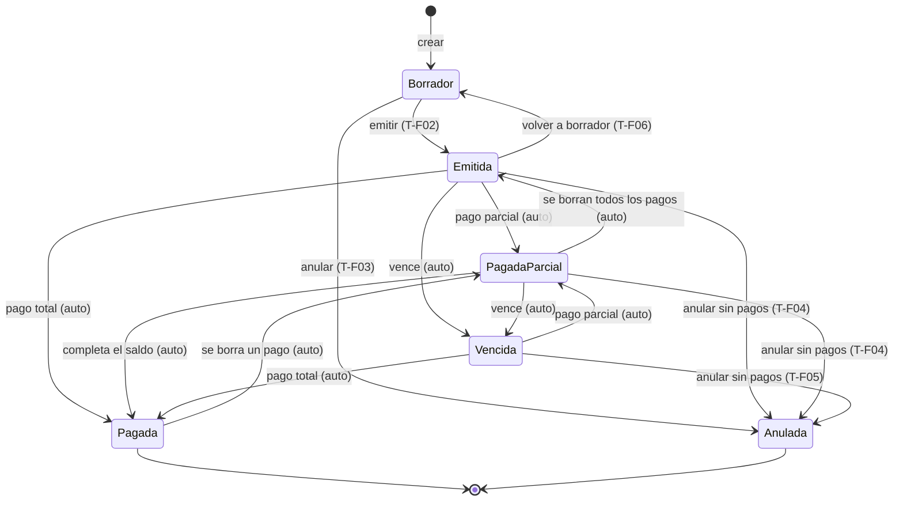
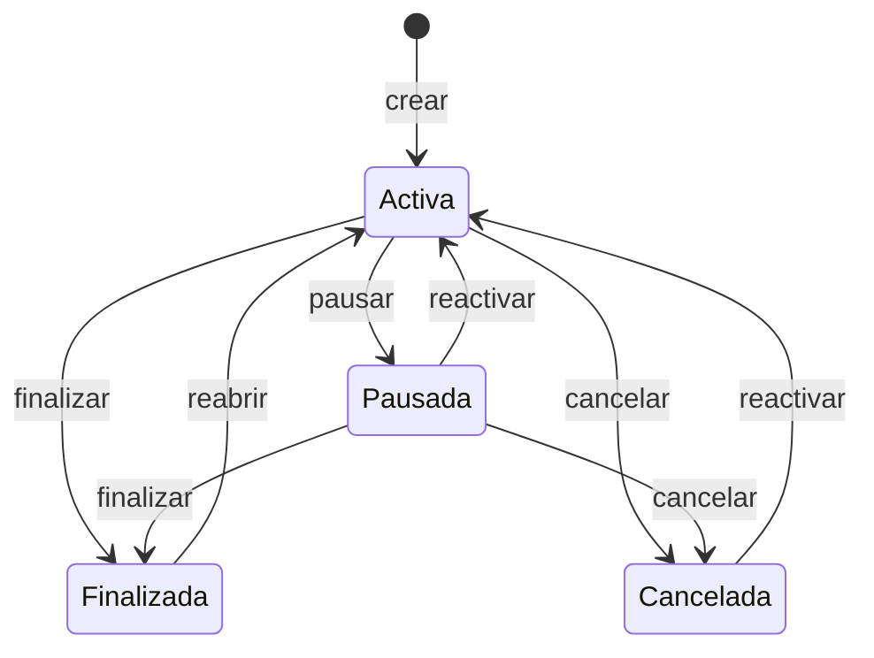
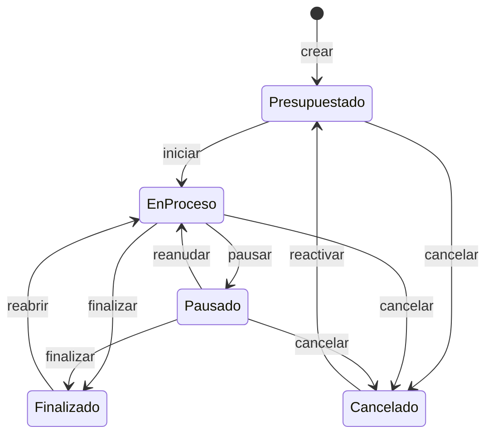

# 08 — Máquinas de estado

> Define `crates/eo-domain/src/state/`. Los enums de estado están en
> [`05-dominio-entidades.md`](./05-dominio-entidades.md) §3; acá se definen **qué transiciones son
> legales**, quién las dispara y qué efectos secundarios tienen.

## 0. El problema que resuelve este documento

**[BUG-LEGADO]** En el sistema anterior los tres estados (`EstadoFactura`, `EstadoObra`,
`EstadoTrabajo`) eran campos libres. Concretamente:

| Síntoma | Evidencia |
| --- | --- |
| No existía **ninguna** validación de transición | no hay una sola comparación de estado previo en toda la capa de servicios |
| Registrar un pago **no** cambiaba el estado de la factura | `PagoFacturaService` guarda el pago y termina; nadie recalcula `Factura.Estado` |
| `Pagada` se ponía a mano desde el desplegable | `FacturaEditViewModel` expone `Enum.GetValues(typeof(EstadoFactura))` sin filtrar |
| `Vencida` nunca se seteaba solo | el dashboard lo compensaba con `Estado == Emitida && Fecha <= hoy - 30d`, o sea que la lógica de vencimiento vivía en el KPI |
| Una factura `Anulada` seguía aceptando pagos | sin guardas |
| Un trabajo `Cancelado` podía volver a `Presupuestado` | sin guardas |
| Los nombres de estado estaban hardcodeados en español | `EstadoTrabajoDisplayConverter` devolvía `"En Curso"`, `"Pausado"`, … saltándose i18n |

El resultado práctico: el estado de una factura no era confiable, así que los informes de deuda
tomaban `Emitida || Vencida` como «impaga» y ignoraban `Pagada` por si estaba mal puesto. Este
documento cierra eso.

## 1. Mecanismo

### 1.1 El trait

```rust
// crates/eo-domain/src/state/mod.rs

/// Un estado que forma parte de una máquina de estados explícita.
pub trait StateMachine: Copy + Eq + Sized + 'static {
    /// Nombre de la entidad, para el mensaje de error. Ej. "Factura".
    const ENTITY: &'static str;

    /// Los estados alcanzables desde `self` por acción **del usuario**.
    /// Las transiciones automáticas (§2.4) no pasan por acá.
    fn allowed_targets(self) -> &'static [Self];

    /// Estados finales: no admiten ninguna transición saliente.
    fn is_terminal(self) -> bool {
        self.allowed_targets().is_empty()
    }

    fn as_key(self) -> &'static str;

    fn can_transition_to(self, to: Self) -> bool {
        self == to || self.allowed_targets().contains(&to)
    }

    /// Única puerta de entrada para cambiar un estado.
    fn transition_to(self, to: Self) -> Result<Self, DomainError> {
        if self.can_transition_to(to) {
            Ok(to)
        } else {
            Err(DomainError::InvalidStateTransition {
                entity: Self::ENTITY,
                from: self.as_key(),
                to: to.as_key(),
            })
        }
    }
}
```

`self == to` se acepta como transición válida (idempotencia): guardar un formulario sin tocar el
desplegable no puede fallar.

### 1.2 Reglas de uso

1. **Ningún** caso de uso asigna `entidad.estado = nuevo` directamente. Siempre
   `entidad.estado = entidad.estado.transition_to(nuevo)?`.
2. El campo `estado` de las entidades es público (doc 05) por simplicidad de mapeo, pero el
   único camino legítimo es `transition_to`. Un test de arquitectura (doc 17) verifica por grep que
   no exista ninguna asignación directa a `.estado =` fuera de `state/` y de los mapeos del
   repositorio.
3. El frontend **sólo ofrece los destinos legales**: el DTO de detalle incluye
   `transicionesPermitidas: string[]` calculado con `allowed_targets()`. El desplegable se puebla con
   esa lista, nunca con todos los valores del enum.
4. Un `DomainError::InvalidStateTransition` se traduce a
   `AppError::Conflict { key: "State.InvalidTransition", params: { entity, from, to } }`.
5. Los nombres visibles de cada estado son claves i18n (§6). Cero literales.

## 2. Factura

### 2.1 Estados

| Estado | Valor | Significado operativo | Editable | Admite pagos |
| --- | --- | --- | --- | --- |
| `Borrador` | `0` | se está armando, no se envió al cliente | sí, todo | no |
| `Emitida` | `1` | enviada al cliente, sin pagos imputados | sí, salvo `numero` y `cliente_id` | sí |
| `PagadaParcial` | `5` | **[NUEVO]** tiene pagos, pero el saldo es `> 0` | sólo `observaciones` y `fecha_vencimiento` | sí |
| `Vencida` | `4` | emitida o parcial, con `fecha_vencimiento` pasada y saldo `> 0` | sólo `observaciones` y `fecha_vencimiento` | sí |
| `Pagada` | `2` | saldo `== 0` | sólo `observaciones` | no |
| `Anulada` | `3` | anulada; no cuenta para nada | no | no |

`PagadaParcial = 5` es nuevo y se agrega al final del enum para no correr los valores existentes en
la base. `Vencida` mantiene el `4` histórico.

**Estados terminales:** `Anulada`. `Pagada` es terminal para el usuario pero no para el sistema: un
pago borrado la devuelve a `PagadaParcial` (T-F08).

### 2.2 Predicados derivados

Estos **no se persisten**, se calculan siempre. Son la autoridad para los informes; el campo
`estado` es para filtrar y mostrar.

```rust
impl Factura {
    /// SUM de los pagos no borrados.
    pub fn total_pagado(&self) -> Money;

    /// total - total_pagado. Puede ser 0 pero nunca negativo (INV-09).
    pub fn saldo(&self) -> Money;

    pub fn esta_paga(&self) -> bool { self.saldo().is_zero() }

    /// Vencida = tiene saldo, no está anulada y la fecha de vencimiento ya pasó.
    /// Si `fecha_vencimiento` es None se usa
    /// `fecha + Business.FacturaDiasVencimientoDefault` (default 30).
    pub fn esta_vencida(&self, hoy: NaiveDate, dias_default: u32) -> bool;

    /// Días de mora. 0 si no está vencida. Alimenta los buckets de antigüedad (doc 06 §4.6).
    pub fn dias_mora(&self, hoy: NaiveDate, dias_default: u32) -> i64;
}
```

**[FIX]** El sistema anterior usaba `Fecha <= hoy - 30 días` como criterio de vencido, es decir la
fecha de **emisión** más 30 días fijos, porque no existía `fecha_vencimiento`. Ahora existe la
columna y el `30` es sólo el default cuando está vacía.

### 2.3 Transiciones del usuario

| ID | Desde | Hasta | Caso de uso | Guardas |
| --- | --- | --- | --- | --- |
| T-F01 | — | `Borrador` | `crear_factura` | estado inicial obligatorio |
| T-F02 | `Borrador` | `Emitida` | `emitir_factura` | `total > 0`; `numero` no vacío; `fecha_vencimiento >= fecha` si está presente |
| T-F03 | `Borrador` | `Anulada` | `anular_factura` | ninguna |
| T-F04 | `Emitida` | `Anulada` | `anular_factura` | `total_pagado == 0`; si tiene pagos hay que borrarlos primero |
| T-F05 | `Vencida` | `Anulada` | `anular_factura` | `total_pagado == 0` |
| T-F06 | `Emitida` | `Borrador` | `volver_a_borrador` | `total_pagado == 0`. Corrige un error de emisión |

`allowed_targets` resultante:

```rust
impl StateMachine for EstadoFactura {
    const ENTITY: &'static str = "Factura";

    fn allowed_targets(self) -> &'static [Self] {
        use EstadoFactura::*;
        match self {
            Borrador      => &[Emitida, Anulada],
            Emitida       => &[Borrador, Anulada],
            PagadaParcial => &[Anulada],   // requiere la guarda de pagos, ver T-F04
            Vencida       => &[Anulada],
            Pagada        => &[],
            Anulada       => &[],
        }
    }
}
```

`Pagada`, `PagadaParcial` y `Vencida` **no** son destinos alcanzables por el usuario: sólo los
alcanzan las transiciones automáticas. `allowed_targets` no los incluye nunca, así que jamás
aparecen en el desplegable de la UI.

### 2.4 Transiciones automáticas

Se ejecutan dentro de la **misma transacción** que la operación que las dispara, por la función:

```rust
/// Recalcula el estado de la factura a partir de sus pagos y de la fecha.
/// Es idempotente. Es el único lugar donde se escriben
/// Pagada / PagadaParcial / Vencida.
pub fn recalcular_estado_factura(
    factura: &mut Factura,
    hoy: NaiveDate,
    dias_default: u32,
) -> Result<(), DomainError>;
```

Lógica exacta, en este orden:

```
si estado ∈ {Borrador, Anulada}            → no se toca nada, return
saldo = total - total_pagado

si saldo == 0                              → estado = Pagada
si no y esta_vencida(hoy, dias_default)    → estado = Vencida
si no y total_pagado > 0                   → estado = PagadaParcial
si no                                      → estado = Emitida
```

| ID | Disparador | Efecto |
| --- | --- | --- |
| T-F07 | `registrar_pago` | `recalcular_estado_factura` |
| T-F08 | `borrar_pago` | `recalcular_estado_factura` (puede volver de `Pagada` a `PagadaParcial` o a `Emitida`) |
| T-F09 | `editar_pago` | `recalcular_estado_factura` |
| T-F10 | `editar_factura` (cambia `total` o `fecha_vencimiento`) | `recalcular_estado_factura` |
| T-F11 | tarea de mantenimiento diaria (doc 13 §6) | `recalcular_estado_factura` de todas las facturas con saldo, para que `Vencida` aparezca sin necesidad de tocar la factura |

**Una factura `Borrador` nunca cambia sola.** Y `recalcular_estado_factura` nunca saca a una factura
de `Anulada`: anular es una decisión humana definitiva.

Como los informes usan los predicados de §2.2 y no el campo, si la tarea T-F11 no corrió los KPIs
siguen siendo correctos; sólo el color del chip en la grilla quedaría atrasado hasta el próximo
recálculo. Esto es deliberado: ningún número depende de que un job haya corrido.

### 2.5 Diagrama



### 2.6 Efectos de `Anulada`

Una factura anulada:

- no aparece en cuenta corriente ni en antigüedad de deuda (doc 06 §4.5 y §4.6),
- no suma a ningún KPI de facturación,
- no admite pagos nuevos ni edición de importes,
- **no** se borra lógicamente: sigue existiendo y visible con su chip rojo, porque el número de
  factura ya fue usado y tiene que quedar el rastro.

Filtro canónico de «factura impaga» para todos los informes:

```sql
estado NOT IN (0 /*Borrador*/, 3 /*Anulada*/) AND saldo > 0
```

## 3. Obra

### 3.1 Estados

| Estado | Valor | Significado | Admite trabajos nuevos | Admite movimientos nuevos |
| --- | --- | --- | --- | --- |
| `Activa` | `0` | en ejecución | sí | sí |
| `Pausada` | `1` | detenida temporalmente | no | sí (siguen entrando gastos) |
| `Finalizada` | `2` | terminada y cerrada | no | sí, con advertencia |
| `Cancelada` | `3` | se cayó | no | no |

Estado inicial: `Activa`. Terminales: ninguno. Una obra finalizada puede reabrirse: en obra pasa
seguido.

### 3.2 Transiciones

| ID | Desde | Hasta | Caso de uso | Guardas |
| --- | --- | --- | --- | --- |
| T-O01 | — | `Activa` | `crear_obra` | |
| T-O02 | `Activa` | `Pausada` | `pausar_obra` | |
| T-O03 | `Pausada` | `Activa` | `reactivar_obra` | |
| T-O04 | `Activa` | `Finalizada` | `finalizar_obra` | ver §3.3 |
| T-O05 | `Pausada` | `Finalizada` | `finalizar_obra` | ver §3.3 |
| T-O06 | `Finalizada` | `Activa` | `reabrir_obra` | requiere confirmación explícita en la UI |
| T-O07 | `Activa` | `Cancelada` | `cancelar_obra` | |
| T-O08 | `Pausada` | `Cancelada` | `cancelar_obra` | |
| T-O09 | `Cancelada` | `Activa` | `reactivar_obra` | requiere confirmación explícita |

```rust
impl StateMachine for EstadoObra {
    const ENTITY: &'static str = "Obra";

    fn allowed_targets(self) -> &'static [Self] {
        use EstadoObra::*;
        match self {
            Activa     => &[Pausada, Finalizada, Cancelada],
            Pausada    => &[Activa, Finalizada, Cancelada],
            Finalizada => &[Activa],
            Cancelada  => &[Activa],
        }
    }
}
```

Prohibidas explícitamente: `Finalizada → Pausada`, `Finalizada → Cancelada`,
`Cancelada → Finalizada`, `Cancelada → Pausada`. Para cualquiera de esas hay que pasar por `Activa`,
lo que fuerza una decisión consciente.

### 3.3 Guarda de finalización y cascada

Al finalizar una obra con trabajos abiertos (`Presupuestado`, `EnProceso` o `Pausado`) el caso de
uso **no falla**: devuelve el conteo para que la UI pregunte, y el usuario elige.

```
finalizar_obra(id, cascada: bool):
    abiertos = trabajos de la obra en {Presupuestado, EnProceso, Pausado}
    si !abiertos.is_empty() y !cascada:
        → Conflict  key: "State.Obra.TieneTrabajosAbiertos"  params: { count }
    obra.estado = obra.estado.transition_to(Finalizada)?
    si cascada:
        para cada trabajo abierto: trabajo.estado = trabajo.estado.transition_to(Finalizado)?
    obra.fecha_fin = obra.fecha_fin.unwrap_or(hoy)
```

La UI muestra: «Esta obra tiene {count} trabajos abiertos. ¿Finalizarlos también?» con las opciones
Cancelar / Finalizar sólo la obra / Finalizar todo. Sólo la tercera manda `cascada = true`; la
segunda no existe, porque dejar trabajos abiertos en una obra cerrada es justo la inconsistencia que
se quiere evitar. Queda entonces: Cancelar o Finalizar todo.

Cancelar una obra en cascada cancela sus trabajos abiertos con la misma mecánica y la clave
`State.Obra.TieneTrabajosAbiertos`.

### 3.4 Diagrama



## 4. Trabajo

### 4.1 Estados

| Estado | Valor | Significado | Admite certificar |
| --- | --- | --- | --- |
| `Presupuestado` | `0` | cotizado, sin arrancar | no |
| `EnProceso` | `1` | en ejecución | sí |
| `Pausado` | `2` | detenido | sí (se certifica lo hecho antes de parar) |
| `Finalizado` | `3` | terminado | no |
| `Cancelado` | `4` | se cayó | no |

Estado inicial: `Presupuestado`. Cubre RC-08 textualmente («si están finalizados o no, si están
pausados, si están en proceso»).

### 4.2 Transiciones

| ID | Desde | Hasta | Caso de uso | Guardas |
| --- | --- | --- | --- | --- |
| T-T01 | — | `Presupuestado` | `crear_trabajo` | la obra no puede estar `Cancelada` |
| T-T02 | `Presupuestado` | `EnProceso` | `iniciar_trabajo` | la obra tiene que estar `Activa`; setea `fecha_inicio = hoy` si está vacía |
| T-T03 | `Presupuestado` | `Cancelado` | `cancelar_trabajo` | |
| T-T04 | `EnProceso` | `Pausado` | `pausar_trabajo` | |
| T-T05 | `Pausado` | `EnProceso` | `reanudar_trabajo` | la obra tiene que estar `Activa` |
| T-T06 | `EnProceso` | `Finalizado` | `finalizar_trabajo` | setea `fecha_fin = hoy` si está vacía |
| T-T07 | `Pausado` | `Finalizado` | `finalizar_trabajo` | ídem |
| T-T08 | `EnProceso` | `Cancelado` | `cancelar_trabajo` | |
| T-T09 | `Pausado` | `Cancelado` | `cancelar_trabajo` | |
| T-T10 | `Finalizado` | `EnProceso` | `reabrir_trabajo` | la obra tiene que estar `Activa`; confirmación explícita; limpia `fecha_fin` |
| T-T11 | `Cancelado` | `Presupuestado` | `reactivar_trabajo` | confirmación explícita |

```rust
impl StateMachine for EstadoTrabajo {
    const ENTITY: &'static str = "Trabajo";

    fn allowed_targets(self) -> &'static [Self] {
        use EstadoTrabajo::*;
        match self {
            Presupuestado => &[EnProceso, Cancelado],
            EnProceso     => &[Pausado, Finalizado, Cancelado],
            Pausado       => &[EnProceso, Finalizado, Cancelado],
            Finalizado    => &[EnProceso],
            Cancelado     => &[Presupuestado],
        }
    }
}
```

Prohibidas: `Presupuestado → Finalizado` (algo que nunca arrancó no puede estar terminado; si se
facturó sin registrar el proceso, hay que pasar por `EnProceso`), `Finalizado → Cancelado`,
`Cancelado → EnProceso` y `Cancelado → Finalizado`.

### 4.3 Guarda de estado de la obra

Las transiciones que ponen un trabajo en marcha (T-T02, T-T05, T-T10) exigen
`obra.estado == Activa`:

```
si obra.estado != Activa:
    → Conflict  key: "State.Trabajo.ObraNoActiva"  params: { estadoObra }
```

Finalizar o cancelar un trabajo **no** mira el estado de la obra: cerrar cosas siempre se permite.

### 4.4 Guarda de finalización con certificación incompleta

Al finalizar un trabajo cuyas órdenes tienen ítems con acumulado `< 100 %`, mismo patrón que §3.3:

```
finalizar_trabajo(id, forzar: bool):
    incompletos = ítems de las órdenes del trabajo con porcentaje_acumulado < 100
    si !incompletos.is_empty() y !forzar:
        → Conflict  key: "State.Trabajo.CertificacionIncompleta"
                    params: { count, avancePromedio }
```

Es una advertencia, no un bloqueo: un trabajo puede cerrarse con menos del 100 % certificado porque
se recortó el alcance.

### 4.5 Diagrama



## 5. Entidades sin enum de estado pero con ciclo de vida

Estas no tienen campo `estado`, pero sí reglas de mutabilidad que hay que hacer cumplir en el caso
de uso. Se documentan acá porque son del mismo tipo de regla.

### 5.1 Certificado — append-only

Un certificado es un documento que se entregó al cliente. Una vez creado:

| Acción | Permitido | Clave del error |
| --- | --- | --- |
| Editar sus ítems o porcentajes | **no** | `State.Certificado.Inmutable` |
| Editar `observaciones` | sí | — |
| Borrar (lógico) | sólo si es el de `numero` más alto de su orden | `State.Certificado.NoEsUltimo` |
| Crear uno nuevo | sí, con `numero = max + 1` | — |

El motivo: los porcentajes acumulados de todos los certificados posteriores dependen de los
anteriores. Editar el N.º 2 cuando ya existe el N.º 3 rompe el acumulado en silencio. Si hay que
corregir, se borra desde el último hacia atrás. Esto satisface INV-15.

### 5.2 Liquidación — confirmación congela

| Acción | Permitido | Clave del error |
| --- | --- | --- |
| Editar importes de una liquidación con `pdf_generado_at` no nulo | **no** | `State.Liquidacion.YaEntregada` |
| Editar `observaciones` | sí | — |
| Borrar (lógico) | sí; libera los adelantos consumidos | — |

Al borrar una liquidación se borran sus filas de `liquidacion_adelantos`, con lo cual esos adelantos
vuelven a estar disponibles para descontar (regla 5.5 del doc 07).

### 5.3 Asistencia — sin estados, con ciclo de valor

`TipoJornada` **no** es una máquina de estados: es un valor que rota con cada click en la grilla. El
ciclo `Completa → Media → Falta → FaltaJustificada → Feriado → Completa` está en doc 05 §3.1 y su
comportamiento de UI en [`09-modulos-funcionales.md`](./09-modulos-funcionales.md). Cualquier valor
puede pasar a cualquier otro: no hay guardas.

Única regla: no se puede cargar asistencia de un empleado con `fecha_egreso` anterior a la fecha del
registro → `Conflict` con `State.Asistencia.EmpleadoEgresado`.

### 5.4 Movimiento — inmutable si está en una liquidación

Un movimiento de adelanto ya consumido por una liquidación no se puede editar ni borrar:

```
si existe fila en liquidacion_adelantos con movimiento_id = X
   y la liquidación no está borrada:
   → Conflict  key: "State.Movimiento.EnLiquidacion"  params: { liquidacionId }
```

## 6. Claves i18n

### 6.1 Nombres de estado

**[FIX]** Reemplazan los literales hardcodeados de `EstadoTrabajoDisplayConverter`
(`"En Curso"`, `"Pausado"`, …) y de `EstadoObraDisplayConverter`.

```json
{
  "State": {
    "Factura": {
      "Borrador": "Borrador",
      "Emitida": "Emitida",
      "PagadaParcial": "Pago parcial",
      "Pagada": "Pagada",
      "Vencida": "Vencida",
      "Anulada": "Anulada"
    },
    "Obra": {
      "Activa": "Activa",
      "Pausada": "Pausada",
      "Finalizada": "Finalizada",
      "Cancelada": "Cancelada"
    },
    "Trabajo": {
      "Presupuestado": "Presupuestado",
      "EnProceso": "En curso",
      "Pausado": "Pausado",
      "Finalizado": "Finalizado",
      "Cancelado": "Cancelado"
    }
  }
}
```

La clave se arma como `State.{entity}.{variant}` y la devuelve `as_key()`.

### 6.2 Errores de transición

| Clave | Params | Cuándo |
| --- | --- | --- |
| `State.InvalidTransition` | `entity`, `from`, `to` | genérico de `transition_to` |
| `State.Factura.RequiereTotalPositivo` | — | T-F02 con `total == 0` |
| `State.Factura.TienePagos` | `count` | T-F04/T-F05/T-F06 con pagos imputados |
| `State.Factura.NoAdmitePagos` | `estado` | pago sobre `Borrador`, `Pagada` o `Anulada` |
| `State.Obra.TieneTrabajosAbiertos` | `count` | T-O04/T-O05/T-O07/T-O08 sin cascada |
| `State.Trabajo.ObraNoActiva` | `estadoObra` | T-T02/T-T05/T-T10 |
| `State.Trabajo.CertificacionIncompleta` | `count`, `avancePromedio` | T-T06/T-T07 sin `forzar` |
| `State.Certificado.Inmutable` | `numero` | editar ítems de un certificado emitido |
| `State.Certificado.NoEsUltimo` | `numero`, `ultimo` | borrar un certificado intermedio |
| `State.Liquidacion.YaEntregada` | `fecha` | editar importes tras generar el PDF |
| `State.Asistencia.EmpleadoEgresado` | `fechaEgreso` | asistencia posterior al egreso |
| `State.Movimiento.EnLiquidacion` | `liquidacionId` | editar/borrar un adelanto consumido |

Los valores de `from`, `to`, `estado` y `estadoObra` que llegan en los params son **claves** de §6.1,
no texto: el frontend las traduce antes de interpolar.

### 6.3 Etiquetas de las acciones

Cada transición del usuario tiene su botón, con su clave. Ejemplo del grupo de factura:
`Actions.Factura.Emitir`, `Actions.Factura.Anular`, `Actions.Factura.VolverBorrador`. El catálogo
completo está en [`14-configuracion-e-i18n.md`](./14-configuracion-e-i18n.md).

## 7. Cómo se expone al frontend

Todo DTO de detalle de una entidad con estado incluye:

```ts
interface EstadoInfo {
  /** Valor actual. */
  actual: string;              // "Emitida"
  /** Clave i18n del nombre visible. */
  clave: string;               // "State.Factura.Emitida"
  /** Destinos legales por acción del usuario, ya filtrados por las guardas
   *  que se pueden evaluar sin más consultas. */
  transicionesPermitidas: TransicionPermitida[];
  /** true si ninguna acción de usuario está disponible. */
  esTerminal: boolean;
}

interface TransicionPermitida {
  destino: string;             // "Anulada"
  clave: string;               // "State.Factura.Anulada"
  accion: string;              // "Actions.Factura.Anular"
  /** Si requiere confirmación explícita del usuario. */
  requiereConfirmacion: boolean;
  /** Clave del mensaje de confirmación, si aplica. */
  confirmacionClave?: string;
}
```

El frontend **no** replica las tablas de transiciones. Si aparece una transición nueva, alcanza con
cambiar `allowed_targets` en Rust. Un `select` de estados poblado desde el enum completo es un bug de
revisión: no debe existir en ninguna vista.

## 8. Tests obligatorios

En `crates/eo-domain/tests/state/`:

| Test | Qué verifica |
| --- | --- |
| `transiciones_legales_exhaustivas` | para cada estado, `allowed_targets()` es **exactamente** la lista de este documento |
| `transiciones_ilegales_fallan` | recorre el producto cartesiano de estados y verifica que todo par que no está en la tabla devuelve `InvalidStateTransition` |
| `transicion_a_si_mismo_es_ok` | `X.transition_to(X)` siempre `Ok` |
| `terminales_no_tienen_salida` | `Anulada`, y ningún estado de obra o trabajo |
| `as_key_es_unico_y_estable` | ninguna clave repetida; coincide con el nombre de la variante |

En `crates/eo-application/tests/state/`, con SQLite en memoria:

| Test | Qué verifica |
| --- | --- |
| `pago_parcial_pone_pagada_parcial` | factura de 1000, pago de 400 → `PagadaParcial`, saldo 600 |
| `pago_total_pone_pagada` | dos pagos que suman el total → `Pagada`, saldo 0 |
| `borrar_pago_vuelve_atras` | desde `Pagada`, borrar un pago → `PagadaParcial` |
| `borrar_todos_los_pagos_vuelve_a_emitida` | → `Emitida`, no `Borrador` |
| `factura_borrador_no_admite_pagos` | `Conflict State.Factura.NoAdmitePagos` |
| `factura_anulada_no_admite_pagos` | ídem |
| `anular_con_pagos_falla` | `Conflict State.Factura.TienePagos` con `count` |
| `vencimiento_se_calcula_sin_columna` | sin `fecha_vencimiento`, vence a los 30 días de `fecha` |
| `recalculo_es_idempotente` | llamarlo dos veces no cambia nada |
| `recalculo_no_toca_borrador_ni_anulada` | |
| `finalizar_obra_con_trabajos_abiertos_sin_cascada_falla` | `Conflict` con el conteo correcto |
| `finalizar_obra_con_cascada_finaliza_trabajos` | todos los abiertos quedan `Finalizado` |
| `iniciar_trabajo_de_obra_pausada_falla` | `Conflict State.Trabajo.ObraNoActiva` |
| `finalizar_trabajo_de_obra_pausada_funciona` | cerrar siempre se puede |
| `editar_certificado_intermedio_falla` | `State.Certificado.Inmutable` |
| `borrar_certificado_intermedio_falla` | `State.Certificado.NoEsUltimo` |
| `borrar_liquidacion_libera_adelantos` | el adelanto vuelve a estar disponible |
| `editar_adelanto_liquidado_falla` | `State.Movimiento.EnLiquidacion` |
