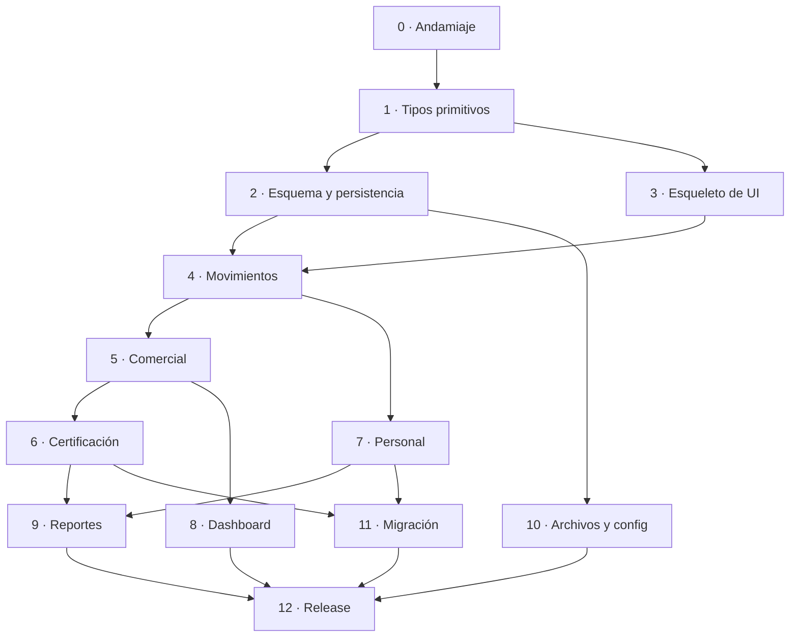

# 19 · Roadmap de implementación

Orden en que se construye el sistema. Las fases están ordenadas por **dependencia técnica**, no por
importancia de negocio: cada una necesita que la anterior esté terminada.

Cada fase tiene un **criterio de terminado verificable**. No se avanza a la siguiente sin cumplirlo.
"Verificable" quiere decir que existe un comando que lo comprueba, o un checklist con pasos concretos;
no "está funcionando".

---

## Cómo leer esto

| Columna | Significado |
| --- | --- |
| Entregable | qué existe al final de la fase |
| Documentos | los que hay que leer para implementarla |
| Criterio de terminado | cómo se verifica |

Al final de cada fase se hace un commit y el checklist de §13 tiene que pasar completo.

---

## Fase 0 · Andamiaje

**Objetivo**: que el proyecto compile, arranque y muestre una ventana vacía.

| Entregable | |
| --- | --- |
| Workspace de Rust con los 5 crates vacíos, cada uno compilando | |
| `src-tauri` con `main.rs`, `tauri.conf.json` y un comando `ping` | |
| Frontend con Vite, Vue, Router, Pinia, i18n, PrimeVue, Tailwind y Shadcn-Vue configurados | |
| `tokens.css` completo con los dos temas | |
| CI de doc 18 §2.1 corriendo en verde | |
| `scripts/sync-version.mjs` y `scripts/check-i18n.mjs` | |

**Documentos**: [`02`](./02-arquitectura.md), [`16`](./16-frontend.md) §1-3,
[`18`](./18-devops.md).

**Criterio de terminado**:

1. `cargo build --workspace` y `cargo clippy --workspace --all-targets -- -D warnings` sin salida.
2. `pnpm tauri:dev` abre una ventana que muestra el resultado del comando `ping`.
3. `pnpm typecheck` y `pnpm lint` limpios.
4. El CI pasa los cuatro jobs.
5. Cambiar el tema de claro a oscuro con un botón provisorio cambia los colores de la ventana.
6. `node scripts/sync-version.mjs --check` pasa.

El punto 5 verifica que los tokens y la integración con PrimeVue estén bien antes de escribir una
sola pantalla. Descubrir que el tema no funciona con quince pantallas hechas cuesta mucho más.

---

## Fase 1 · Tipos primitivos

**Objetivo**: `Money`, `Decimal4` y el manejo de fechas, con su suite completa. Nada más.

| Entregable | |
| --- | --- |
| `Money(i64)` y `Decimal4(i64)` con la API de doc 04 §1.3 | |
| Serialización a string de 4 decimales, en los dos sentidos | |
| Redondeo half-away-from-zero | |
| `civil_to_utc` / `utc_to_civil` y el parseo de fechas de entrada | |
| Puerto `Clock` con la implementación real y la fija de test | |
| `Result`, `PagedResult`, `PagedQuery` | |
| `AppError`, `DomainError`, `ValidationErrors`, `FieldError` | |
| Frontend: `useMoney`, `useDateFormat`, `MoneyText`, `MoneyInput`, `DateText`, `DateInput` | |

**Documentos**: [`04`](./04-dinero-fechas-y-tipos.md), [`16`](./16-frontend.md) §4.

**Criterio de terminado**:

1. Todos los tests de doc 17 §2.1 y §2.2 pasan, incluidos los tres de `proptest`.
2. Cobertura de `eo-domain` sobre estos tipos ≥ 95 %.
3. Los tests de frontend de `useMoney` y `MoneyInput` pasan.
4. Un test de ida y vuelta completo: un `Money` de Rust, serializado, enviado a TypeScript,
   formateado, editado en un `MoneyInput`, devuelto y deserializado, es igual al original.

Esta fase es corta y no se puede saltear. Todo el resto del sistema depende de que estos tipos estén
bien, y un error acá aparece como un centavo de diferencia en un reporte seis meses después.

---

## Fase 2 · Esquema y persistencia base

**Objetivo**: la base de datos con sus 21 tablas, y el patrón de repositorio funcionando para una
entidad.

| Entregable | |
| --- | --- |
| `eo-migration` con las migraciones del DDL completo de doc 03 | |
| Semillas: 4 tipos de movimiento y los tipos de concepto de pago | |
| Entidades SeaORM de las 21 tablas | |
| Trait `Repository<T>` genérico con soft delete, paginación y `row_version` | |
| `UnitOfWork` sobre transacciones de SeaORM | |
| Un repositorio concreto completo: `TipoMovimientoRepository` | |
| Comando Tauri `listar_tipos_movimiento` y una pantalla que lo muestra en un `DataTable` | |

**Documentos**: [`03`](./03-modelo-de-datos.md), [`04`](./04-dinero-fechas-y-tipos.md) §4-5,
[`02`](./02-arquitectura.md) §7.

**Criterio de terminado**:

1. Todos los tests de doc 17 §4.1 y §4.2 pasan.
2. `todo_on_delete_coincide_con_el_documento` pasa: las 20 claves foráneas con el `ON DELETE` de
   doc 03 §4.
3. `esquema_coincide_con_el_documento`: el snapshot del `sqlite_master` está revisado a mano contra
   doc 03.
4. `pnpm tauri:dev` muestra los 4 tipos de movimiento de sistema en una grilla.
5. Borrar lógicamente un tipo lo saca de la grilla y la fila sigue en la base.

El punto 4 es la primera vez que el sistema recorre las cinco capas de punta a punta. A partir de acá
cada módulo es repetir el patrón.

---

## Fase 3 · El esqueleto de la interfaz

**Objetivo**: la cáscara de navegación y los composables compartidos. Sin módulos de negocio todavía.

| Entregable | |
| --- | --- |
| `AppShell`, `AppSidebar`, `AppHeader`, `AppStatusBar` | |
| Las 15 rutas de doc 10 §2, todas resolviendo a una vista con su encabezado | |
| `useServerTable` completo, con debounce, cancelación y persistencia | |
| `useCrudDrawer`, `useConfirmDelete`, `useApiError`, `useShortcuts` | |
| `DataGrid`, `ListState`, `PageHeader`, `FilterBar`, `CrudDrawer`, `StatePill`, `PercentBar` | |
| `CommandPalette` y los atajos globales de doc 10 §4 | |
| Migas de pan | |
| Toast y confirmación globales | |
| `es.json` y `en.json` con las claves comunes | |
| Los 14 tests de arquitectura de doc 16 §8 | |

**Documentos**: [`09`](./09-modulos-funcionales.md) §1, [`10`](./10-navegacion-y-atajos.md),
[`16`](./16-frontend.md).

**Criterio de terminado**:

1. Las 15 rutas se abren desde el menú y desde la paleta de comandos.
2. Los atajos globales funcionan, y `Escape` respeta la cascada de doc 10 §4.3.
3. Los tests de `useServerTable` de doc 17 §6.1 pasan, en particular debounce y cancelación.
4. Los 14 tests de arquitectura pasan.
5. La aplicación en inglés no muestra ninguna etiqueta en español.
6. A 1024×768 ninguna pantalla tiene scroll horizontal.

Escribir estos composables **antes** de las pantallas es deliberado. Si se escriben después, la
primera pantalla define el patrón por accidente y las demás lo copian con variaciones.

---

## Fase 4 · Movimientos

**Objetivo**: el primer módulo completo. Es el más complejo de los CRUD y el único con filtrado y
paginación de servidor, así que sirve de plantilla para todos los demás.

| Entregable | |
| --- | --- |
| Entidad `Movimiento` con `total()` | |
| DTOs, validación y mapeo | |
| Casos de uso: crear, editar, borrar, obtener, listar paginado con filtros | |
| Repositorio con el filtrado de servidor de doc 09 §3.2 | |
| Comandos Tauri del módulo | |
| `MovimientosView` y `MovimientoForm` con los campos de doc 09 §3.2 | |
| Módulos de apoyo: `TiposMovimientoView`, `CategoriasView` | |

**Documentos**: [`05`](./05-dominio-entidades.md) §2.13, [`06`](./06-casos-de-uso-y-formulas.md) §3,
[`07`](./07-validaciones.md), [`09`](./09-modulos-funcionales.md) §3.2, §3.13 y §3.14,
[`11`](./11-contratos-tauri.md).

**Criterio de terminado**:

1. Alta, edición, borrado y listado funcionan.
2. Los filtros de texto, rango de fechas, tipo, categoría, cliente y trabajo funcionan **en el
   servidor**, con debounce de 300 ms.
3. Los cinco tamaños de página funcionan, incluido `0` = todos.
4. El total de la página viene del backend y coincide con la suma de las filas visibles.
5. Un error de validación se muestra en el campo, sin toast, y el drawer no se cierra.
6. Cobertura de los casos de uso del módulo ≥ 85 %.
7. Categorías jerárquicas: crear una subcategoría y verla anidada.

El punto 4 verifica la regla de doc 16 §4.1: el frontend no suma importes.

---

## Fase 5 · Comercial

**Objetivo**: clientes, obras, trabajos y facturación con sus pagos.

| Entregable | |
| --- | --- |
| CRUD de `Cliente` con N contactos | |
| CRUD de `Obra` con número único global | |
| CRUD de `Trabajo` con su estado | |
| CRUD de `Factura` con `total = subtotal + iva` | |
| `PagoFactura` con la reclasificación de estado de doc 08 §2 | |
| Máquinas de estado de factura, obra y trabajo | |
| Vistas de detalle de cliente y obra, con sus pestañas | |

**Documentos**: [`05`](./05-dominio-entidades.md), [`06`](./06-casos-de-uso-y-formulas.md) §4,
[`08`](./08-maquinas-de-estado.md), [`09`](./09-modulos-funcionales.md) §3.3 a §3.5 y §3.8.

**Criterio de terminado**:

1. Un cliente con tres contactos, uno marcado como principal, y no se puede marcar dos.
2. Intentar crear una obra con un número repetido da un error de validación claro, incluso si la obra
   que tenía ese número está borrada.
3. Los tests de transición de estado de doc 17 §2.4 pasan, con el test de completitud.
4. Registrar un pago parcial deja la factura en `PagadaParcial`; completarlo la deja en `Pagada`.
5. No se puede borrar un cliente que tiene obras, y el mensaje dice por qué.
6. Borrar un cliente sin obras borra sus contactos en cascada.

El punto 2 es específico porque el índice único de `obras.numero` **no** está filtrado por
`is_deleted` (doc 03 §3.6), y el mensaje de error tiene que explicarlo o el usuario no entiende nada.

---

## Fase 6 · Certificación

**Objetivo**: órdenes de trabajo, ítems y el historial de certificados. Es el módulo con la fórmula
más delicada.

| Entregable | |
| --- | --- |
| CRUD de `OrdenTrabajo` con ajuste UOCRA y otros descuentos | |
| CRUD de `OrdenTrabajoItem` con cantidad, precio, unidad y porcentajes | |
| Emisión de un `Certificado` con sus `CertificadoItem` | |
| Fórmulas de subtotal actual y acumulado | |
| Validación de acumulado ≤ 100 | |
| `CertificadosView` con el histórico por orden | |

**Documentos**: [`06`](./06-casos-de-uso-y-formulas.md) §5, [`03`](./03-modelo-de-datos.md) §3.18-3.19,
[`09`](./09-modulos-funcionales.md) §3.6 y §3.7.

**Criterio de terminado**:

1. Los tests de certificación de doc 17 §3.4 pasan, incluido que el ajuste UOCRA se aplique como
   **porcentaje**.
2. Emitir un certificado congela los porcentajes del momento en `certificado_items`.
3. Emitir un segundo certificado sobre la misma orden arranca desde el acumulado del primero.
4. Intentar certificar por encima del 100 % acumulado se rechaza con el mensaje traducido.
5. El histórico muestra los dos certificados con sus totales y no se pisan.
6. RC-10 cumplido: se puede reimprimir un certificado anterior y sale idéntico al original.

El punto 6 es el requerimiento explícito del cliente que el sistema anterior no cumplía. Se verifica
generando el PDF de un certificado, emitiendo otro, y regenerando el primero: los dos archivos tienen
que tener el mismo contenido.

---

## Fase 7 · Personal

**Objetivo**: empleados, asistencia y liquidaciones. La fase con el algoritmo más largo del sistema.

| Entregable | |
| --- | --- |
| CRUD de `Empleado` con tarifa y frecuencia | |
| Grilla de asistencia con el ciclo de click de doc 09 §3.10 y upsert inmediato | |
| Tabla `feriados` y la sincronización con la API | |
| Algoritmo de sugerencia de liquidación, con sus tres ramas | |
| Cascada de multiplicadores feriado > domingo > sábado | |
| `liquidacion_adelantos`: vinculación explícita de cada adelanto | |
| Wizard de liquidación en 3 pasos, con preview editable | |

**Documentos**: [`06`](./06-casos-de-uso-y-formulas.md) §6 y §8,
[`09`](./09-modulos-funcionales.md) §3.9 a §3.11,
[`03`](./03-modelo-de-datos.md) §3.20-3.21, [`13`](./13-servicios-externos-y-archivos.md) §3.

**Criterio de terminado**:

1. Los 9 tests de sugerencia de liquidación de doc 17 §3.4 pasan.
2. El test de referencia de doc 17 §7.2, con la cuenta desarrollada en el comentario, da exactamente
   el valor esperado.
3. La grilla de asistencia recorre el ciclo completo con clicks y persiste cada cambio.
4. Cargar dos veces la asistencia del mismo día y empleado no crea dos filas.
5. Un domingo feriado usa el multiplicador de feriado, no el de domingo.
6. INV-05 verificado: un adelanto ya descontado en una liquidación no aparece en otra, y el índice
   único lo impide a nivel de base.
7. El wizard permite editar el preview antes de confirmar, y lo que se guarda es lo editado.
8. La aplicación funciona con la API de feriados caída, usando los de la tabla local.

---

## Fase 8 · Dashboard y análisis comercial

**Objetivo**: los agregados. No hay entidades nuevas; es lectura.

| Entregable | |
| --- | --- |
| KPIs del dashboard con la comparación contra el período anterior | |
| Gráficos con `Chart` de PrimeVue | |
| Rentabilidad por obra y por trabajo | |
| Cuenta corriente por cliente | |
| Antigüedad de deuda con los 4 buckets | |
| Cotización del dólar en la barra de estado | |

**Documentos**: [`06`](./06-casos-de-uso-y-formulas.md) §4.5, §4.6, §7 y §9,
[`09`](./09-modulos-funcionales.md) §3.1 y §3.3, [`13`](./13-servicios-externos-y-archivos.md) §2.

**Criterio de terminado**:

1. Los tests de dashboard, rentabilidad, cuenta corriente y antigüedad de doc 17 §3.4 pasan.
2. Los bordes de los buckets se verifican en 30, 31, 60, 61, 90 y 91 días.
3. Un margen con ingresos en cero da `0`, no una división por cero.
4. El dashboard carga en menos de un segundo con 5.000 movimientos.
5. Con las dos APIs externas caídas el dashboard se muestra completo, sin la cotización.
6. Ningún importe del dashboard se calcula en el frontend.

---

## Fase 9 · Reportes y exportaciones

**Objetivo**: los archivos que salen del sistema.

| Entregable | |
| --- | --- |
| Exportación de movimientos a PDF, XLSX, DOCX, CSV y JSON | |
| PDF de liquidación con los adelantos fechados uno por uno | |
| PDF de certificado en landscape con sus 9 columnas | |
| Contratista y logo desde configuración | |
| Centro de reportes con el diálogo de guardado | |

**Documentos**: [`12`](./12-reportes-y-exportaciones.md),
[`14`](./14-configuracion-e-i18n.md) §2.12.

**Criterio de terminado**:

1. Los tests de reportes de doc 17 §4.4 pasan.
2. RC-02 cumplido: el PDF de liquidación lista cada adelanto con su fecha y concepto.
3. Ningún literal de contratista ni de logo en el código; salen de configuración.
4. Los cinco formatos de movimientos se generan y abren en su aplicación nativa.
5. Exportar una lista vacía produce un archivo válido.
6. Exportar 5.000 movimientos a XLSX tarda menos de 10 segundos.
7. Los totales de cada reporte coinciden con lo que muestra la pantalla.

El punto 7 se verifica a mano, comparando pantalla y archivo. Es el control que detecta un error de
formateo en el reporte.

---

## Fase 10 · Archivos, backup y configuración

**Objetivo**: lo que rodea a los datos.

| Entregable | |
| --- | --- |
| Adjuntos polimórficos con whitelist de MIME y límite de tamaño | |
| Papelera de adjuntos | |
| Backup con `VACUUM INTO` y verificación de integridad | |
| Restauración que cierra la conexión antes de copiar | |
| Export e import JSON con la allowlist de tablas | |
| `ConfiguracionView` con todas las secciones de doc 14 §2 | |
| Enlaces de email y WhatsApp | |

**Documentos**: [`13`](./13-servicios-externos-y-archivos.md),
[`14`](./14-configuracion-e-i18n.md).

**Criterio de terminado**:

1. Los tests de doc 17 §4.5 pasan, incluidos los tres de seguridad.
2. Un adjunto con nombre `../../x.pdf` no escapa del directorio de adjuntos.
3. Un backup se crea, se restaura, y los datos están completos.
4. Un `config.json` corrupto no impide arrancar: se renombra y se usa el default.
5. Cambiar el idioma en configuración cambia la interfaz sin reiniciar.
6. Cambiar los separadores de miles y decimales cambia el formato de todos los importes.
7. El enlace de WhatsApp abre el cliente con el mensaje armado desde la plantilla de i18n.

---

## Fase 11 · Migración de datos

**Objetivo**: el binario `eo-import-legacy`, con su suite y sus fixtures.

| Entregable | |
| --- | --- |
| `eo-import-legacy` con las 7 fases de doc 15 §2 | |
| Detección de escala y el tratamiento especial de `PagosFactura.Monto` | |
| Derivación de certificados, adelantos, contactos y feriados | |
| Reclasificación de estados de factura | |
| Verificación post-import completa | |
| Reporte JSON | |
| Los 4 fixtures de doc 15 §8.1 | |

**Documentos**: [`15`](./15-migracion-de-datos.md).

**Criterio de terminado**:

1. Los 23 tests de doc 15 §8 pasan.
2. `todas_las_columnas_escaladas_estan_mapeadas` y `todas_las_tablas_del_origen_estan_mapeadas` pasan.
3. Un import sobre `legacy_dirty.db` produce un reporte con todas las advertencias esperadas y una
   base consistente.
4. Un import sobre la **base real del usuario**, en `--dry-run`, produce un reporte sin problemas
   bloqueantes.
5. Las 10 invariantes de doc 15 §7.3 se verifican y pasan.
6. Los conteos y las 34 sumas monetarias cuadran.

El punto 4 es el que importa: los fixtures cubren los casos que anticipamos, la base real tiene los
que no. Se corre antes de considerar la fase terminada, y si aparece algo se agrega al fixture
`legacy_dirty.db` y se resuelve.

---

## Fase 12 · Pulido y primera release

**Objetivo**: `0.1.0` instalable.

| Entregable | |
| --- | --- |
| Icono e identidad visual de la aplicación | |
| Pantalla de bienvenida en el primer arranque | |
| Aviso post-import si hubo advertencias | |
| Comprobación de versión nueva en el arranque | |
| `CHANGELOG.md` | |
| README con la guía de instalación y de import | |
| Workflow de release produciendo los artefactos de las 4 plataformas | |

**Documentos**: [`18`](./18-devops.md) §3.

**Criterio de terminado**:

1. El checklist manual completo de doc 17 §9, los 12 puntos.
2. Todos los umbrales de cobertura de doc 17 §8.2 cumplidos.
3. `cargo clippy` y `pnpm lint` sin una sola advertencia.
4. Los tests de i18n pasan: los dos locales sincronizados, ninguna clave faltante, ninguna sin usar.
5. El workflow de release produce los artefactos de Windows, Linux y las dos arquitecturas de macOS.
6. El instalador de Windows se instala y desinstala limpio en una máquina sin herramientas de
   desarrollo.
7. Arranque en frío en esa máquina limpia: crea la base y abre el dashboard.
8. Import de la base real y verificación de los tres números del paso 7 de doc 15 §9.

---

## Resumen de dependencias

Las fases 3 y 2 pueden ir en paralelo una vez terminada la 1: una es backend y la otra frontend, y no
se tocan hasta la fase 4. Las fases 5 y 7 también son independientes entre sí.

Las fases 1 y 2 son las únicas que no se pueden apurar. Un error en los tipos primitivos o en el
`ON DELETE` de una clave foránea se paga muchas veces más adelante.

---

## 13. Checklist de fin de fase

Se corre al cerrar cada fase, antes del commit. Es el mismo que el template de pull request.

| # | Verificación |
| --- | --- |
| 1 | `cargo fmt --all -- --check` sin salida |
| 2 | `cargo clippy --workspace --all-targets -- -D warnings` sin salida |
| 3 | `cargo test --workspace` en verde |
| 4 | `pnpm lint`, `pnpm typecheck`, `pnpm test` en verde |
| 5 | `pnpm i18n:check` en verde |
| 6 | Los umbrales de cobertura de la fase se cumplen |
| 7 | Todo texto visible nuevo tiene su clave en `es.json` **y** `en.json` |
| 8 | Ningún color literal, ningún formato de fecha literal, ningún importe calculado en el frontend |
| 9 | Ningún valor configurable hardcodeado |
| 10 | Los tests obligatorios de doc 17 correspondientes a la fase existen y pasan |
| 11 | Las dos pantallas nuevas se ven bien en los dos temas y a 1024×768 |
| 12 | La documentación de `docs/` se actualizó si algo se decidió distinto de lo escrito |

El punto 12 es el que mantiene útil esta especificación. Si la implementación se aparta del documento,
**el documento se corrige**; no se deja desactualizado. Un documento que miente es peor que no
tenerlo.
