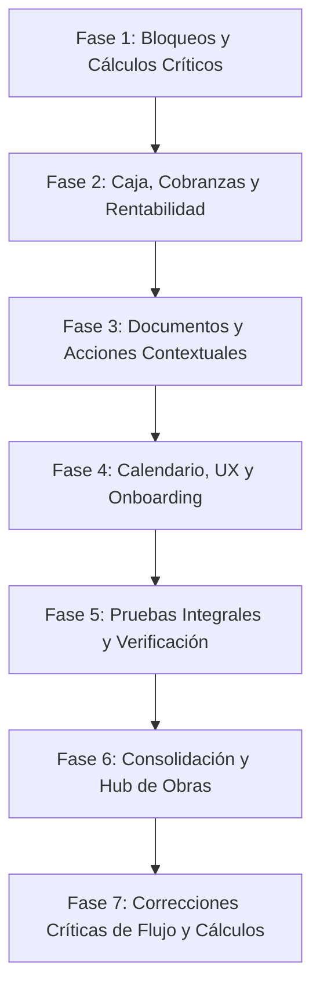

# Plan Maestro de Mejoras: Flujo de Trabajo, Cálculos y Diseño UX/UI

## 1. Contexto y Objetivos

Certaro es una plataforma de escritorio para pymes que gestionan proyectos/obras (instalaciones eléctricas, sanitarias, HVAC, construcción liviana, servicios de campo). Tras una auditoría exhaustiva realizada desde la perspectiva de un usuario final, se detectaron brechas funcionales que interrumpen el flujo operativo diario, cálculos que pueden perjudicar la liquidación de haberes o desvirtuar la rentabilidad, y desconexiones entre módulos clave (Cobranzas vs. Caja, Certificados vs. Facturas, Asistencia vs. Costos de Obra).

El objetivo de este plan es **cerrar el ciclo operativo completo**, eliminando fricciones, garantizando la precisión numérica fija exigida por el dominio, y dotando a la interfaz de coherencia y accesibilidad contextual.

---

## 2. Pila Tecnológica y Reglas de Arquitectura

Cualquier cambio implementado en este plan debe respetar estrictamente la arquitectura existente:

| Capa | Tecnologías | Reglas Clave de Implementación |
| :--- | :--- | :--- |
| **Backend / Dominio** | Rust (workspace multi-crate: `eo-domain`, `eo-application`, `eo-infrastructure`) | Clean Architecture. Cero `f64` para montos monetarios o porcentajes (usar exclusivamente `Money` y `Decimal4` con escala fija $\times 10.000$). |
| **Persistencia** | SQLite + SeaORM + Migraciones SeaORM | Transacciones atómicas (`UnitOfWork`). `soft_delete` con `Audit`. Concurrencia optimista vía `RowVersion`. |
| **Capa de Aplicación / Tauri** | Tauri v2 + Rust Commands | Contratos fuertemente tipados. Los comandos devuelven DTOs listos; el frontend no realiza aritmética monetaria. |
| **Frontend UI** | Vue 3 (`<script setup>`, Composition API) + TypeScript | PrimeVue 4 (componentes de datos y formularios) + Tailwind CSS (`tailwindcss-primeui`) + Lucide Icons. |
| **Estado e i18n** | Pinia + `vue-i18n` | Estado desacoplado en stores. Todas las etiquetas y mensajes pasan por catálogos `es.json` y `en.json`. |
| **Reportes y Documentos** | Rust (`printpdf`, `rust_xlsxwriter`, `docx-rs`) | Generación atómica en backend. Guardado mediante diálogo nativo de Tauri. |

---

## 3. Principios Rectores del Flujo de Trabajo

1. **Sin tareas redundantes:** Una acción realizada en un módulo debe propagar sus efectos colaterales de manera transparente (ej: cobrar una factura debe poder asentar el ingreso en caja sin obligar a tipear el monto de nuevo).
2. **Imputación directa y contextual:** El usuario debe poder registrar gastos y adelantos asociándolos a la entidad correspondiente (Empleado, Proyecto, Trabajo) en el momento de la carga.
3. **Acciones al alcance de la mano ("Action where you are"):** Para imprimir un recibo o un certificado no se debe forzar al usuario a abandonar la vista de detalle para buscar en un listado general de 100 elementos.
4. **Respeto irrestricto de las reglas laborales y financieras:** La edición de un registro dentro de un lote no debe penalizar ni alterar los cálculos automáticos de los demás registros del lote.
5. **Legibilidad inmediata:** Nunca exponer identificadores técnicos (UUIDs crudos) en títulos, subtítulos ni columnas de datos.

---

## 4. Estructura de Documentación del Plan

Este subdirectorio contiene la especificación detallada por módulo:

- [00-CHECKLIST-AVANCE.md](./00-CHECKLIST-AVANCE.md): Tablero de control y seguimiento con criterios de aceptación.
- [01-PLAN-MAESTRO.md](./01-PLAN-MAESTRO.md): Este documento (visión general, arquitectura y fases).
- [02-MODULO-MOVIMIENTOS-Y-CAJA.md](./02-MODULO-MOVIMIENTOS-Y-CAJA.md): Imputación de movimientos, selección de empleados para adelantos, vinculación de cobranzas y caja de proyectos.
- [03-MODULO-LIQUIDACIONES-Y-PERSONAL.md](./03-MODULO-LIQUIDACIONES-Y-PERSONAL.md): Corrección del bug de recargos en lotes, exportación ágil de recibos en PDF.
- [04-MODULO-COMERCIAL-Y-OBRAS.md](./04-MODULO-COMERCIAL-Y-OBRAS.md): Corrección del árbol de proyectos, puente entre certificados y facturas, navegación a detalles.
- [05-MODULO-CALENDARIO-Y-UX.md](./05-MODULO-CALENDARIO-Y-UX.md): Resolución de bug de huso horario, estandarización de interfaz con PrimeVue y onboarding inicial.
- [06-FASE6-CONSOLIDACION-FLUJOS.md](./06-FASE6-CONSOLIDACION-FLUJOS.md): Hub de proyectos, historial de certificados en OT y cobro directo desde CC.
- [07-FASE7-CORRECCIONES-FLUJO-Y-CALCULOS.md](./07-FASE7-CORRECCIONES-FLUJO-Y-CALCULOS.md): Correcciones críticas de cálculo en certificados, recargos de jornales, caja de obras y ergonomía.

---

## 5. Estrategia de Implementación por Fases

### Fase 1: Bloqueos y Cálculos Críticos (Prioridad Inmediata)
- Desbloquear la carga de Adelantos a personal agregando el campo `empleadoId`.
- Eliminar el bug de cálculo que sobreescribe los recargos de fin de semana en liquidaciones.
- Corregir el mapeo cruzado de presupuesto/rentabilidad y localidad en el árbol de proyectos.
- Corregir el desfasaje horario en el guardado de eventos de calendario.

### Fase 2: Integración de Caja, Cobranzas y Rentabilidad
- Habilitar los selectores de Cliente / Proyecto / Trabajo en el formulario de Movimientos.
- Conectar la caja de proyectos con los movimientos imputados y mostrar totales/balance.
- Permitir que los cobros registrados en Facturas se registren opcionalmente como movimientos de caja.

### Fase 3: Documentos y Acciones Contextuales
- Agregar botones de exportación PDF directos en `LiquidacionDetalleView` y `CertificadoDetalleView`.
- Agregar acción "Facturar Certificado" con precarga de importes e IVA.

### Fase 4: Calendario, UX y Onboarding
- Reemplazar los controles HTML crudos del Calendario por componentes PrimeVue (`Dialog`, `Select`, etc.).
- Permitir vincular eventos de calendario con Proyectos/Trabajos.
- Crear una bienvenida guiada para usuarios nuevos (sin base legacy) con configuración inicial.
- Habilitar la navegación hacia `ProyectoDetalleView` y corregir subtítulos con UUIDs.

### Fase 5: Pruebas y Verificación
- Ejecución de suites completas (`cargo test`, `pnpm test`, `pnpm typecheck`).
- Prueba de humo manual extremo a extremo del flujo operativo.

### Fase 6: Consolidación de Flujos, Hub de Obras y Ergonomía
- Historial de certificados emitidos dentro de la orden de trabajo con exportación directa.
- Hub integral de obra con pestañas en `ProyectoDetalleView`.
- Modales nativos integrados en calendario y filtro por proyecto en asistencia.
- Cobro directo de facturas desde cuenta corriente.

### Fase 7: Correcciones Críticas de Flujo, Cálculos Numéricos y Ergonomía
- Filtrado por proyecto en el repositorio de movimientos para la Caja de Obra.
- Corrección de deducción múltiple de `otrosDescuentos` en certificados y desglose en modal.
- Preservación de recargos de sábados, domingos y feriados al editar días o tarifas en liquidaciones.
- Reversión atómica de movimientos en caja al borrar cobranzas de facturas.
- Corrección de zona horaria en cobros automáticos para evitar desfasaje de fecha civil.
- Filtrado activo por cuadrilla en asistencia y acceso directo a ficha de clientes.
