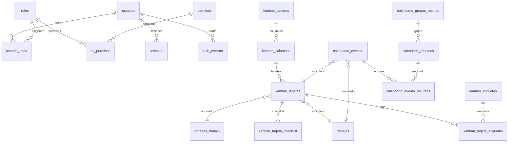

# Certaro v2 — Plan Maestro de Implementación

> **Documento Vivo de Seguimiento y Especificación Técnica**  
> Rama de trabajo: `feat/v2-enterprise-expansion`  
> Última actualización: 2026-09-02

---

## 1. Decisiones y Respuestas del Usuario

| Aspecto | Decisión Aprobada | Detalle |
|---|---|---|
| **Modelo de despliegue** | **Opción 3** | App Desktop (Tauri) soporta SQLite local y conexión directa a MySQL/PostgreSQL en servidor/Docker. Sin servidor HTTP intermediario obligatorio en esta etapa. |
| **Bypass SQLite** | **Automático** | En SQLite no hay login ni permisos bloqueantes (modo personal/local inmediato sin autenticación forzada). |
| **Usuario inicial (Super Admin)** | **Auto-creación en setup** | Al conectar por primera vez con MySQL/PostgreSQL o ejecutar migraciones iniciales, se crea el usuario inicial super-administrador predeterminado. |
| **Proveedores Auth** | **Aprobados** | Microsoft (Entra ID), Google, GitHub, Active Directory (LDAP) y 2FA TOTP (Google Authenticator, Authy, etc.). Deshabilitados por defecto, activables por configuración. |
| **Backup / Restore** | **Soportado** | Sistema de backup/restore para SQLite y soporte de snapshot/dump estructurado para MySQL/PostgreSQL. |
| **Tableros Kanban** | **Flexibles (Ambas)** | Soporta múltiples tableros (por proyecto) y tableros globales consolidados a elección del usuario. |
| **Tarjetas Kanban** | **Custom + Presets** | Tarjetas custom libres y presets preconfigurados vinculados a `Trabajo`, `OrdenTrabajo`, etc., con sincronización bidireccional de estados. |
| **Calendario** | **Ambas Vistas + Eventos Mixtos** | Vista clásica (día, semana, mes) + vista Resources Day (por empleado / proyecto). Eventos propios creados en el calendario y proyección de eventos virtuales (asistencias, feriados, vencimientos). |

---

## 2. Checklist General de Fases

- [x] **Fase 1: Soporte Multi-Base de Datos (SQLite / MySQL / PostgreSQL)**
  - [x] 1.1 Configuración de base de datos (`DatabaseConfig` en `certaro-application`)
  - [x] 1.2 Dependencias `Cargo.toml` (`sqlx-mysql`, `sqlx-postgres`)
  - [x] 1.3 Conexión dinámica en `certaro-infrastructure` (`connection.rs`)
  - [x] 1.4 Migraciones SeaORM portables en `certaro-migration` (compatibles SQLite / MySQL / PostgreSQL)
  - [x] 1.5 Adaptación de modelos y tipos de auditoría (soft-delete y unique indexes portables)
  - [x] 1.6 Tests de persistencia y verificación multi-dialecto

- [ ] **Fase 2: Sistema de Autenticación, Usuarios, Roles y Permisos (RBAC)**
  - [ ] 2.1 Entidades de dominio (`Usuario`, `Rol`, `Permiso`, `Sesion`, `AuthExterno`)
  - [ ] 2.2 Modelos de persistencia SeaORM y migraciones para las 7 tablas de Auth
  - [ ] 2.3 Puertos de seguridad (`PasswordHasher` con Argon2id, `TokenPort`, `TotpPort`)
  - [ ] 2.4 Casos de uso de autenticación y gestión de usuarios/roles
  - [ ] 2.5 Seed de usuario Super Administrador y catálogo de permisos
  - [ ] 2.6 Middleware/Guard de permisos en Tauri (bypass transparente en modo SQLite)
  - [ ] 2.7 Frontend: Store de Auth (`useAuthStore`), vistas de Login, Usuarios y Roles, composable `usePermission`

- [ ] **Fase 3: Módulo Tablero Kanban**
  - [ ] 3.1 Entidades de dominio (`KanbanTablero`, `KanbanColumna`, `KanbanTarjeta`, `KanbanEtiqueta`, etc.)
  - [ ] 3.2 Migraciones y modelos de persistencia SeaORM (7 tablas)
  - [ ] 3.3 Repositorios y casos de uso en `certaro-application`
  - [ ] 3.4 Sincronización bidireccional `KanbanTarjeta` ↔ `Trabajo` / `OrdenTrabajo`
  - [ ] 3.5 Comandos IPC Tauri para Kanban
  - [ ] 3.6 Frontend: Componentes Kanban (Tablero, Columnas, Tarjetas, Drag & Drop, Filtros, Modal Detalle)

- [ ] **Fase 4: Módulo Calendario / Scheduler**
  - [ ] 4.1 Entidades de dominio (`CalendarioEvento`, `CalendarioRecurso`, `CalendarioGrupoRecurso`)
  - [ ] 4.2 Migraciones y modelos de persistencia SeaORM (4 tablas)
  - [ ] 4.3 Repositorios y casos de uso de calendario y proyección de eventos virtuales
  - [ ] 4.4 Comandos IPC Tauri para Calendario
  - [ ] 4.5 Frontend: Vistas Día, Semana, Mes y vista Resources Day (por empleado / proyecto)

- [ ] **Fase 5: Backup Unificado, Integración Final y Pulido**
  - [ ] 5.1 Estrategia de backup/restore para SQLite / MySQL / PostgreSQL
  - [ ] 5.2 Pruebas integrales de extremo a extremo y suites de tests
  - [ ] 5.3 Actualización de documentación y changelog

---

## 3. Especificación Detallada por Componente

### 3.1 Esquema de Base de Datos y Nuevas Tablas (Total: 39 tablas)



### 3.2 Catálogo de Permisos Predefinidos (RBAC)

```
movimientos:ver          movimientos:crear        movimientos:editar       movimientos:borrar
facturas:ver             facturas:crear           facturas:editar          facturas:borrar
empleados:ver            empleados:crear          empleados:editar         empleados:borrar
asistencias:ver          asistencias:registrar    asistencias:editar
liquidaciones:ver        liquidaciones:generar    liquidaciones:pagar
proyectos:ver            proyectos:crear          proyectos:editar
trabajos:ver             trabajos:crear           trabajos:editar
kanban:ver               kanban:crear_tarjeta     kanban:mover_tarjeta     kanban:gestionar_tablero
calendario:ver           calendario:crear_evento  calendario:editar_evento calendario:gestionar_recursos
usuarios:ver             usuarios:crear           usuarios:editar          usuarios:gestionar_roles
sistema:configuracion    sistema:backup           sistema:restore
```

---

## 4. Registro de Avance de Commits

| Fecha | Commit | Descripción |
|---|---|---|
| 2026-09-02 | *(inicial)* | Creación de rama `feat/v2-enterprise-expansion` y documento `docs/v2/PLAN_V2.md` |
