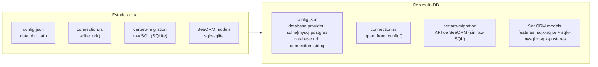
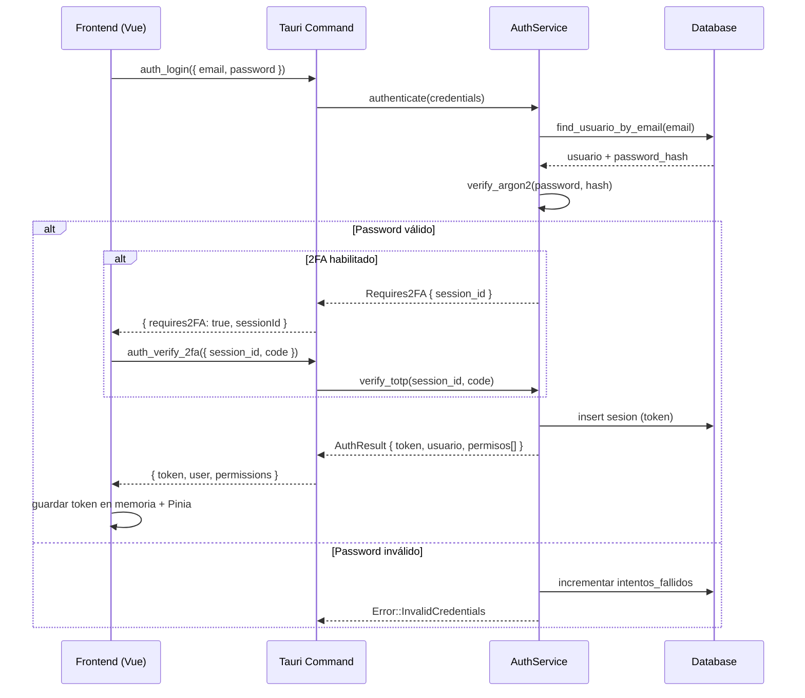
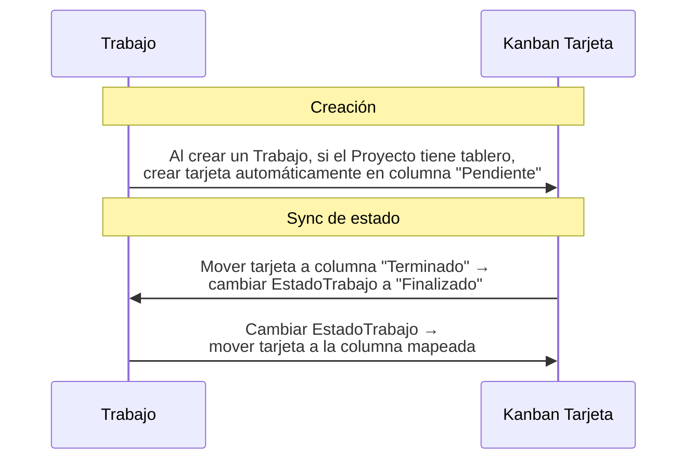

# Plan de Implementación — Certaro v2

Plan de expansión mayor del sistema Certaro. Cubre cuatro ejes: soporte multi-base de datos, sistema de autenticación/RBAC, tablero Kanban y módulo de Calendario.

> [!IMPORTANT]
> Este plan es un borrador para revisión. NO se implementará hasta que el usuario apruebe (con las modificaciones que considere necesarias).

---

## Revisión del Usuario

### Decisiones que necesitan tu input

> [!WARNING]
> **Modelo de despliegue para MySQL/PostgreSQL**
> Hoy Certaro corre como app de escritorio Tauri (empaquetada, un exe que el usuario instala). Para MySQL/PostgreSQL, la base de datos está en un servidor. Opciones:
> 1. **Seguir siendo app Tauri de escritorio** que se conecta directo a MySQL/PostgreSQL remoto (requiere que la empresa tenga la DB accesible desde cada puesto).
> 2. **Agregar un modo servidor HTTP** (Actix-Web / Axum) que se despliega como servicio, y las PCs usan un frontend web (o la app Tauri apuntando al servidor).
> 3. **Ambos**: la misma app Tauri soporta conexión directa a la DB remota, sin servidor HTTP intermedio.
>
> **Recomendación: opción 3** — la app Tauri se conecta directamente a MySQL/PostgreSQL cuando la configuración lo indica. No se agrega un servidor HTTP intermedio. Esto mantiene la arquitectura simple y evita duplicar la capa IPC (Tauri invoke + REST). Para empresas con necesidades web, eso sería un futuro eje de expansión.

> [!IMPORTANT]
> **Proveedores de autenticación OAuth**
> Listados como opcionales, todos deshabilitados por defecto, activables en la configuración. Confirmar la lista:
> - Microsoft (Entra ID / Azure AD)
> - Google
> - GitHub
> - Active Directory (LDAP)
> - 2FA (TOTP — Google Authenticator, Authy, etc.)
>
> ¿Faltan o sobran proveedores? ¿Auth0 / Keycloak como opción futura?

> [!IMPORTANT]
> **Calendario: ¿vista de recursos o vista clásica?**
> La imagen de referencia muestra un **Resources Day** con columnas por recurso (Studio A, Lab B, etc.). Para Certaro, los "recursos" serían:
> - Empleados
> - Proyectos (obras)
> - Equipos/herramientas (si se agrega en el futuro)
>
> ¿Confirmas que el calendario debe soportar **ambas** vistas (vista personal/clásica + vista por recursos)? ¿Los recursos iniciales son empleados y proyectos?

---

## Preguntas Abiertas

1. **¿Quién administra los usuarios cuando se usa MySQL/PostgreSQL?** ¿Hay un "super admin" que se crea con la primera ejecución (asistente de setup), o los usuarios se crean por CLI?
2. **¿Se mantiene el backup/restore de SQLite** cuando se usa MySQL/PostgreSQL, o se delega al DBA con `mysqldump` / `pg_dump`?
3. **Kanban: ¿se necesitan tableros múltiples** (ej. uno por proyecto) o un único tablero global con filtros?
4. **Kanban: ¿qué entidades son "tarjetas"?** ¿Solo `Trabajo`? ¿También `OrdenTrabajo`? ¿Entidades custom?
5. **Calendario: ¿crear eventos propios** (reuniones, recordatorios) o solo mostrar datos existentes (asistencias, feriados, vencimientos de facturas)?

---

## 1. Soporte Multi-Base de Datos (SQLite / MySQL / PostgreSQL)

### 1.1 Principio de diseño

La misma estructura de esquema corre en los tres motores. Las diferencias (tipos de columna, sintaxis de índices parciales, auto-increment vs. UUID) se abstraen en la capa de migración y el ORM. **La capa de dominio y aplicación no sabe qué motor hay debajo.**

### 1.2 Arquitectura actual y puntos de impacto



### 1.3 Cambios propuestos

---

#### 1.3.1 Configuración — `DatabaseConfig`

##### [MODIFY] [config.rs](file:///d:/GitHub/Certaro/crates/certaro-application/src/config.rs)

Agregar nueva sección `database` a `AppConfig`:

```rust
#[derive(Debug, Clone, PartialEq, Eq, Serialize, Deserialize)]
#[serde(rename_all = "camelCase")]
pub enum DatabaseProvider {
    Sqlite,
    Mysql,
    Postgres,
}

#[derive(Debug, Clone, PartialEq, Eq, Serialize, Deserialize)]
#[serde(rename_all = "camelCase", default)]
pub struct DatabaseConfig {
    pub provider: DatabaseProvider,
    /// Para SQLite: ruta al archivo. Para MySQL/PostgreSQL: connection string completo.
    pub url: Option<String>,
    pub max_connections: u32,
    pub min_connections: u32,
    /// Segundos
    pub acquire_timeout: u64,
}
```

**Default**: `provider: Sqlite`, `url: None` (se resuelve desde `data_dir`).

---

#### 1.3.2 Dependencias — Cargo features

##### [MODIFY] [Cargo.toml](file:///d:/GitHub/Certaro/Cargo.toml)

```toml
[workspace.dependencies]
sea-orm = { version = "1", features = [
    "sqlx-sqlite",
    "sqlx-mysql",
    "sqlx-postgres",
    "runtime-tokio-rustls",
    "macros",
    "with-uuid",
    "with-chrono",
] }
sea-orm-migration = { version = "1", features = [
    "sqlx-sqlite",
    "sqlx-mysql",
    "sqlx-postgres",
    "runtime-tokio-rustls",
] }
sqlx = { version = "0.8", default-features = false, features = [
    "sqlite", "mysql", "postgres",
    "runtime-tokio-rustls",
] }
```

> [!NOTE]
> Alternativa: usar **Cargo features** del workspace (`db-sqlite`, `db-mysql`, `db-postgres`) para compilar solo el driver necesario y reducir tamaño del binario. Sería más limpio pero requiere builds condicionales. **Recomendación**: empezar con los tres habilitados siempre; optimizar después si el tamaño importa.

---

#### 1.3.3 Conexión

##### [MODIFY] [connection.rs](file:///d:/GitHub/Certaro/crates/certaro-infrastructure/src/persistence/connection.rs)

Reescribir para soportar los tres motores:

```rust
pub async fn open_from_config(cfg: &DatabaseConfig) -> Result<DatabaseConnection, DbErr> {
    let url = resolve_url(cfg);
    let db = connect(&url, cfg).await?;
    
    // PRAGMAs solo para SQLite
    if matches!(cfg.provider, DatabaseProvider::Sqlite) {
        apply_sqlite_pragmas(&db).await?;
    }
    
    Migrator::up(&db, None).await?;
    info!(provider = ?cfg.provider, "database ready");
    Ok(db)
}
```

- `open()` sigue existiendo como atajo para SQLite (backward compat).
- `open_in_memory()` sigue para tests.

---

#### 1.3.4 Migraciones compatibles

##### [MODIFY] Todos los archivos en `crates/certaro-migration/src/`

**Problema actual**: las migraciones usan SQL raw con sintaxis SQLite (ej. `TEXT`, `INTEGER`, `BLOB`, `CHECK (col IN (0,1))`, `WHERE is_deleted = 0` en índices parciales).

**Solución**: reescribir las migraciones usando la **API de SchemaManager de SeaORM** que genera SQL compatible con los tres motores:

```rust
// Antes (raw SQL, solo SQLite):
manager.create_table(
    Table::create()
        .table(TipoMovimiento::Table)
        ...
)

// Después (API de SeaORM, portable):
manager.create_table(
    Table::create()
        .table(TipoMovimiento::Table)
        .col(ColumnDef::new(TipoMovimiento::Id).uuid().not_null().primary_key())
        .col(ColumnDef::new(TipoMovimiento::Nombre).string_len(100).not_null())
        .col(ColumnDef::new(TipoMovimiento::EsIngreso).boolean().not_null().default(false))
        // ...
        .to_owned(),
)
.await
```

**Aspectos a resolver por motor**:

| Aspecto | SQLite | MySQL | PostgreSQL |
|---------|--------|-------|------------|
| UUID PK | `TEXT` | `CHAR(36)` | `UUID` nativo |
| Booleanos | `INTEGER CHECK(0,1)` | `TINYINT(1)` | `BOOLEAN` |
| Fechas ISO | `TEXT` | `DATETIME(3)` | `TIMESTAMPTZ` |
| Money (i64) | `INTEGER` | `BIGINT` | `BIGINT` |
| RowVersion | `BLOB(8)` | `BINARY(8)` | `BYTEA` |
| Índice parcial | `WHERE is_deleted = 0` | No soportado → usar trigger o columna calculada | Soportado |
| Soft-delete unique | Índice parcial | Incluir `is_deleted` + `deleted_at` en unique compuesto | Índice parcial |

> [!WARNING]
> **Los índices parciales (`WHERE is_deleted = 0`) NO existen en MySQL.** Alternativa para MySQL: hacer el índice unique sobre `(nombre, deleted_at)` donde `deleted_at` es `NULL` para activos — MySQL permite múltiples `NULL` en unique.

---

#### 1.3.5 Modelos SeaORM

##### [MODIFY] Todos los archivos en `crates/certaro-infrastructure/src/persistence/models/`

Los modelos de SeaORM actuales ya son bastante genéricos. Los cambios principales:
- Asegurar que los tipos de columna usen `ColumnType` portables (ya lo hacen por usar derive macros).
- Para `RowVersion`: verificar que el tipo `Vec<u8>` mapee correctamente a `BINARY(8)` en MySQL y `BYTEA` en PostgreSQL.

---

#### 1.3.6 Seeders

##### [MODIFY] [seed.rs](file:///d:/GitHub/Certaro/crates/certaro-infrastructure/src/persistence/seed.rs)

Los seeders ya usan SeaORM ActiveModel inserts, que son portables. Solo verificar que no haya SQL raw escondido.

---

### 1.4 Compatibilidad SQLite ↔ MySQL/PostgreSQL

| Escenario | Comportamiento |
|-----------|---------------|
| SQLite → MySQL | Herramienta de migración one-shot (nuevo crate o script). Lee SQLite, inserta en MySQL. |
| MySQL → SQLite | Dump con herramienta inversa. Para empresas que quieran downgrade. |
| MySQL ↔ PostgreSQL | Similar herramienta. O `certaro-import-legacy` evoluciona. |
| **Run simultaneo** | NO soportado. La app corre contra UNA base por configuración. |

---

## 2. Sistema de Usuarios, Roles y Permisos (RBAC)

### 2.1 Principio de diseño

- **SQLite mode**: sin login, sin usuarios. La app arranca directo al dashboard. Todo el sistema de auth se bypasea.
- **MySQL/PostgreSQL mode**: login obligatorio. Cada acción pasa por un chequeo de permisos. El sistema es configurable por un usuario con rol administrador.

### 2.2 Modelo de datos — Nuevas entidades

```mermaid
erDiagram
    usuarios ||--o{ usuario_roles : "tiene roles"
    roles ||--o{ usuario_roles : "asignado a"
    roles ||--o{ rol_permisos : "tiene permisos"
    permisos ||--o{ rol_permisos : "en roles"
    usuarios ||--o{ sesiones : "sesiones activas"
    usuarios ||--o{ auth_externo : "proveedores OAuth"
    
    usuarios {
        uuid id PK
        string email UK
        string nombre_completo
        string password_hash "nullable (OAuth-only users)"
        boolean activo
        boolean requiere_2fa
        string totp_secret "nullable, cifrado"
        datetime ultimo_login
        int intentos_fallidos
        datetime bloqueado_hasta "nullable"
        -- audit --
    }
    
    roles {
        uuid id PK
        string nombre UK
        string descripcion
        boolean es_sistema "admin, viewer no se borran"
        int prioridad "para resolver conflictos"
        -- audit --
    }
    
    permisos {
        uuid id PK
        string modulo "movimientos, facturas, empleados, kanban, calendario..."
        string accion "ver, crear, editar, borrar, exportar"
        string recurso "opcional: sub-recurso"
        string clave UK "modulo:accion o modulo:accion:recurso"
    }
    
    usuario_roles {
        uuid id PK
        uuid usuario_id FK
        uuid rol_id FK
        -- audit --
    }
    
    rol_permisos {
        uuid id PK
        uuid rol_id FK
        uuid permiso_id FK
    }
    
    sesiones {
        uuid id PK
        uuid usuario_id FK
        string token_hash
        datetime expira_en
        string ip
        string user_agent
        datetime created_at
    }
    
    auth_externo {
        uuid id PK
        uuid usuario_id FK
        string proveedor "microsoft, google, github, ldap"
        string proveedor_user_id
        string email
        datetime vinculado_en
    }
```

### 2.3 Tablas nuevas (DDL)

Se agregarán **7 tablas** al esquema existente (21 → 28 tablas):

| # | Tabla | Propósito |
|---|-------|-----------|
| 22 | `usuarios` | Cuentas de usuario |
| 23 | `roles` | Roles con prioridad |
| 24 | `permisos` | Catálogo de permisos (seed) |
| 25 | `usuario_roles` | Relación N:M usuario ↔ rol |
| 26 | `rol_permisos` | Relación N:M rol ↔ permiso |
| 27 | `sesiones` | Sesiones activas (tokens) |
| 28 | `auth_externo` | Vínculos OAuth |

### 2.4 Permisos predefinidos (seed)

Módulos × Acciones. Cada módulo tiene un conjunto de acciones. Ejemplo:

```
movimientos:ver         movimientos:crear       movimientos:editar
movimientos:borrar      movimientos:exportar
facturas:ver            facturas:crear          facturas:editar
facturas:borrar         facturas:exportar       facturas:registrar_pago
empleados:ver           empleados:crear         empleados:editar
kanban:ver              kanban:crear_tarjeta    kanban:mover_tarjeta
kanban:editar_tarjeta   kanban:borrar_tarjeta   kanban:gestionar_tablero
calendario:ver          calendario:crear_evento calendario:editar_evento
calendario:borrar_evento
sistema:backup          sistema:restore         sistema:configuracion
usuarios:ver            usuarios:crear          usuarios:editar
usuarios:borrar         usuarios:gestionar_roles
```

### 2.5 Roles predefinidos (seed)

| Rol | Permisos | Sistema |
|-----|----------|---------|
| **Administrador** | Todos | ✅ (no borrable) |
| **Operador** | CRUD de todas las entidades de negocio, pero no gestión de usuarios ni configuración del sistema | ✅ |
| **Visualizador** | Solo `*:ver` y `*:exportar` | ✅ |

Los usuarios pueden crear roles custom y asignarles cualquier combinación de permisos.

### 2.6 Arquitectura de autenticación



#### Componentes nuevos en el backend:

##### [NEW] `crates/certaro-application/src/ports/auth.rs`
Trait `AuthPort`: `authenticate()`, `verify_token()`, `refresh()`, `revoke()`.

##### [NEW] `crates/certaro-application/src/ports/password.rs`
Trait `PasswordHasher`: `hash()`, `verify()`. Implementación con Argon2id.

##### [NEW] `crates/certaro-application/src/use_cases/auth/`
- `login.rs` — autenticación con email+password
- `login_oauth.rs` — flujo OAuth (Microsoft, Google, GitHub)
- `verify_2fa.rs` — verificación TOTP
- `logout.rs` — invalidar sesión
- `refresh.rs` — renovar token
- `setup_2fa.rs` — activar/desactivar 2FA

##### [NEW] `crates/certaro-application/src/use_cases/usuarios/`
- `create.rs`, `update.rs`, `delete.rs`, `list.rs`, `get.rs`
- `change_password.rs`
- `assign_roles.rs`
- `reset_password.rs`

##### [NEW] `crates/certaro-application/src/use_cases/roles/`
- `create.rs`, `update.rs`, `delete.rs`, `list.rs`
- `assign_permissions.rs`

##### [NEW] `crates/certaro-infrastructure/src/auth/`
- `argon2.rs` — implementación de `PasswordHasher`
- `token.rs` — generación/validación de tokens (HMAC-SHA256 o JWT si se necesita)
- `totp.rs` — generación/validación TOTP (RFC 6238)
- `oauth/microsoft.rs`, `oauth/google.rs`, `oauth/github.rs`
- `ldap.rs` — Active Directory via LDAP

#### Dependencias nuevas de Rust:

```toml
# Auth
argon2 = "0.5"          # password hashing
totp-rs = "5"            # TOTP 2FA
data-encoding = "2"      # base32 para TOTP secrets
rand = "0.8"             # token generation
hmac = "0.12"            # token signing
sha2 = "0.10"            # token signing
# OAuth
oauth2 = "4"             # OAuth2 client
# LDAP
ldap3 = { version = "0.11", optional = true }
```

### 2.7 Middleware de permisos

En `src-tauri/src/`, un **guard** que intercepta cada comando Tauri:

```rust
/// Verifica que el usuario actual tenga el permiso requerido.
/// En modo SQLite, siempre retorna Ok(()).
pub async fn require_permission(
    state: &AppState,
    token: Option<&str>,
    permiso: &str,
) -> Result<Option<Usuario>, ApiError> {
    if state.is_sqlite_mode() {
        return Ok(None); // Sin auth en modo SQLite
    }
    
    let token = token.ok_or(ApiError::unauthorized())?;
    let session = state.auth().verify_token(token).await?;
    let permisos = state.auth().get_permissions(session.usuario_id).await?;
    
    if !permisos.contains(permiso) {
        return Err(ApiError::forbidden(permiso));
    }
    
    Ok(Some(session.usuario))
}
```

### 2.8 Frontend — Sistema de Auth

##### [NEW] `src/stores/useAuthStore.ts`
- Estado: `user`, `token`, `permissions[]`, `isAuthenticated`, `requires2FA`
- Acciones: `login()`, `logout()`, `verify2FA()`, `refreshToken()`

##### [NEW] `src/composables/usePermission.ts`
```typescript
export function usePermission() {
  const auth = useAuthStore()
  
  function can(permiso: string): boolean {
    // En modo SQLite, siempre true
    if (auth.isSqliteMode) return true
    return auth.permissions.includes(permiso)
  }
  
  function canAny(...permisos: string[]): boolean { ... }
  function canAll(...permisos: string[]): boolean { ... }
  
  return { can, canAny, canAll }
}
```

##### [NEW] `src/views/auth/LoginView.vue`
Pantalla de login con email/password, botones OAuth, campo 2FA condicional.

##### [NEW] `src/views/admin/UsuariosView.vue`
CRUD de usuarios con asignación de roles.

##### [NEW] `src/views/admin/RolesView.vue`
CRUD de roles con checklist de permisos (tree de módulos → acciones).

##### [MODIFY] `src/router/index.ts`
- Guard global: si modo MySQL/PostgreSQL → verificar `isAuthenticated`, sino redirect a `/login`.
- Guard por ruta: verificar `can(permiso)` según la ruta.

##### [MODIFY] Todos los componentes con acciones protegidas
- Botones de crear/editar/borrar condicionados con `v-if="can('modulo:accion')"`.
- Menú lateral condicionado para ocultar secciones sin permiso.

---

## 3. Tablero Kanban

### 3.1 Referencia visual

El diseño se inspira en PrimeUI TaskBoard (Meridian) pero será una implementación custom:


**Elementos clave del diseño:**
- **Tabs** superiores para alternar entre tableros (ej. por proyecto)
- **Header** con título, contadores (iniciativas, en curso, bloqueadas), avatares de miembros
- **Columnas** con título y contador de tarjetas, menú desplegable
- **Tarjetas** con: tags de color, título, indicador de prioridad (P1-P4), checklist progress, fecha, avatar asignado
- **Drag & drop** entre columnas
- **+ Add card** al pie de cada columna

### 3.2 Modelo de datos — Nuevas entidades

```mermaid
erDiagram
    kanban_tableros ||--o{ kanban_columnas : "columnas"
    kanban_tableros ||--o{ kanban_tablero_miembros : "miembros"
    kanban_columnas ||--o{ kanban_tarjetas : "tarjetas"
    kanban_tarjetas ||--o{ kanban_tarjeta_etiquetas : "etiquetas"
    kanban_tarjetas ||--o{ kanban_tarjeta_checklist : "checklist"
    kanban_tarjetas }o--|| trabajos : "vinculado (opcional)"
    kanban_tarjetas }o--|| proyectos : "vinculado (opcional)"
    kanban_etiquetas ||--o{ kanban_tarjeta_etiquetas : "usada en"
    
    kanban_tableros {
        uuid id PK
        string nombre
        string descripcion
        uuid proyecto_id FK "nullable, tablero por proyecto"
        boolean es_default "un solo default"
        int posicion
        -- audit --
    }
    
    kanban_columnas {
        uuid id PK
        uuid tablero_id FK
        string nombre
        string color "hex"
        int posicion
        int limite_wip "nullable, WIP limit"
        boolean es_final "tarjetas aquí = terminadas"
        -- audit --
    }
    
    kanban_tarjetas {
        uuid id PK
        uuid columna_id FK
        string titulo
        string descripcion "nullable, markdown"
        int prioridad "1=P1 urgente ... 4=P4 baja"
        int posicion "orden dentro de la columna"
        uuid asignado_a FK "nullable → usuarios"
        date fecha_limite "nullable"
        uuid trabajo_id FK "nullable, link a Trabajo"
        uuid proyecto_id FK "nullable, link a Proyecto"
        uuid orden_trabajo_id FK "nullable, link a OT"
        -- audit --
    }
    
    kanban_etiquetas {
        uuid id PK
        string nombre
        string color "hex"
        -- audit --
    }
    
    kanban_tarjeta_etiquetas {
        uuid id PK
        uuid tarjeta_id FK
        uuid etiqueta_id FK
    }
    
    kanban_tarjeta_checklist {
        uuid id PK
        uuid tarjeta_id FK
        string texto
        boolean completado
        int posicion
    }
    
    kanban_tablero_miembros {
        uuid id PK
        uuid tablero_id FK
        uuid usuario_id FK "nullable si SQLite"
    }
```

### 3.3 Tablas nuevas (DDL)

| # | Tabla | Propósito |
|---|-------|-----------|
| 29 | `kanban_tableros` | Contenedor de columnas |
| 30 | `kanban_columnas` | Columnas del tablero (estados) |
| 31 | `kanban_tarjetas` | Tarjetas con prioridad, asignación, links |
| 32 | `kanban_etiquetas` | Tags de color reutilizables |
| 33 | `kanban_tarjeta_etiquetas` | N:M tarjeta ↔ etiqueta |
| 34 | `kanban_tarjeta_checklist` | Ítems de checklist por tarjeta |
| 35 | `kanban_tablero_miembros` | Quién participa en cada tablero |

### 3.4 Integración con entidades existentes

La tarjeta Kanban puede **linkear** (FK nullable) a:
- `trabajos` — el caso más natural: un trabajo avanza por columnas (Pendiente → En curso → Terminado)
- `proyectos` — tablero de vista general de un proyecto
- `ordenes_trabajo` — seguimiento de órdenes

Esto permite que al crear un trabajo, automáticamente se cree una tarjeta en el tablero del proyecto (configurable).

### 3.5 Casos de uso

##### [NEW] `crates/certaro-application/src/use_cases/kanban/`
- `tablero_create.rs`, `tablero_update.rs`, `tablero_delete.rs`, `tablero_list.rs`
- `columna_create.rs`, `columna_update.rs`, `columna_delete.rs`, `columna_reorder.rs`
- `tarjeta_create.rs`, `tarjeta_update.rs`, `tarjeta_delete.rs`
- `tarjeta_move.rs` — mover entre columnas o reordenar dentro de la misma columna
- `tarjeta_assign.rs` — asignar a usuario
- `tarjeta_checklist.rs` — add/toggle/remove ítems
- `tarjeta_etiqueta.rs` — add/remove tags
- `tablero_sync.rs` — sync bidireccional con trabajos (si estado del trabajo cambia, mueve la tarjeta; si la tarjeta se mueve, opcionalmente cambia el estado del trabajo)

### 3.6 Repositorios nuevos

##### [NEW] Traits en `crates/certaro-application/src/ports/repositories.rs`
```rust
#[async_trait]
pub trait KanbanTableroRepository: Send + Sync { ... }
#[async_trait]
pub trait KanbanColumnaRepository: Send + Sync { ... }
#[async_trait]
pub trait KanbanTarjetaRepository: Send + Sync { ... }
#[async_trait]
pub trait KanbanEtiquetaRepository: Send + Sync { ... }
```

Agregar accesores al trait `Transaction`.

### 3.7 Frontend — Componente Kanban

##### [NEW] `src/views/kanban/KanbanView.vue`
Vista principal con tabs de tableros.

##### [NEW] `src/components/kanban/KanbanBoard.vue`
Componente principal que renderiza columnas y tarjetas. **Drag & drop** usando `@vueuse/core` (`useDraggable`) o una librería liviana como `vue-draggable-plus` (basada en SortableJS).

##### [NEW] `src/components/kanban/KanbanColumn.vue`
Columna individual: header con título + contador + color, zona de drop, lista de tarjetas, botón "+ Add card".

##### [NEW] `src/components/kanban/KanbanCard.vue`
Tarjeta: tags coloridas, título, indicador de prioridad (P1-P4 con colores), avatar del asignado, fecha límite, progress bar del checklist.

##### [NEW] `src/components/kanban/KanbanCardDetail.vue`
Dialog/drawer lateral al hacer clic en una tarjeta. Permite editar título, descripción (markdown), prioridad, asignar usuario, agregar etiquetas, manejar checklist, cambiar fecha, vincular a trabajo/proyecto.

##### [NEW] `src/components/kanban/KanbanBoardSettings.vue`
Configuración del tablero: CRUD de columnas (nombre, color, posición, WIP limit), miembros.

##### [NEW] `src/stores/useKanbanStore.ts`
Estado: tableros[], tablero activo con sus columnas + tarjetas, etiquetas disponibles.

##### [NEW] `src/api/kanban.ts`
Wrappers de invoke para los comandos Kanban.

#### Dependencias frontend nuevas:

```json
{
  "vue-draggable-plus": "^0.6"
}
```

### 3.8 Permisos Kanban

```
kanban:ver                    — ver tableros
kanban:crear_tarjeta          — crear tarjetas
kanban:mover_tarjeta          — drag & drop
kanban:editar_tarjeta         — editar contenido
kanban:borrar_tarjeta         — borrar tarjetas
kanban:gestionar_tablero      — crear/editar/borrar tableros y columnas
```

---

## 4. Módulo de Calendario / Scheduler

### 4.1 Referencia visual

El diseño se inspira en PrimeUI Scheduler (Meridian) con vista de Resources Day:


**Elementos clave del diseño:**
- **Header** con navegación (← hoy →), fecha, selector de vista
- **Vistas**: Día, Semana, Mes, Resources Day (multi-recurso)
- **Eje Y**: franjas horarias (7:00 AM, 8:00 AM, ...)
- **Columnas** en Resources Day: agrupadas por ubicación/recurso con sub-columnas (ej. North Campus → Studio A, Lab B)
- **Eventos**: bloques coloreados con título + rango horario, posicionados sobre la grilla

### 4.2 Modelo de datos — Nuevas entidades

```mermaid
erDiagram
    calendario_eventos ||--o{ calendario_evento_recursos : "recursos asignados"
    calendario_recursos ||--o{ calendario_evento_recursos : "asignado a eventos"
    calendario_recursos }o--|| calendario_grupos_recurso : "en grupo"
    calendario_eventos }o--|| trabajos : "vinculado (opcional)"
    calendario_eventos }o--|| proyectos : "vinculado (opcional)"
    calendario_eventos }o--|| kanban_tarjetas : "vinculado (opcional)"
    
    calendario_eventos {
        uuid id PK
        string titulo
        string descripcion "nullable"
        datetime inicio
        datetime fin
        boolean todo_el_dia
        string color "hex, nullable"
        string recurrencia "nullable, RRULE (RFC 5545)"
        uuid creado_por FK "nullable → usuarios"
        uuid trabajo_id FK "nullable"
        uuid proyecto_id FK "nullable"
        uuid tarjeta_kanban_id FK "nullable"
        -- audit --
    }
    
    calendario_recursos {
        uuid id PK
        string nombre
        string tipo "empleado, proyecto, equipo"
        string color "hex"
        uuid referencia_id "nullable, → empleados.id o proyectos.id"
        uuid grupo_id FK "nullable"
        int posicion
        -- audit --
    }
    
    calendario_grupos_recurso {
        uuid id PK
        string nombre "ej: Norte, Sur, Zona A"
        int posicion
        -- audit --
    }
    
    calendario_evento_recursos {
        uuid id PK
        uuid evento_id FK
        uuid recurso_id FK
    }
```

### 4.3 Tablas nuevas

| # | Tabla | Propósito |
|---|-------|-----------|
| 36 | `calendario_eventos` | Eventos del calendario |
| 37 | `calendario_recursos` | Recursos asignables (empleados, proyectos, equipos) |
| 38 | `calendario_grupos_recurso` | Agrupaciones de recursos |
| 39 | `calendario_evento_recursos` | N:M evento ↔ recurso |

**Total de tablas tras la expansión: 39** (21 existentes + 7 auth + 7 kanban + 4 calendario)

### 4.4 Integración con datos existentes

El calendario no solo muestra eventos propios. También puede **proyectar** datos del sistema como eventos virtuales (calculados, no almacenados):

| Fuente | Evento virtual |
|--------|---------------|
| `asistencias_empleado` | Asistencia/ausencia del día |
| `feriados` | Feriados marcados como all-day |
| `facturas` (fecha_vencimiento) | Vencimiento de facturas |
| `trabajos` (fecha_inicio, fecha_fin_estimada) | Rango del trabajo |
| `ordenes_trabajo` | Fecha de la orden |
| `kanban_tarjetas` (fecha_limite) | Deadlines de tarjetas |
| `liquidaciones` (periodo) | Períodos de liquidación |

Estos se mezclan con los eventos reales del calendario en la vista. El frontend los distingue visualmente (color, ícono, read-only).

### 4.5 Casos de uso

##### [NEW] `crates/certaro-application/src/use_cases/calendario/`
- `evento_create.rs`, `evento_update.rs`, `evento_delete.rs`
- `evento_move.rs` — drag & drop para cambiar hora/fecha
- `evento_resize.rs` — cambiar duración arrastrando borde
- `eventos_rango.rs` — obtener eventos para un rango de fechas (la consulta principal)
- `recurso_create.rs`, `recurso_update.rs`, `recurso_delete.rs`, `recurso_list.rs`
- `grupo_create.rs`, `grupo_update.rs`, `grupo_delete.rs`
- `eventos_virtuales.rs` — genera eventos virtuales a partir de asistencias, feriados, facturas, etc.

### 4.6 Repositorios nuevos

```rust
#[async_trait]
pub trait CalendarioEventoRepository: Send + Sync {
    async fn find_by_id(&self, id: Uuid) -> AppResult<Option<CalendarioEvento>>;
    async fn search_by_rango(
        &self,
        desde: DateTime<Utc>,
        hasta: DateTime<Utc>,
        recurso_ids: Option<&[Uuid]>,
    ) -> AppResult<Vec<CalendarioEvento>>;
    async fn insert(&self, entity: &CalendarioEvento) -> AppResult<()>;
    async fn update(&self, entity: &CalendarioEvento, esperado: RowVersion) -> AppResult<()>;
    async fn soft_delete(&self, id: Uuid, esperado: RowVersion, at: DateTime<Utc>) -> AppResult<()>;
}

#[async_trait]
pub trait CalendarioRecursoRepository: Send + Sync { ... }
```

### 4.7 Frontend — Componentes del Calendario

##### [NEW] `src/views/calendario/CalendarioView.vue`
Vista principal con selector de vista (día, semana, mes, resources day).

##### [NEW] `src/components/calendario/CalendarGrid.vue`
Componente que renderiza la grilla horaria:
- **Eje Y**: franjas de 30 min o 1 hora
- **Eje X**: días (vista semana) o recursos (vista resources day)
- Posiciona los eventos como `position: absolute` dentro de la grilla

##### [NEW] `src/components/calendario/CalendarDayView.vue`
Vista de un solo día con todas las franjas horarias.

##### [NEW] `src/components/calendario/CalendarWeekView.vue`
Vista semanal: 7 columnas (o 5 si se configura).

##### [NEW] `src/components/calendario/CalendarMonthView.vue`
Vista mensual tipo grilla clásica.

##### [NEW] `src/components/calendario/CalendarResourcesView.vue`
Vista Resources Day: columnas por recurso, agrupadas por grupo. Este es el componente más complejo — replica la imagen de referencia.

##### [NEW] `src/components/calendario/CalendarEvent.vue`
Bloque de evento con color, título, rango horario. Soporta drag para mover y resize para cambiar duración.

##### [NEW] `src/components/calendario/CalendarEventDetail.vue`
Dialog para crear/editar evento: título, descripción, inicio, fin, todo el día, color, recursos asignados, recurrencia, vincular a trabajo/proyecto/tarjeta.

##### [NEW] `src/components/calendario/CalendarHeader.vue`
Barra superior: ← Today → | fecha actual | Day Week Month Resources.

##### [NEW] `src/stores/useCalendarioStore.ts`
Estado: vista actual, rango visible, eventos[], recursos[], grupos[].

##### [NEW] `src/api/calendario.ts`
Wrappers de invoke.

### 4.8 Permisos Calendario

```
calendario:ver               — ver el calendario
calendario:crear_evento      — crear eventos propios
calendario:editar_evento     — editar eventos
calendario:borrar_evento     — borrar eventos
calendario:gestionar_recursos — CRUD de recursos y grupos
```

---

## 5. Integración entre módulos

### 5.1 Kanban ↔ Trabajos



**Mapeo columna ↔ estado** configurable por tablero:

| Columna Kanban | EstadoTrabajo |
|---------------|---------------|
| Pendiente | Pendiente |
| En Curso | EnCurso |
| En Revisión | EnCurso (o nuevo estado) |
| Terminado | Finalizado |

### 5.2 Calendario ↔ Kanban

Las tarjetas con `fecha_limite` aparecen como eventos virtuales en el calendario. Al hacer clic, se abre la tarjeta en un drawer.

### 5.3 Calendario ↔ Asistencias

La asistencia diaria de empleados se muestra como eventos en la vista Resources Day, donde cada recurso = empleado. Códigos de color por tipo de jornada.

### 5.4 Auditoría multi-usuario

Cuando el sistema corre en modo MySQL/PostgreSQL con auth:
- `created_by` y `updated_by` se agregan al bloque de auditoría (opcionales, `NULL` en SQLite mode)
- Esto permite saber quién creó/modificó cada registro

##### [MODIFY] Bloque de auditoría en todas las tablas existentes

```sql
-- Columnas nuevas (nullable, solo usadas en modo multi-usuario):
created_by TEXT NULL REFERENCES usuarios(id),
updated_by TEXT NULL REFERENCES usuarios(id),
```

---

## 6. Resumen de entidades nuevas

### Por capa

| Capa | Archivos nuevos |
|------|----------------|
| `certaro-domain/src/entities/` | `usuario.rs`, `rol.rs`, `permiso.rs`, `sesion.rs`, `auth_externo.rs`, `kanban_tablero.rs`, `kanban_columna.rs`, `kanban_tarjeta.rs`, `kanban_etiqueta.rs`, `kanban_checklist_item.rs`, `calendario_evento.rs`, `calendario_recurso.rs`, `calendario_grupo_recurso.rs` |
| `certaro-domain/src/enums/` | `prioridad_tarjeta.rs`, `tipo_recurso.rs`, `auth_provider.rs` |
| `certaro-application/src/dtos/` | DTOs para auth, kanban, calendario |
| `certaro-application/src/validation/` | Validadores para auth, kanban, calendario |
| `certaro-application/src/use_cases/` | `auth/`, `usuarios/`, `roles/`, `kanban/`, `calendario/` |
| `certaro-application/src/ports/` | `auth.rs`, `password.rs` + traits de repositorios |
| `certaro-infrastructure/src/persistence/models/` | Modelos SeaORM para las 18 tablas nuevas |
| `certaro-infrastructure/src/persistence/mappers/` | Mappers para las entidades nuevas |
| `certaro-infrastructure/src/persistence/repositories/` | Implementaciones de repositorios |
| `certaro-infrastructure/src/auth/` | Implementaciones de auth (argon2, token, totp, oauth) |
| `certaro-migration/src/` | Nueva migración para las 18 tablas |
| `src-tauri/src/commands/` | `auth.rs`, `usuarios.rs`, `roles.rs`, `kanban.rs`, `calendario.rs` |
| `src/views/` | `auth/`, `admin/`, `kanban/`, `calendario/` |
| `src/components/` | `kanban/`, `calendario/` |
| `src/stores/` | `useAuthStore.ts`, `useKanbanStore.ts`, `useCalendarioStore.ts` |
| `src/api/` | `auth.ts`, `usuarios.ts`, `roles.ts`, `kanban.ts`, `calendario.ts` |

---

## 7. Patrones de diseño utilizados

| Patrón | Dónde | Por qué |
|--------|-------|---------|
| **Strategy** | `DatabaseProvider` → elige connection string y PRAGMAs | Un solo `open_from_config()` para los tres motores |
| **Repository** | Todos los repos con traits | Desacoplamiento DB ↔ negocio (ya existente, se extiende) |
| **Unit of Work** | Transacciones | ACID en operaciones multi-tabla (ya existente, se extiende) |
| **Guard/Middleware** | `require_permission()` | Chequeo de permisos centralizado |
| **Observer** | Sync Kanban ↔ Trabajos | Cuando cambia uno, notifica al otro |
| **Null Object** | `AnonymousUser` en modo SQLite | El guard retorna un "usuario nulo" que tiene todos los permisos |
| **Factory** | `Services::build()` → inyecta el `AuthPort` correcto según mode | DI configurable |
| **Composite** | Calendario: eventos reales + virtuales | Una sola vista mezcla fuentes |
| **Adapter** | `LdapAuthAdapter`, `OAuthAdapter` | Cada proveedor externo se adapta al trait `AuthPort` |
| **Event Sourcing (light)** | `sesiones` table | Auditoría de sesiones, no full ES |

---

## 8. Plan de verificación

### 8.1 Tests automatizados

```bash
# Backend
cargo test --workspace                          # 509+ tests existentes + nuevos
cargo clippy --workspace --all-targets -- -D warnings

# Frontend
pnpm test                                        # 81+ tests existentes + nuevos
pnpm typecheck
pnpm lint
```

**Tests nuevos estimados**:
- ~80 tests de auth (login, 2FA, permisos, OAuth mock)
- ~60 tests de kanban (CRUD tarjetas, drag & drop, sync con trabajos)
- ~50 tests de calendario (CRUD eventos, rango queries, eventos virtuales)
- ~30 tests de multi-DB (migraciones en los tres motores, seeders)
- ~40 tests frontend (stores, composables, componentes kanban/calendario)

### 8.2 Verificación manual

1. **Multi-DB**: Levantar la app contra SQLite, MySQL (Docker) y PostgreSQL (Docker). Verificar que las 39 tablas se crean correctamente y que el CRUD funciona.
2. **Auth**: Login con usuario admin creado por seed. Crear rol custom, asignar permisos. Verificar que un usuario sin permiso ve botones deshabilitados y recibe `403` si intenta forzar.
3. **Kanban**: Crear tablero, columnas, tarjetas. Drag & drop. Verificar sync con trabajos.
4. **Calendario**: Crear eventos. Verificar vista Resources Day con empleados. Verificar eventos virtuales de feriados y asistencias.

---

## 9. Fases de implementación sugeridas

| Fase | Contenido | Dependencia |
|------|-----------|-------------|
| **A** | Multi-DB: config, connection, migraciones portables | Ninguna |
| **B** | Auth + RBAC: entidades, login, permisos, frontend | Fase A (necesita MySQL/PostgreSQL) |
| **C** | Kanban: entidades, CRUD, drag & drop, integración con trabajos | Fase A |
| **D** | Calendario: entidades, CRUD, vistas, eventos virtuales | Fases A + C (links a kanban) |
| **E** | Integración final: sync completo, tests E2E, pulido | Fases A-D |

> [!TIP]
> Las fases C y D pueden ejecutarse en paralelo ya que son módulos independientes (salvo el link tarjeta → evento que se agrega al final).
